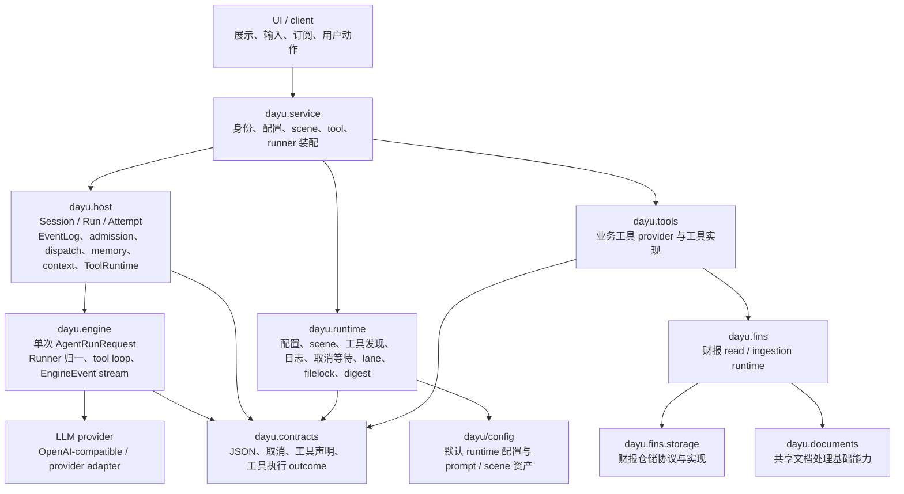

# Dayu 开发手册总览

本文档是 `dayu/` 包的总揽级开发手册。

Dayu 的核心依赖方向如下：

```text
UI -> Service -> Host -> Engine
```

## Agent更新约束【必须遵守】

- 本文档只写当前代码已实现的总揽级设计意图、整体架构、稳定边界、主要组件、关键执行路径、核心术语、公共契约、日志与可观测性、扩展入口和代码阅读顺序。
- 更新本文档时必须先核对当前代码和相关子包 README；代码真源高于设计文档，子包 README 只作为已核对过的边界摘要。
- 本文档只描述跨包关系和总控边界；Host、Engine、Fins、Config、Service 的内部机制以各自 README 为准。
- 不写用户手册、安装运行命令、测试清单、文件级流水账或 review / work unit 过程状态。
- 不写未来计划、路线图、未落地能力或实现细节；只保留当前代码已经实现且对开发者稳定有用的说明。

## 设计意图

Dayu 是生产级通用 Agent，具备买方财报分析能力，核心范式是“宿主强约束下的 LLM in the loop”。

在这个范式里，LLM 负责分析、推理、生成和按工具 schema 发起工具调用；系统可靠性来自宿主边界，而不是来自模型自律。Host 掌控 Session / Run / Attempt 生命周期、admission、取消、恢复、EventLog、工具治理、memory / context governance、projection 和可恢复事实。Engine 只执行单次 `AgentRunRequest`，把模型调用、Runner 协议归一、tool loop、取消观察和终态收口表达为强类型 `EngineEvent stream` 或 `AgentRunResult`。

系统优先保证这些性质：

- Host durable EventLog 与同事务状态索引是治理事实真源；projection、memory、tool trace、outbox、audit 和 diagnostic 都是派生视图或观察记录。
- 同一 Session 的 active Run 由 Host admission 约束；queued Run 是 durable state，不是内存队列。
- Agent、Runner、Attempt 和 Engine worker 都是一次执行边界；steer、resume、recovery、retry、replay 都创建新的 Attempt 或新关联 Run，不恢复旧实例。
- 工具调用必须经过 Host-owned ToolRuntime、accept barrier、截断治理、等待治理和重复调用治理；assistant final answer 和普通工具证据不会自动成为 evidence-backed fact。
- Context compaction 治理由 Host 负责；Engine 只在 provider 明确报告输入上下文溢出时发出 `context_compaction_requested`。
- 财报 read、download、preprocess / process 与 upload 的业务底座收敛到共享 Fins service/runtime 与 `dayu.fins.storage` 仓储协议；Host 和 Engine 不直接读取财报原文或仓储文件。

## 整体架构



依赖只能沿 `UI -> Service -> Host -> Engine` 主链路向下发生。`dayu.contracts`、`dayu.runtime` 和 `dayu.documents` 是层中立基础包，不属于 UI / Service / Host / Engine 任一业务层。财报领域能力在 `dayu.fins` 内闭合；业务工具可以调用 Fins runtime，但 Host / Engine 不把 Fins 业务规则写入自己的状态机。

## 稳定边界

- `UI` 当前是外部调用者角色，不是 `dayu/` 下的实现包。它只通过 Service / Host public view 发起动作和订阅结果，不写 Host truth。
- `dayu.service` 是 Host 外部 composition boundary。它把 runtime typed config、runtime locations、工具发现结果、prepared scene、显式 override 和 env / secret mapping 映射成 `OpenHostOptions` 与 `SubmitFollowupRequest`，并提供可复用 entrypoint runtime helper 处理 Session ensure/create、follow-up terminal observation、cancel request 构造和 watcher failure 诊断；Fins direct 命令入口通过 `dayu.service.fins_direct` 暴露 `AsyncIterator[FinsEvent]`，不伪装成 Host Run，也不把 CLI 操作建模为 durable job。
- `dayu.host` 是宿主治理真源。它拥有 Session / Run / Attempt / EventLog、admission、dispatch、cancel、steer、wait-resume、retry、replay、ToolRuntime、context governance、Conversation Memory、projection、outbox、purge 和 startup recovery。
- `dayu.engine` 是单次 run 执行边界。它不导入 Host，不读取 Host durable store，不管理 Session / Run / Attempt，不发现工具，不持有工具权限或财报业务语义。
- `dayu.contracts` 是 Dayu Agent 公共契约包。它承载层中立数据与协议，不承载 Host / Engine 状态机、Service 流程、UI 展示语义或 Fins 业务事实。
- `dayu.runtime` 是层中立运行期基础设施包。它不得 import `dayu.engine` / `dayu.host` / `dayu.service` / `dayu.ui` / `dayu.fins`，也不承载任何层的状态机或业务语义。
- `dayu.config` 提供包内默认配置、prompt fragments 和 scene manifests。ConfigLoader 只读取 typed config view；ScenePrepare 只解释显式传入的 scene manifest root、prompt asset root 和 context slot values。
- `dayu.tools` 承载业务工具实现与 provider。工具通过 `dayu.runtime.tools_discovery` 或 Service composition root 显式发现后形成 `ToolBundle`，再由 Host ToolRuntime 治理执行。
- `dayu.fins` 是财报领域能力边界。共享 `DefaultFinsRuntime` 装配 read runtime 与 ingestion runtime；财报文档存取必须通过 `dayu.fins.storage` 仓储协议与实现。
- `dayu.documents` 是共享文档处理基础包。它只把调用方提供的文档来源解析为章节、表格、全文、页内容和搜索命中等结构，不处理 Host 生命周期、工具治理或财报仓储真源。

## 主要组件

- `dayu.contracts`：`JsonValue`、`CancellationToken`、工具 schema、工具声明、工具调用请求、工具 outcome、等待 outcome、`ToolExecutor` 和工具来源引用。
- `dayu.runtime`：日志级别与装配、协作式取消等待、runtime lane、filelock、diagnostic 文本脱敏、有界截断、digest、config loader、location resolver、scene prepare、tool discovery、assembly helper 与 tool truncation defaults。
- `dayu.config`：包内默认 `models`、`execution_profiles`、`host_runtime`、`runtime_lanes`、`tool_discovery` 和 prompt / scene 资产。
- `dayu.service.host_assembly`：从 runtime config、prepared scene、工具发现和 secret mapping 组合 Host construction-time inputs 与 per-run request。
- `dayu.service.fins_direct`：从 product entrypoint 显式参数构造 Fins download / preprocess / upload typed request，并把 Fins direct runtime events 以 `AsyncIterator[FinsEvent]` 形式交给调用方消费。
- `dayu.host`：public Host handle、durable store、admission、dispatch、EngineEvent ingest、ToolRuntime、waiting、production wait poller、context compaction、Conversation Memory、projection、outbox、purge、startup recovery。
- `dayu.engine`：`run_agent_messages`、`run_agent_and_wait`、Agent loop、Runner 协议归一、provider adapter、tool loop、length continuation、fallback、provider error classification 和 EngineEvent contract。
- `dayu.tools`：业务工具 provider 与工具实现，输出 current `ToolDefinition` / `ToolBundle`。
- `dayu.fins`：财报 storage repository、read runtime、ingestion runtime、download / preprocess / process / upload direct stream 与 awaiting observation foundation、processors、Fins tools provider。
- `dayu.documents`：Markdown、HTML、Docling JSON 等文档处理器与 Docling PDF runtime 装配 helper。

## 关键执行路径

### Service 装配

Service 从 `dayu.runtime.location` 解析 workspace 与包内资产位置，用 `ConfigLoader` 读取 typed config，用 `ToolsDiscovery` 聚合业务 `ToolBundle`，用 `ScenePrepare` 拼接 system prompt、工具选择和 AgentPolicy override，再通过 `compose_open_host_options(...)` / `compose_submit_followup_request(...)` 或 `compose_submit_followup_request_with_overrides(...)` 生成 Host public typed inputs。需要 production wait poller 时，Service / composition root 在 construction time 显式提供 wait poll adapter registry 与 wait poller policy；Host 不接收 raw config patch、profile id 或隐式 lookup。面向 product entrypoint 的共享 Service helper 在 submit 前 attach `watch_session_events(session_id)`；cancel helper 用 public `get_run(...)` 判断已终态 Run 并跳过取消，非终态则在 `cancel_run(...)` 前 attach watcher；terminal fallback 只使用 `get_run(...)` 与 `read_outbox_terminal_items(...)`。

### 普通 follow-up

UI / Service 调用 `open_host(options)` 得到 Host handle，先 ensure / create Session，再用 `SubmitFollowupRequest(behavior=QUEUE)` 提交输入。Host admission 在 durable transaction 内写入输入事实、Run / Attempt / dispatch 状态与幂等记录；scheduler 读取已提交事实，构造 `AgentRunRequest` 并派发本地 Engine worker。Engine 产出的 `EngineEvent stream` 必须经 Host ingest 校验后才变成 Host facts。

### Steer 与 cancel

`submit_followup(behavior=STEER, target_run_id=...)` 是同一 Run 内的改向机制，只允许目标为同一 Session 当前 active 的 `RUNNING` 或 `WAITING` Run。Host 在同一 Run 下收口旧 Attempt 并创建新的 Attempt / execution。`cancel_run(...)` 和 `cancel_session_runs(...)` 是 durable command，不是直接杀 worker；active worker cancel 是 commit 后的 best-effort 传播，已 accepted 的事实不会被撤回。

### 工具与 Fins

Engine 只看到调用方传入的 `tool_schemas` 与 `ToolExecutor`。Host ToolRuntime 把业务 `ToolBundle` 包装成受治理的 batch executor，负责权限、截断、等待、重复调用治理、diagnostic、payload descriptor 和 accept barrier。Fins 工具通过共享 `DefaultFinsRuntime.get_read_runtime()` 与 `DefaultFinsRuntime.get_ingestion_runtime()` 复用同一套仓储、处理器注册表和 ingestion runtime；工具触发的 download、preprocess 与 upload 长事务通过 lightweight observation handle 接入 Host wait-resume。CLI 等 direct 数据命令不创建 Host Run，也不创建 CLI-facing durable job；它们在 Service/Fins boundary 内消费普通 `AsyncIterator[FinsEvent]`，运行中输出 `PROGRESS`，终态由唯一 `RESULT` 收口，取消走当前 operation-scoped cancellation。

### Wait / resume

长事务工具返回 `ToolAwaitingOutcome` 时，Engine 以 `run_suspended` 结束本次 run。Host 接受 awaiting fact 后将 Run 推进为 `WAITING` 并创建 wait record。外部长事务完成后，调用方通过 `resolve_wait(...)` 把结果交回 Host；启用 production wait poller 时，Host runtime 也可以通过 construction-time poll adapter registry 观察 wait record 指向的外部 job，并在完成或 lost 时进入同一个 `resolve_wait(...)` 管线。Host 写入 wait resolution facts，并为同一 Run 创建新的 resume Attempt。resume 不恢复旧 Agent、Runner、Engine generator 或工具调用栈。

### Wait callback completion

wait callback completion 是 wait-resume 的 transport-facing 入口形态。Service / Web 层负责把 HTTP-like callback 请求解析成 framework-neutral request，再映射为 Host callback typed contract；Host callback adapter 执行认证、digest 校验、stale / late 预分类，并把通过预检的 callback 转成 `ResolveWaitRequest(source=CALLBACK)` 进入既有 `resolve_wait` 管线。状态迁移、replay、same-key conflict、late result rejection 和 resume Attempt 创建仍由 Host durable command path 统一治理。

当前代码提供的是 Service framework-neutral mapper 与 Host callback typed boundary，不是已经注册好的真实 HTTP route。secret backend、HMAC / bearer verifier、physical cancel、Engine contract 和 UI surface 不属于这个入口的当前实现范围；production wait poller 是独立的 Host opener runtime，不属于 callback endpoint 本身。

### Context compaction

proactive compact 由 Host context budget 在 Attempt 创建前触发；reactive compact 只由 EngineEvent `context_compaction_requested` 触发。该事件来自 provider 明确报告输入上下文溢出，不来自 final candidate 的 `finish_reason=LENGTH`。`LENGTH` 表示达到模型输出上限，属于 Engine length continuation / degraded answer 机制。Compact 执行、candidate 校验、artifact 写入、recovery Attempt 创建与 fallback / failure / cancel 收口都由 Host 治理。

### Startup recovery

如果 LLM / Engine 未返回时 Host 进程退出，Host 不在退出瞬间伪造 terminal facts。下次 `open_host` 启动时，startup recovery scanner 基于 durable Run / Attempt / dispatch / owner liveness truth 做 positive orphan proof 分类；只有证据成立时才 closeout 旧 Attempt 或创建 recovery Attempt。runtime lane TTL、projection lag 或 worker 没返回本身不构成 recovery truth。

### 投递与派生视图

HostEvent、outbox、Conversation Memory、tool trace、audit、diagnostic 和 projection 都来自 committed Host facts。它们可以服务 UI 展示、离线 terminal notification、后续 RunInputBuilder、诊断和审计，但不能反向驱动 EventLog truth 或 Run / Attempt 状态迁移。

## 核心术语

- `Session`：Host 管理的一条持续会话上下文。
- `Run`：用户可见的一次 Agent 目标、问题或 follow-up，属于一个 Session。
- `Attempt`：Host 为完成某个 Run 派发给 Engine worker 的一次执行生命周期。
- `EventLog`：Host append-only canonical facts；状态索引、projection、memory、outbox 和 audit 都从它或同事务状态派生。
- `AgentRunRequest`：Host 或底层调用方交给 Engine 的单次 run 输入快照。
- `EngineEvent stream`：Engine 产出的异步事件流，是 Host ingest 的输入，不是 Host durable truth。
- `RunnerEvent stream`：Runner 到 Agent 的 provider 协议归一事件流，只在 Engine 内部消费。
- `HostEvent`：Host 面向 UI / Service 的 typed event view，来自 committed Host facts。
- `ToolBundle`：业务工具声明集合，定义真源在 `dayu.contracts`，由 Service / discovery 装配后交给 Host。
- `ToolRuntime`：Host-owned 工具治理模块，包装业务工具为受治理 `ToolExecutor`。
- `Fins runtime`：`DefaultFinsRuntime` 装配的财报共享业务底座，包含 read runtime、ingestion runtime、仓储和处理器注册表。
- `Context Governance`：Host 对上下文预算、compaction、compact artifact、recovery 和 fallback 的治理机制。
- `Conversation Memory`：Host Session-level read model，只消费 committed facts 与 accepted compact 结果。

`turn` 不用于描述 Engine / Runner 执行路径；如需表达用户视角多轮对话，应明确其与 `Session`、`Run` 的关系。`resume` 不表示恢复旧执行实例，而是基于 durable facts 构造新的 Attempt。

## 公共契约

### 契约分层

公共契约按定义真源分层：

- `dayu.contracts`：Dayu Agent 公共契约，Host / Engine / ToolRuntime / tools / runtime discovery 可共同使用。
- `dayu.engine.contracts` 与 `dayu.engine` 包根：Engine 专属契约和函数式执行入口，定义 Host -> Engine 的单次 run contract。
- `dayu.host` 包根：Host public API，定义 Service / UI 可调用的 Session / Run / wait / outbox / purge / event view contract。
- `dayu.runtime` typed config / scene / discovery 输出：Service assembly 的层中立输入契约，不是 Host 或 Engine runtime state。
- `dayu.runtime` lane / filelock：层中立运行期资源协调与文件互斥契约，不是 Host lifecycle truth。
- `dayu.fins.storage` 与 `dayu.fins.service_runtime`：财报领域仓储协议与共享 Fins runtime assembly contract。

### `dayu.contracts`

`dayu.contracts` 当前导出：

- `JsonValue`：严格 JSON 值联合。
- `CancellationToken`：跨层取消观察协议，不导出取消异常。
- `ToolSchema`、`ToolFunctionSchema`、`ToolParametersSchema`、`ToolTruncateSpec`、`ToolTruncationStrategy`：工具 schema 与截断声明。
- `ToolDefinition`、`ToolDisplayInfo`、`ToolBundle`、`ToolCallable`、`tool(...)`、`ToolExecutionCapability`：最小工具声明契约。execution capability 只声明 Host / ToolRuntime 选择执行边界所需的运行期能力，不进入 LLM-facing tool schema；具体工具实现、工具发现、权限与执行治理不属于公共包。
- `ToolCallRequest`、`BatchToolExecutionContext`、`BatchToolExecutionRequest`：Engine 到 ToolExecutor 的批式工具调用输入。
- `ToolCompletedOutcome`、`ToolFailedOutcome`、`ToolAwaitingOutcome`、`ToolCancelledOutcome`、`BatchToolExecutionRecord`、`BatchToolExecutionOutcome`：工具执行结果与批次结果。
- `ToolAwaitKind`、`ToolAwaitSpec`、`ToolAwaitSnapshot`：长事务等待契约。
- `ToolExecutor`：只包含 `execute(BatchToolExecutionRequest)` 的批式执行协议。
- `ToolResultSuccess`、`ToolResultFailure`、`ToolResultEnvelope`、`ToolResultMeta`：工具结果 envelope。
- `ToolBundleSourceKind`、`ToolBundleSourceRef`：工具 bundle 来源引用。

`dayu.contracts` 不承载 Host / Engine 状态机，不承载财报业务事实，也不把 tool definition 直接变成 Host-governed execution。definition / bundle 只能投影为 `ToolSchema` 后进入 Engine；实际执行必须由 Host / ToolRuntime 或等价调用方包装成 `ToolExecutor`。

### Engine public contract

Engine public contract 以 `AgentRunRequest` 为入口，以 `EngineEvent stream` 或 `AgentRunResult` 为输出。稳定入口是 `run_agent_messages(request)` 与 `run_agent_and_wait(request)`。核心类型包括 `AgentPolicy`、`AgentMessage`、`AssistantToolCall`、`RunnerSpec`、`RunnerCallOptions`、`AsyncRunner`、`RunnerEvent`、`EngineEvent`、provider request extension、client correlation 和 run outcome union。

Engine 契约只描述一次 run 的执行输入、Runner 调用、工具批次、取消观察、provider 归一、usage、context overflow、length continuation、fallback 和 terminal outcome。Session / Run / Attempt 生命周期、EventLog、memory、wait record、ToolRuntime、工具权限、业务工具发现和财报仓储不属于 Engine contract。

### Host public contract

Host public contract 以 `open_host(options)` 返回的异步 `Host` handle 为普通入口。核心类型包括 `OpenHostOptions`、`OrdinaryRunExecutionBaseline`、`CompactorRunnerBaseline`、`HostToolingOptions`、Session / Run request 与 snapshot、Session 列表读取结果、`FollowupBehavior`、`CancelMode`、wait resolution request / outcome、outbox read / drain request、`HostEvent`、`HostFinalAnswerView`、`HostApiError`、`OperationContext` 和本地 worker typed boundary。

Host contract 的稳定语义是 durable command 和 typed read view。`submit_followup`、`cancel_run`、`resolve_wait`、`retry_run`、`replay_run`、`close_session`、`purge_session` 等 command 都先进入 Host admission 或对应治理入口；`get_session`、`list_sessions`、`get_run`、outbox read 和 storage usage report 等读取入口只返回 Host durable truth 或明确的派生 read view，不触发执行。低层 durable store、command handle factory、scheduler、projection runner、ToolRuntime factory 和 state mutator 不是普通 Service-facing contract。

### Service / runtime assembly contract

Service assembly contract 由 `dayu.runtime.config_loader`、`dayu.runtime.location`、`dayu.runtime.scene_prepare`、`dayu.runtime.tools_discovery`、`dayu.runtime.assembly` 与 `dayu.service.host_assembly` 共同形成。它把包内默认配置和 workspace 覆盖配置转成 typed config view，把 scene manifest 与 prompt fragments 转成 prepared scene inputs，把工具 provider 输出转成 `ToolBundle`，再映射到 Host construction-time inputs。

这条 contract 的关键边界是显式装配：ConfigLoader 不创建 Host，不解析 secret，不做工具发现；ScenePrepare 不读取 ConfigLoader，不表达 workflow；ToolsDiscovery 不持有 Host / Service 上下文；Host 只接收最终 typed value。

### Runtime infrastructure contract

`dayu.runtime.lane` 提供 cross-process runtime capacity contract。当前公共类型包括 `LaneController`、`LaneConfig`、`LaneOwner`、`LaneClaimToken`、`LaneAcquireOutcome`、`LaneAcquired`、`LaneAcquireCancelled`、`LaneAcquireTimedOut`、`SQLiteLaneCoordinatorConfig` 和 `RuntimeLane*` 错误类型。lane 只表达资源容量 claim、heartbeat、release、timeout 和 acquire cancellation；它不表达 Host admission、Run / Attempt owner、lease / fencing、EventLog ordering、dispatch ownership 或 startup recovery proof。

`dayu.runtime.filelock` 提供同步文件访问互斥 contract。当前公共类型包括 `RuntimeFileLock`、`RuntimeFileLockOptions`、`RuntimeFileLockToken`、`RuntimeFileLockError`、`RuntimeFileLockTimeoutError` 和 helper `file_lock(...)`。filelock 只用于普通文件访问互斥；它不替代 SQLite transaction、Host EventLog 顺序、Run / Attempt 状态机、durable store lock、remote worker ownership 或 recovery 判断，也不提供 async wrapper。

### Fins contract

Fins public 使用边界不在 `dayu.fins` 包根导出，当前包根 `__all__` 为空。稳定能力分布在子包：

- `dayu.fins.storage`：财报文档、公司元数据、source document、blob、processed document、maintenance 等仓储协议与 filesystem 实现。
- `dayu.fins.service_runtime.DefaultFinsRuntime`：共享 Fins runtime assembly root，提供 `get_read_runtime()` 与 `get_ingestion_runtime()`。
- `dayu.fins.tools.*_provider`：把 Fins read / download / preprocess / upload 能力声明为业务工具 provider。
- `dayu.fins.ingestion_runtime`：download / preprocess / process 的 ingestion runtime foundation。
- `dayu.fins.processors`：财报处理器和处理器注册表。

财报存取必须通过 `dayu.fins.storage` 仓储协议；CLI、tool provider、CI 或其它入口需要复用同一 shared Fins service/runtime，避免 read、download、preprocess / process、upload 逻辑在多个入口漂移。

## 日志与可观测性

日志用于诊断系统执行过程，不承担 UI 输出、审计真源、tool trace 热 / 冷数据、EventLog canonical fact 或 projection checkpoint 职责。需要稳定查询、审计、恢复或投递的事实必须进入对应 typed EventLog / projection / audit / tool trace 机制。

`dayu.runtime.log` 默认把 `dayu.*` 诊断日志写入 stderr，并保留显式 stream override；CLI composition root 显式使用 stderr 作为诊断通道，stdout 保持为命令结果和用户 UI 输出通道。

| 级别 | 用途 |
| --- | --- |
| `DEBUG` | 执行细节，例如有界策略分支、事件分类、计数、cursor、CAS 结果和 diagnostic refs。不得输出大 prompt、大 tool result、delta 全量、provider secret、完整业务 payload 或财报原文。 |
| `VERBOSE` | 执行路径骨架，例如 Engine run、iteration、Runner 调用、tool loop、Host command、dispatch、ingest、terminal closeout 和 projection catch-up。 |
| `INFO` | 重要信息，例如进程启动、Host handle / scheduler 启停和 run finished 摘要。 |
| `WARN` | 可恢复异常，例如 provider retry、projection catch-up 失败但 command 已提交、worker startup / closeout 可诊断失败。 |
| `ERROR` | 本次操作失败，例如 Engine run failed、Host command 无法完成、dispatch / worker 本次执行失败。 |
| `CRITICAL` | 系统 invariant / contract 被破坏，例如 EventLog / state index 不一致或 ToolRuntime accept barrier 被绕过。 |

`dayu.runtime.log_levels` 是层中立日志 level 数值真源；`dayu.runtime.log` 负责把 `VERBOSE=15` 注册为 stdlib level name 并装配日志。Engine 只使用 stdlib logger，由上层完成日志装配。

Engine / Runner 日志不输出完整 prompt、provider headers、API key、完整工具结果或大段响应。Runner / provider 诊断事件上的 `raw_payload` 是有界、脱敏、摘要化诊断载荷，不保证保留 provider 原始 payload。

## 扩展入口

- 新 UI / CLI / Web / GUI 入口：通过 Service 解析身份、场景、配置和调用上下文，再调用 Host public handle；不要直接控制 Engine。
- 新 execution profile 或模型配置：更新 `dayu/config` 或 workspace overlay，由 runtime ConfigLoader 和 Service assembly 显式映射到 Host / Engine typed inputs。
- 新 scene：通过 `dayu.runtime.scene_prepare` 装配 prompt fragments、tool selection、model hints 和 AgentPolicy override；scene manifest 不表达 workflow 或 Host lifecycle。
- 新业务工具：输出 current `ToolDefinition` / `ToolBundle`，经 tools discovery 或 Service composition root 传入 `HostToolingOptions`；不要让 Host 扫描业务包。
- 新财报能力：在 Fins storage / runtime / processors / tools provider 边界内扩展，继续复用 shared `DefaultFinsRuntime`。
- 新本地执行后端：实现 `LocalEngineWorkerFactory`、`LocalEngineWorker` 与 `LocalWorkerHandle`，通过 `OpenHostOptions` 装配到 Host。
- 新 provider 或 provider request extension：在 Engine Runner / provider extension 边界扩展，保持 `RunnerSpec`、`RunnerCallOptions` 和 `ProviderRequestExtension` 的 typed contract。
- 新 context compaction 能力：通过 Host `ContextBudgetPolicy`、compactor baseline、compact material / candidate 校验和 recovery policy 扩展；compact 生命周期仍属于 Host。
- 新 memory projection 或 read model：消费 committed EventLog facts 与 accepted compact payload，保持可重建、带 provenance、带 digest，不写 Run / Attempt truth。
- 新 runtime 通用能力：优先放入 `dayu.runtime`，并保持层中立 import 边界。
- 新 document processor：放入 `dayu.documents` 或 Fins processors 中的对应注册表；路径权限、工具执行和 Host accept barrier 不属于 document processor。

## 代码阅读顺序

1. [dayu/README.md](/Users/leo/workspace/dayu-agent-r/dayu/README.md)：先建立总览边界、核心术语和公共契约分层。
2. [dayu/contracts](/Users/leo/workspace/dayu-agent-r/dayu/contracts)：理解 JSON、取消、工具声明、工具执行、等待和来源引用契约。
3. [dayu/engine/README.md](/Users/leo/workspace/dayu-agent-r/dayu/engine/README.md) 与 [dayu/engine](/Users/leo/workspace/dayu-agent-r/dayu/engine)：理解单次 run、AgentRunRequest、RunnerEvent、EngineEvent、provider adapter 和 tool loop。
4. [dayu/host/README.md](/Users/leo/workspace/dayu-agent-r/dayu/host/README.md) 与 [dayu/host](/Users/leo/workspace/dayu-agent-r/dayu/host)：理解 Host public API、EventLog、admission、dispatch、ToolRuntime、memory、context governance、wait-resume 和 recovery。
5. [dayu/config/README.md](/Users/leo/workspace/dayu-agent-r/dayu/config/README.md)、[dayu/runtime](/Users/leo/workspace/dayu-agent-r/dayu/runtime) 与 [dayu/service/README.md](/Users/leo/workspace/dayu-agent-r/dayu/service/README.md)：理解 config / scene / tool discovery / Service assembly 如何生成 Host typed inputs。
6. [dayu/fins/README.md](/Users/leo/workspace/dayu-agent-r/dayu/fins/README.md) 与 [dayu/fins](/Users/leo/workspace/dayu-agent-r/dayu/fins)：理解财报 storage、read runtime、ingestion runtime、processors 和 Fins tools provider。
7. [dayu/documents](/Users/leo/workspace/dayu-agent-r/dayu/documents)：理解共享文档处理器和 Docling runtime 的层外基础能力。
8. [dayu/tools](/Users/leo/workspace/dayu-agent-r/dayu/tools)：理解业务工具 provider 如何输出 current `ToolDefinition`。
9. [tests/README.md](/Users/leo/workspace/dayu-agent-r/tests/README.md) 与对应测试目录：用测试确认公共入口、状态机、边界约束和关键机制。
