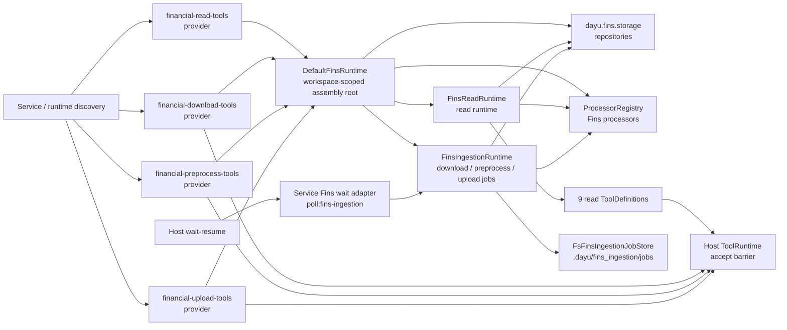

# Fins 开发手册

本文档是 `dayu.fins` 包的开发手册。

Fins 在整体架构中不是 `UI / Service / Host / Engine` 的一层，而是由工具与 Service assembly 接入的财报业务能力包：

```text
UI -> Service -> Host -> Engine
        |        |
        |        v
        |    ToolRuntime -> dayu.fins
        v
   Service Fins wait adapter assembly
```

## Agent更新约束【必须遵守】

- 本文档只写两类内容：
  - 当前代码已实现的整个 Agent 的设计意图、架构边界，范围包括 `UI -> Service -> Host -> Engine` 以及 Fins 作为财报业务能力包的位置。
  - 当前代码已实现的 `dayu.fins` package 的 capability 定位、两条执行路径、对外接口、公共契约、架构、稳定边界、主要组件、状态机、关键机制、Processors 的类继承关系和扩展点。
- 更新本文档时必须先核对 `dayu.fins` 当前代码；代码真源高于历史 plan、review artifact 或口头设计意图。
- 必须按本文档现有章节职责写作：`设计意图` 和 `架构边界` 先说明整个 Agent 与 Fins 位置；其后章节只说明 `dayu.fins` package。
- 不写用户手册、安装运行命令、测试清单、文件级流水账或 review / work unit 过程状态。
- 不写未来计划、路线图、未落地能力或实现细节；只保留当前代码已经实现且对开发者稳定有用的说明。

## 设计意图

Dayu 是生产级通用 Agent，具备买方财报分析能力，核心范式是“宿主强约束下的 LLM in the loop”。

在整个 Agent 中，LLM 负责分析、推理和生成；Host 负责生命周期、取消、恢复、工具治理、EventLog、memory / context governance 和持久化事实。Fins 提供买方财报分析所需的业务底座：财报文档存取、ticker 归一、公司信息 resolver、read tools、download / preprocess / upload direct stream、awaiting tools、processor registry、XBRL / financial statement 能力，以及供 Service wait adapter 观察的 lightweight observation handle。

`dayu.fins` 的设计重点是把财报业务能力从 Host / Engine 中剥离出来：

- Host / Engine 不读取财报文件树，不理解 SEC 表单、ticker、XBRL、章节切分或 processed 产物。
- 财报文档存取必须通过 `dayu.fins.storage` 的仓储协议与仓储实现完成。
- read、download、preprocess / process 与 upload foundation 共用 `DefaultFinsRuntime`、仓储协议、processor registry 和 workspace-scoped ingestion runtime，避免工具入口、测试 / CI 入口或其它入口复制业务逻辑后产生漂移。
- Fins 工具只暴露业务语义结果；工具权限、ToolRuntime accept barrier、截断、`fetch_more`、长事务 wait、cancel、resume 和审计仍由 Host / ToolRuntime 治理。
- Fins direct stream 是 CLI / Service direct 调用的用户可见进度边界；Fins awaiting observation handle 是 Host wait adapter 的轻量观察引用；二者都不是 Host durable truth。

## 架构边界

整体依赖方向固定为：

```text
UI -> Service -> Host -> Engine
```

- `UI` 负责展示、输入收集、流式订阅和用户动作触发。
- `Service` 负责业务入口、身份解析、配置 / scene / tool / runner 装配，并调用 Host。
- `Host` 负责 Agent 运行宿主边界、状态治理、持久化、工具运行时治理、memory / context governance、projection、恢复和取消。
- `Engine` 负责单次 run 的模型交互、Runner 协议归一、tool loop、取消观察和 `EngineEvent stream`。
- `Fins` 是财报业务能力包；它通过工具 provider、Fins runtime、storage、processor 和 lightweight observation contract 被装配到 Agent 中，不成为新的架构层。

Fins 与其它层的稳定边界如下：

- Host 不导入 `dayu.fins`，不读取财报仓储，不执行财报下载 / 预处理，不解释财报业务规则；Host 只接收受治理工具结果或 wait adapter 映射后的 wait poll 结果。
- Engine 不导入 `dayu.fins`，不感知财报业务语义；Engine 只看到 Host 传入的 `ToolSchema` 和 `ToolExecutor`。
- Service / composition root 可以装配 Fins tools provider，也可以基于显式 Fins awaiting provider 配置构造 Host `WaitAdapterRegistry` 与 Service-owned Fins wait adapter；Service 只负责识别 provider identity，并把 raw provider config 交给 Fins 唯一 parser，再复用并行的私有 typed projection 完成 assembly。
- `dayu.fins` 不依赖 Host。Fins awaiting observation 只暴露 lightweight handle、snapshot 与 observation runtime；Host wait-resume integration 位于 `dayu.service.fins_wait_adapter`，它只使用 Host wait adapter public snapshot / outcome contract，不读取 Host durable store，也不改变 Host / Engine contract。
- Fins 不依赖 `dayu.service`、`dayu.ui` 或 `dayu.engine`；`dayu.engine` 与 `dayu.runtime` 也不得反向导入 Fins。

公共包边界固定如下：

- `dayu.contracts` 是 Dayu Agent 公共契约包，承载 UI / Service / Host / Engine / ToolRuntime / tools 可共同使用的层中立数据与协议，例如 JSON 值、取消 token、工具声明、工具 schema、工具调用请求、工具执行 outcome、工具等待 outcome 和 `ToolExecutor`；它不承载 Host / Engine 状态机，也不承载财报业务事实。
- `dayu.runtime` 是层中立运行期基础设施包，提供工具发现 provider contract、取消等待、日志级别、诊断文本脱敏、截断、filelock、lane 等可复用 helper；它不得依赖 `dayu.engine` / `dayu.host` / `dayu.service` / `dayu.ui` / `dayu.fins`，也不承载任何层的状态机或业务语义。
- `dayu.documents` 提供文档处理器公共协议、ProcessorRegistry 和通用 Docling / Markdown / BeautifulSoup 处理器；Fins 在其上注册财报业务增强处理器和 SEC 表单专项处理器。
- 工具声明契约属于 `dayu.contracts`；具体 Fins read / download / preprocess / upload 工具实现属于 `dayu.fins.tools`，工具发现装配属于 runtime discovery / Service assembly，工具运行时治理属于 Host / ToolRuntime。

## 接口

`dayu.fins` 包根当前不导出业务符号；开发者使用明确子包入口，避免把包根变成兼容性 re-export 面。

### Shared runtime

`dayu.fins.service_runtime.DefaultFinsRuntime` 是 Fins 默认共享装配根：

- `DefaultFinsRuntime.create(workspace_root=Path)`：由显式 Fins workspace root 创建文件系统仓储、processor registry、ingestion runtime 和 legacy job store。
- `get_read_runtime(processor_cache_max_entries=128)`：懒加载并缓存 `FinsReadRuntime`；`close()` 只关闭已经创建的 read runtime，不为清理触发惰性创建，关闭后拒绝新的 read runtime 获取。
- `get_ingestion_runtime()`：懒加载并缓存 `FinsIngestionRuntime`。
- `get_processor_registry()`：返回 Fins processor registry。

`DefaultFinsRuntime` 不持有 Host、Service、EventLog、ToolRuntime 或 Engine Runner。共享语义不是进程级 singleton，而是同一 `workspace_root` 下复用同一套业务代码、仓储布局、processor registry 和 legacy job store。

### Storage

`dayu.fins.storage` 是财报文档存取边界，包内导出窄仓储协议与文件系统实现：

- `CompanyMetaRepositoryProtocol`
- `SourceDocumentRepositoryProtocol`
- `ProcessedDocumentRepositoryProtocol`
- `DocumentBlobRepositoryProtocol`
- `FilingMaintenanceRepositoryProtocol`
- `BatchingRepositoryProtocol`
- 对应 `Fs*Repository` 文件系统实现
- `FileStore` / `LocalFileStore`

source document meta 中的 `source_provider` 是来源提供方真源，当前支持 SEC EDGAR、巨潮资讯、港交所披露易与用户上传。storage snapshot 负责把同版 source meta 投影为 typed provenance；read runtime 的 citation 只消费当前 processor borrow 所持 snapshot 的 provenance 来生成 LLM-facing `source_type` 与 `source_provider`，不重新读取仓储或猜测来源。

source published revision 由 complete-source mutation owner 在每次 source create、update、replace、delete 或 restore 的最终 meta 中自动生成并持久化，随同一个 batch commit 与 source 内容原子发布。`SourceDocumentRevision.token` 只承诺非空字符串的 exact opaque equality，不承诺 prefix、长度、字符集、hash 算法或其它 grammar；producer 不能传入 token，processed / company / maintenance-only batch 与 rollback 不改变已发布 token。consumer 只通过 storage snapshot 取得同版 opaque revision，不按 meta、文件字段、时间或内容 hash 重建它。

`SourceDocumentRepositoryProtocol.read_source_snapshot(...)` 是 storage-owned 单文档一致读取边界。light snapshot 在同一 publication guard 下返回 exact identity、typed source kind、完整 source meta、provenance、persisted revision、完整有序文件描述符与 primary filename，不暴露 published path 或 local URI；full snapshot 从同一次 guard 内打开的全部 regular file descriptors 复制到 snapshot 私有临时树，并在复制后核对同一 source kind 的 persisted revision、identity descriptor 与 deletion state。真实 publication 变化可由 storage 内部有界重取，持续变化抛出不携带 path/key/revision 的 typed consistency error；静态 inode/content/meta corruption 保持原有 corruption / I/O failure，不伪装为 publication change。snapshot 必须显式关闭且 close 幂等，关闭后其 `Source` 不可再读，full snapshot 的 `materialize()` 只返回临时树路径。

read runtime 的每个 processor cache entry 独占一份 full snapshot，并从中取得 processor、source meta、provenance 与 citation 所需事实。单次 read 在同一 active borrow 内完成 processor 调用、结果与 citation 构造；replacement、LRU eviction、clear 与 runtime close 只 retire entry，若仍有 active borrow 则延迟到最后一次 release 后关闭 snapshot。相同文档的并发 cache miss 在 creation lock 内按 full snapshot 再次核对，只有一个 matching entry 被构建和发布，竞争失败的 snapshot 会立即关闭。storage typed consistency exhaustion 只在 read runtime 映射为既有 `source_changed_during_read` 业务错误。

storage mutation authority 由显式 `BatchToken(transaction_id, ticker)` 承载。只有 `BatchingRepositoryProtocol` 提供 `begin_batch(...)`、`commit_batch(...)` 与 `rollback_batch(...)` lifecycle；source、blob、processed、company 与 filing maintenance 的所有 mutation 都要求 keyword-only `batch=`，并由 shared repository set 的同一 storage core 校验 token 仍开放且 ticker 匹配。异步 task、线程或 callback 不从上下文推断 authority；需要回调写文件时，每次 invocation 都显式接收并传递同一个 token。

source publication 使用 blob-first、complete-source commit：producer 可以先在 caller-owned batch 中按 identity handle 写入全部 blob，published read 在 commit 前仍看不到该 source；随后 producer 只执行一次 final source create/update，完整提供 meta、files、primary、provenance 与 manifest 所需事实。commit validator 是完整 source 的资格 owner，拒绝缺失、悬空、重复、false completion、非法 provenance、symlink 或 containment escape；不存在 acknowledgement、半完成 source 或 stable re-entry 契约。

文件系统实现对同 ticker writer 使用覆盖整个 transaction 的 reservation：同进程调用方通过 per-ticker condition 等待，跨进程调用方通过 blocking writer lock 串行化，不使用 timeout 猜测写者完成。commit 与 recovery 的物理目录切换另由短时 publication guard 保护，published read 不读取 staging，也不被长 staging / validator 阶段阻塞；published meta、manifest、blob、processed 与 `LocalFileSource.open()` 在在线 rename 窗口只能观察完整 old 或完整 new。所有 writer 退出路径统一释放 reservation 并通知等待者；recovery 只做 nonblocking try-lock，活动 writer 存在时立即跳过。journal 只保存可校验的最小相对事实；进程崩溃后 fresh repository 会在相同锁序下恢复到完整 old/new，并清理未提交 staging。

source repository 以 typed integrity contract 分类 published 或 staged source：`MISSING` 表示目标不存在，`COMPLETE` 表示完整树通过结构、文件大小与 SHA-256 校验，`REPAIR_REQUIRED` 表示已发布目标缺文件、大小不符或 digest 不符；malformed SHA-256 属于结构损坏并直接失败，不降级为可修复状态。下载 workflow 在任何 company、maintenance 或 rejected artifact publication 前执行 whole-tree preflight；恰有一个本轮已选中的损坏目标时先完成 repair 并重新校验完整树，多处损坏或未选中目标损坏则在业务副作用前 fail closed。repair transport 始终重新取得目标内容，Phase B 仍按原请求的 overwrite policy 与同版 identity 决定 publication；provider、PDF 与 Docling I/O 均不在 writer reservation 内执行。

download / upload overwrite 是单目标替换语义，不是 ticker 级清空语义。下载路径不得在发现本轮有效目标 document_id 之前清空 ticker 的全部 filings；空结果、失败或取消不得删除非目标旧文档。上传覆盖路径先完成文件校验、Docling 转换和取消检查，再由顶层 caller 开启短 batch，在其中 reset 目标文档、blob-first 写入文件并发布一次完整 source；commit 前失败或取消只 rollback 一次并保留旧文档，commit 开始后 caller 不再二次 rollback。

filing 上传的参数与 published-state 判定由统一 typed validator 持有。CLI 在 Service factory 前完成首次校验，非 CLI runtime 入口也在 producer、observation 或 job 创建前复用同一 validator；Service、runtime runner 与 SEC/CN/HK facade 只透传同一个 validated request，不把它还原为散参。workflow 在 prepare 前通过注入的同一个 `FilingUploadStateRepositoryProtocol` 重读 fresh snapshot、调用同一 validator并核对 canonical ticker/document identity；只有 fresh result 的 action、source meta 与 company decision 可以驱动 prepare/stage/commit，旧派生值会被丢弃。该协议只提供 upload admissibility 所需的 company/source 同版轻量快照，不替代包含文件、provenance 与 revision 的完整 `read_source_snapshot`。fresh workspace 的只读校验不创建 identity、ticker、lock 或 job 目录，实际写入 owner 在首次 mutation 时惰性建立基础设施；状态读取损坏或 I/O 失败通过 closed path-free operational reason 投影，原始 cause 只进入 operator log。

filing 的 company meta 与 source/blob 共享一个 caller-owned publication batch：转换失败或 terminal skip 不开启 batch；company stage 与 source stage 任一失败只 rollback 该 batch，成功时一次 commit 同时可见。上传失败通过 `dayu.fins.upload_failure` 的 closed kind/code 与固定安全文案贯穿 pipeline result、runtime summary、direct RESULT 详情和 durable failure summary；原始异常只进入 operator log，不进入用户事件或持久化 public summary。

`FilingMaintenanceRepositoryProtocol` 持有 SEC 下载拒绝注册表。注册表条目使用 `DownloadRejectionEntry` typed contract，包含 document id、拒绝原因、分类、SEC form、filing date 和下载版本；文件系统仓储读取非法 registry 时失败关闭，保存时只通过 typed entry 序列化，SEC 下载、SC13 过滤和下载诊断只消费该 typed registry。

文件系统仓储只接受 `dayu.fins.ticker_normalization` 已产生的 canonical ticker，并把 ticker 物理目录固定为 `portfolio/<canonical ticker>`；storage 不在读写边界静默归一化 ticker。document ID 仍作为 exact opaque identity 保存，并由 storage-private mapping key 隔离路径语义。ticker 与 document 目录都持有 identity descriptor，lookup、枚举、staging、publication、backup 与 recovery 必须双向校验 descriptor；损坏或非 canonical ticker 失败关闭，不由下游工具补偿。filename、SEC `primaryDocument` 投影后的文件名、manifest entry、object key 与 local URI 保持单路径组件、containment 与 symlink fail-closed 边界。

financial statement result contract 由 `dayu.fins.domain.financial_result_contract` 持有。processor 必须显式产生 `statement_type`、`periods`、`rows`、`currency`、`units`、`scale` 与 `data_quality`；`reason` 仅在 `partial` 时出现并给出稳定、可操作的降级原因，`xbrl/extracted` 完整结果省略该字段。`units` 只表达货币或计量单位，`scale` 独立表达 `units/thousands/millions/billions` 数值倍率；存在 rows 但缺少直接 scale 或 fiscal 证据时保持已有数据并降级为 `partial`，不得由 read runtime 补默认值。工具公共结果只在同一 typed projection 中组合 ticker、document ID、同版 citation 与这些业务字段。

XBRL facts processor result contract 由 `dayu.fins.domain.xbrl_result_contract` 持有：`query_xbrl_facts` 必须包含扁平 `query_params`、`facts` 与 `data_quality`，可选过滤条件只在实际提供时出现；`reason` 仅在 `partial` 时出现。正常执行但零命中是 `xbrl` 结果；部分 concept 失败是带 reason 的 `partial`；全部 concept 失败抛 typed execution error。read runtime 先校验并独立复制输入，再规范化和稳定去重而不修改 producer 数据；唯一公共 projection 输出最终 `facts`，并只用 `fact_count=len(facts)` 表达同一结果实际返回的事实数量。

上传链路的 company meta freshness 由 `dayu.fins.pipelines.upload_company_meta` 持有：只有既有 meta 的 `resolver_version` 等于当前 upload resolver 版本时才可保留；版本不一致时必须用本次上传字段重新校验并写入。`updated_at` 仅是审计时间，不是 freshness TTL。SEC/CN/HK 下载链路仍由各自 producer 写入公司元数据，不经上传 freshness 逻辑；read runtime 只读取仓储中的 company meta，不刷新或推断 freshness。

### Resolver

`dayu.fins.resolver` 是公司信息等财报业务标识解析能力的 public subpackage。`dayu.fins` 包根不 re-export resolver 符号，调用方应显式导入子包。

当前已实现 FMP 公司信息 resolver：

- `FmpCompanyInfo(canonical_ticker, company_name, ticker_aliases)`：不可变解析结果，`ticker_aliases` 是 tuple，首项恒为 canonical ticker。
- `FmpCompanyInfoResolver(api_key=..., http_client=..., timeout_seconds=...)`：显式接收 FMP API key 和 timeout，不读取环境变量。
- `resolve_company_info(canonical_ticker)`：先用 `search-symbol` 精确匹配 canonical ticker 后定位公司名，再用 `search-name` 搜索严格同名证券，alias 去重后返回；HTTP、JSON、空结果、无精确 ticker 命中、非法 payload 或第二跳失败都会收口为 `FmpCompanyInfoResolutionError`。

resolver 只提供业务解析能力；调用方负责读取环境变量、配置超时、处理失败回退和决定是否把公司名投影给 LLM。

### Read runtime 与 read tools provider

`dayu.fins.tools.read_runtime.FinsReadRuntime` 是 read path runtime，当前提供：

- `list_documents`
- `get_document_sections`
- `read_section`
- `search_document`
- `list_tables`
- `get_table`
- `get_page_content`
- `get_financial_statement`
- `query_xbrl_facts`

read runtime 持有 `document_id -> storage snapshot -> processor` 路由和 read tool 输出投影。processor 的可选能力边界使用 typed protocol 显式判断：分页、财务报表、XBRL facts 与 XBRL taxonomy 能力都由 protocol 方法承诺，不通过字符串属性名探测。source meta 从当前 snapshot 收窄为本地 typed projection；fiscal year 只接受 producer 持久化的正整数，fiscal period 只接受 domain canonical 值，缺失值保持 `None`，不从 form、report date 或 filing date 补偿。processor cache 有界并拥有 snapshot 资源生命周期，不另设 source meta cache；`list_documents` 只组合 filing/material 两个 typed document list 与对应轻量 meta 投影，不为每个列表项创建 snapshot。

read path 对 source decode、search index 构建、XBRL 查询全失败和读取期间 source 变化使用 typed failure code。非法 UTF-8 不以忽略字符或空文本继续；section/enrichment/BM25F 任一构建失败不返回空搜索成功；这些失败在工具边界投影为稳定业务错误，原始异常只作为内部 cause 保留。协作式取消仍优先传播，不被 degradation mapping 改写。

`dayu.fins.tools.provider.discover_tools(spec)` 是 read tools 的 ToolsDiscovery provider 入口，provider id 为 `financial-read-tools`。启用时必须通过 effective spec 提供绝对 `workspace_root`，并返回九个 read tools；read provider 是否参与发现只由 provider-level `enabled` 控制。

当前 read tools 名称为：

- `list_documents`
- `get_document_sections`
- `read_section`
- `search_document`
- `list_tables`
- `get_table`
- `get_page_content`
- `get_financial_statement`
- `query_xbrl_facts`

### Download / preprocess / upload awaiting tools

Fins ingestion 通过三个独立 awaiting provider 暴露 awaiting tools：

- `dayu.fins.tools.download_provider.discover_tools(spec)`：provider id 为 `financial-download-tools`，返回 `start_fins_download`。
- `dayu.fins.tools.preprocess_provider.discover_tools(spec)`：provider id 为 `financial-preprocess-tools`，返回 `start_fins_preprocess`。
- `dayu.fins.tools.upload_provider.discover_tools(spec)`：provider id 为 `financial-upload-tools`，返回 `start_fins_upload`。

三个 awaiting provider 都必须通过 effective spec 获得绝对 `workspace_root`。upload provider 启用时注册 `start_fins_upload`；上传工具只在工具边界校验本地路径存在、指向普通文件且文件非空。当前实现不把本地源文件授权建模为 upload provider 的配置职责；调用方仍需在进入工具前承担本地文件来源可信性与用户授权。工具调用只注册 lightweight observation handle 并返回 `ToolAwaitingOutcome(EXTERNAL_JOB)`，不等待长事务完成、不直接 resolve Host wait，也不把 handle 当作业务事实返回给模型。上传后的 source/blob/processed 写入仍必须通过 Fins workspace repository 完成。

三个 awaiting provider 还必须显式提供 provider-owned
`config.awaiting_resolution_mode`。`dayu.fins.ingestion.awaiting_resolution` 是该字段、
closed typed enum 与严格 parser 的唯一 public owner，
只接受精确的 `poll`、`callback`、`manual`；缺失、`null`、非字符串、空串、大小写变体、
前后空白和未知值都失败，不提供默认或 loose parsing。每个 provider 在创建 runtime/tool
definition 前调用同一 parser；Service discovery 路径也在 enabled filtering 前调用该
parser，并把 typed mode 保存到独立私有 metadata，而不是改写 raw provider config。

### Batch upload plan

`dayu.fins.upload_batch` 是本地批量上传领域事实的唯一 owner。它接收不可变的
`UploadBatchPlanRequest`，在 lexical / resolved containment 与内部 symlink fail-closed 边界内扫描调用方显式传入的
源目录，并返回由 `UploadBatchFilingEntry`、`UploadBatchMaterialEntry` 和 `UploadBatchSkippedEntry` 组成的
`UploadBatchPlan`。公开常量 `FINS_UPLOAD_FILE_SUFFIXES` 是 upload 输入后缀真源；默认只扫描直属文件，显式
recursive 或直接存在 `20YY` / `20YYQn` / `20YYH1` 结构目录时才递归。

Fins 根据文件名与直接结构父目录产生财年、财期、material routing/name、同期优先级、去重、数量限制和业务可读
skip reason。年度 filing 最多保留 5 份；周期 filing 只保留最新财年并最多 6 份；presentation 最多 6 份；
earnings-call 上限等于过滤后的 filing 数量；financial statements 不设数量上限。显式 fiscal metadata 只覆盖对应
推断字段，material 与 filing 保持互斥，所有裁剪与安全拒绝都进入 typed skipped facts。

该模块不构造 argv、不渲染平台脚本、不读取环境或 FMP、不启动 ingestion job、不读取 storage，也不创建 Host Run。
CLI 只能机械消费 typed plan，把 filing/material entry 投影为当前 direct upload grammar，并把 skipped facts投影为人类可读
摘要；文件名规则、caps 和 skip reason 不得在 CLI renderer 或测试 fixture 中重算。

### Ingestion runtime 与 awaiting observation

`dayu.fins.ingestion_runtime.FinsIngestionRuntime` 是下载、预处理与上传的 typed runtime foundation。当前稳定入口分为 direct stream、awaiting observation 和 legacy durable job helpers：

- `def download(FinsDownloadRequest, *, cancellation_token: CancellationToken | None = None) -> ValidatedFinsEventStream`
- `def preprocess(FinsPreprocessRequest, *, cancellation_token: CancellationToken | None = None) -> ValidatedFinsEventStream`
- `def upload(FinsUploadRequest, *, cancellation_token: CancellationToken | None = None) -> ValidatedFinsEventStream`
- `start_observed_download(...) -> FinsObservationHandle`
- `start_observed_preprocess(...) -> FinsObservationHandle`
- `start_observed_upload(...) -> FinsObservationHandle`
- `prepare_observed_download(...) -> FinsObservationHandle`
- `prepare_observed_preprocess(...) -> FinsObservationHandle`
- `prepare_observed_upload(...) -> FinsObservationHandle`
- `activate_observation(handle) -> None`
- `poll_observation(handle) -> FinsObservationSnapshot`
- `cancel_observation(handle) -> FinsObservationSnapshot`
- `abandon_observation(handle) -> None`
- legacy helpers `start_download(...)` / `start_preprocess(...)` / `start_upload(...)` / `read_job(...)` / `read_job_events(...)` / `request_cancel(...)` 仍保留在 runtime foundation 中服务 legacy job-store 覆盖；Service direct 和 Fins awaiting tools 不消费这些入口。

Host wait-resume integration 位于 `dayu.service.fins_wait_adapter`。Fins package 只拥有 `FinsObservationHandle`、`FinsObservationSnapshot`、`FinsObservationStatus`、`FinsObservationRuntime` 与 observation handle token parser；它不导入 Host wait types，也不读取 Host durable wait row。

## 调用者装配示例

调用者进入 Fins 的稳定入口是 `DefaultFinsRuntime`。不同入口可以创建各自的 runtime 实例，但同一 `workspace_root` 会使用同一套仓储布局、processor registry 构造逻辑和 legacy job store。
awaiting tool callable 与 Service wait activation adapter 例外：activation adapter 必须接收 awaiting tool callable 使用的同一个 `FinsIngestionRuntime` 实例，因为 prepared observation 是进程内 runtime 状态，不是可由 `workspace_root` 重新发现的持久事实。

### Read caller

Tool discovery 的 read provider 已经内置这条路径：

```text
dayu.fins.tools.provider.discover_tools(spec)
  -> parse_fins_workspace_root_config(spec.config)
  -> DefaultFinsRuntime.create(workspace_root=...)
  -> runtime.get_read_runtime(...)
  -> build_fins_read_tool_definitions(read_runtime=..., workspace_root=...)
```

其它直接调用 read runtime 的入口也应走同一装配根：

```python
from pathlib import Path

from dayu.fins.service_runtime import DefaultFinsRuntime

workspace_root = Path("/abs/path/to/fins-workspace")
runtime = DefaultFinsRuntime.create(workspace_root=workspace_root)
read_runtime = runtime.get_read_runtime()

documents = read_runtime.list_documents(ticker="AAPL")
sections = read_runtime.get_document_sections(
    ticker="AAPL",
    document_id="example-document-id",
)
```

调用者不应自行拼装 `FsCompanyMetaRepository`、`FsSourceDocumentRepository`、`FsProcessedDocumentRepository` 或 `ProcessorRegistry`，也不应直接构造 `FinsReadRuntime(...)` 来绕过 shared runtime。

### Download / preprocess / upload caller

Tool discovery 的 download / preprocess / upload providers 已经内置这条路径：

```text
dayu.fins.tools.download_provider.discover_tools(spec)
dayu.fins.tools.preprocess_provider.discover_tools(spec)
dayu.fins.tools.upload_provider.discover_tools(spec)
  -> parse_fins_workspace_root_config(spec.config)
  -> DefaultFinsRuntime.create(workspace_root=...)
  -> runtime.get_ingestion_runtime()
  -> build start_fins_download / start_fins_preprocess / start_fins_upload ToolDefinition
```

其它直接调用 ingestion runtime 的入口也应走同一装配根，并优先消费 direct stream：

```python
import asyncio
from pathlib import Path

from dayu.fins.domain.enums import SourceKind
from dayu.fins.direct_events import FinsEventType
from dayu.fins.ingestion_runtime import (
    FinsDownloadRequest,
    FinsPreprocessRequest,
    FinsUploadFilingRequest,
)
from dayu.fins.service_runtime import DefaultFinsRuntime

workspace_root = Path("/abs/path/to/fins-workspace")
upload_file = Path("/abs/path/to/uploads/aapl-2025-10k.pdf")
runtime = DefaultFinsRuntime.create(workspace_root=workspace_root)
ingestion = runtime.get_ingestion_runtime()

async def run_direct_ingestion() -> None:
    async for event in ingestion.download(
        FinsDownloadRequest(
            ticker="AAPL",
            source="auto",
        )
    ):
        if event.event_type is FinsEventType.RESULT:
            break

    async for event in ingestion.preprocess(
        FinsPreprocessRequest(
            ticker="AAPL",
            source_kind=SourceKind.FILING,
            rebuild_processed=False,
        )
    ):
        if event.event_type is FinsEventType.RESULT:
            break

    async for event in ingestion.upload(
        FinsUploadFilingRequest(
            ticker="AAPL",
            source_kind=SourceKind.FILING,
            action="auto",
            files=(upload_file,),
            fiscal_year=2025,
            fiscal_period="FY",
            overwrite=False,
        )
    ):
        if event.event_type is FinsEventType.RESULT:
            break


asyncio.run(run_direct_ingestion())
```

Tool awaiting provider 使用同一装配根，但入口是 observation handle：

```text
start_fins_download / start_fins_preprocess / start_fins_upload
  -> FinsIngestionRuntime.prepare_observed_download / prepare_observed_preprocess / prepare_observed_upload
  -> return ToolAwaitingOutcome(EXTERNAL_JOB)
  -> Host accepted wait activation
  -> FinsIngestionRuntime.activate_observation(handle)
  -> FinsIngestionWaitPollAdapter polls observation snapshot
```

Legacy job-store helpers 仍可由低层测试或明确选择 legacy job-store 的内部路径调用：

```python
download_start = ingestion.start_download(
    FinsDownloadRequest(
        ticker="AAPL",
        source="auto",
    )
)
```

`FinsReadRuntime` 只服务 read path；download、preprocess 与 upload 必须使用 `FinsIngestionRuntime`。当前默认 runtime 为 US ticker 的 `source="sec"` / `source="auto"` 装配 SEC production download adapter，为 CN ticker 的 `source="cninfo"` / `source="auto"` 装配巨潮 production download adapter，为 HK ticker 的 `source="hkexnews"` / `source="auto"` 装配披露易 production download adapter；没有匹配 adapter 的 download stream 会进入明确 failed RESULT。preprocess path 读取 workspace 中已有 source docs，并通过 processor registry 写入 processed repository。当前默认 runtime 内置 production upload runner：US ticker 走 SEC upload workflow，CN/HK ticker 走 CN/HK upload facade，并通过 `DoclingUploadService` 写入 source/blob 仓储。直接调用 ingestion runtime 时，调用方必须自行保证 `files` 指向可信本地普通文件；`start_fins_upload` 工具会在工具边界校验本地路径存在、指向普通文件且文件非空。Material 上传使用 `FinsUploadMaterialRequest`，并必须提供 `form_type` 与 `material_name`。

## 公共契约

Fins 公共契约分为 Fins 专属契约、Dayu Agent 公共契约和文档处理器契约。

### Fins 专属契约

- `dayu.fins.domain`：财报领域模型、枚举与共享业务值 parser，包括 `Market`、`SourceKind`、公司元数据、源文档、processed 文档、文件对象、批处理 token、rejected filing artifact、SEC form parser / alias expansion、财期、文档质量与财务数据质量等数据对象和封闭值。
- `dayu.fins.ticker_normalization`：ticker 标准化结果与 market / exchange 推导。
- `dayu.fins.storage.repository_protocols`：公司、源文档、processed、blob、filing maintenance 与批处理事务仓储协议。
- `FinsDownloadRequest` / `FinsPreprocessRequest` / `FinsUploadFilingRequest` / `FinsUploadMaterialRequest`：下载、预处理与上传请求。
- `FinsSourceDownloadAdapter` / `FinsSourceDownloadAdapterRequest` / `FinsSourceDownloadAdapterResult`：下载来源 adapter 协议。
- `FinsUploadRunner` / `FinsJobCancellationChecker` / `FinsUploadResultSummary`：上传 runner 边界、协作式取消检查器与有界结果摘要。
- `FinsEvent` / `FinsProgress` / `FinsResultSummary`：direct stream 的用户可见进度、终态和有界详情契约。
- `FinsObservationHandle` / `FinsObservationSnapshot` / `FinsObservationStatus`：awaiting tools 与 Host wait adapter 之间的 lightweight observation 契约。
- `FinsIngestionJobRecord` / `FinsIngestionJobStatus` / `FinsIngestionOperationKind` / `FinsIngestionJobStart`：legacy ingestion durable job 契约，仍由 runtime foundation 保留，但不是 CLI direct 或 awaiting tool 的公共引用。
- `dayu.fins.ingestion_events`：legacy ingestion job event 的 canonical 公共入口，导出 `FinsIngestionJobEventAppend`、`FinsIngestionJobEventRecord`、`FinsIngestionJobEventType` 与有界 payload 校验 helper。
- `FinsIngestionStartCancelledError`：可选启动取消 token 在 direct / observed / legacy start 边界命中时的 runtime 异常。
- `FinsIngestionJobStore` / `FsFinsIngestionJobStore`：legacy ingestion job record 存储协议与文件系统实现。
- `FinancialDataProcessor` / `FinancialStatementResult` / `XbrlFactsResult`：财务报表与 XBRL 查询能力协议。

### Dayu Agent 公共契约

这些契约定义真源在 `dayu.contracts` 或层中立公共位置；Fins 只消费、生成或适配，不拥有 Host / Engine 治理语义。

- `JsonValue`：工具参数、工具结果、event detail 和有界 summary 的公共 JSON 值类型。
- `ToolDefinition` / `ToolDisplayInfo`：Fins provider 暴露给 runtime discovery 的工具定义。
- `ToolSchema` / `ToolFunctionSchema` / `ToolParametersSchema` / `ToolTruncateSpec`：工具 schema 与截断声明。
- `ToolCallRequest` / `BatchToolExecutionContext`：工具 callable 接收的调用请求与执行上下文。
- `ToolExecutionOutcome` / `ToolAwaitingOutcome`：普通工具结果、失败、取消和长事务等待 outcome。
- `ToolAwaitKind.EXTERNAL_JOB`：Fins download / preprocess / upload awaiting tools 使用的等待类型。
- `ToolsDiscoveryProviderSpec` / `ToolsDiscoveryProviderOutput`：Fins providers 的 runtime discovery contract。

### 文档处理器契约

这些契约定义真源在 `dayu.documents.processors`：

- `DocumentProcessor`：章节、表格、全文、搜索等通用文档读取协议。
- `PageAwareProcessor`：按页读取的可选协议。
- `ProcessorRegistry`：处理器注册、优先级选择与 fallback 创建。
- `DoclingProcessor` / `MarkdownProcessor` / `BSProcessor`：Fins 复用并增强的通用处理器实现。

## 架构

`dayu.fins` 内部按 domain、storage、processors、read runtime、tools 与 ingestion observation 分工；Host wait integration 由 Service-owned adapter 装配。



```text
dayu.fins
├── domain                    # 财报领域模型、枚举、SEC form / 财期 / 质量封闭值 parser
├── downloaders               # source-specific 低层下载器；当前包含 SEC / 巨潮 / 披露易 downloader
├── storage                   # 仓储协议、文件系统仓储、文件对象存储
├── pipelines                 # source-specific ingestion pipeline；当前包含 SEC 与 CN/HK download / upload pipeline
├── processors                # 财报处理器、SEC 表单专项处理器、registry
├── tools                     # read tools、download/preprocess/upload awaiting tools、providers、read runtime
├── direct_events.py          # direct 事件、结果、类型化协议错误与 ValidatedFinsEventStream 公共 owner
├── ingestion_runtime.py      # download/preprocess/upload direct stream、observation 与 legacy job runtime
├── ingestion                 # awaiting resolution、legacy job helper 与 lightweight observation contract
├── service_runtime.py        # DefaultFinsRuntime shared assembly root
└── ticker_normalization.py   # ticker 标准化
```

## 稳定边界

Fins 稳定边界是 workspace-scoped runtime、仓储协议、processor registry、tools provider 输出、direct event contract 和 lightweight observation contract。wait adapter binding 属于 Service assembly。

Fins 不负责：

- Host Session / Run / Attempt / EventLog / admission / dispatch / memory / context governance。
- Engine iteration、RunnerEvent、provider payload、provider retry、length continuation 或 context compaction。
- Service 配置加载、scene manifest 解释、runner profile 选择或 UI 交互。
- ToolRuntime accept barrier、工具权限、side-effect 幂等治理、truncation cursor、`fetch_more`、tool trace 或 audit。
- 把 observation handle、legacy job store、processed 产物、raw provider payload 或工具诊断提升为 Host truth。

Fins workspace 规则固定如下：

- 四个 Fins provider 的 effective spec 都必须提供非空绝对 `workspace_root`；provider 不从 cwd 或环境变量推断。
- 包内默认 `financial-read-tools`、`financial-download-tools`、`financial-preprocess-tools`、`financial-upload-tools` 均为 enabled 且 raw config 不写 `workspace_root`；Service assembly 会用当前运行时 workspace root 注入绝对 `workspace_root`。upload provider 默认注册 `start_fins_upload`，默认非上传 scene 通过窄标签 `fins-read`、`fins-download`、`fins-preprocess` 选择 read/download/preprocess 工具，避免 broad `fins` tag 误选 upload。
- Service assembly 为 Fins awaiting providers 构造 Service-owned wait adapter registry 时，要求同一 Host assembly 内启用的 Fins download / preprocess / upload provider 使用同一个绝对 `workspace_root`。
- legacy ingestion job store 当前路径为 `<workspace_root>/.dayu/fins_ingestion/jobs`，保存 legacy job governance records 与每个 job 的 event sidecar，不保存财报正文、processed payload、raw download payload 或 upload 本地文件路径。Direct stream 和 lightweight observation handle 不以该目录作为公共观察真源。
- upload provider 只注册工具并校验输入是存在、非空的普通文件；仓储写入边界仍属于 `dayu.fins.storage`，工具 caller 不能指定 source/blob/processed 的仓储写入目录。

## 主要组件

### Storage

Storage 是财报文件系统的唯一访问边界。仓储协议按职责拆分为 company meta、source document、processed document、blob、filing maintenance 与 batching，避免把所有能力塞进单个宽仓储。文件系统实现通过 shared repository set 复用路径、锁和批处理事务语义。

source repository 拥有完整 source meta、manifest 与 provenance；blob repository 拥有文件对象；processed、company 与 filing maintenance repository 分别拥有各自业务事实。它们只消费 caller 显式传入的 required `batch=`，不拥有 lifecycle，也不通过另一个 repository 的存在性确认 mutation authority。producer 先写全部 blob，再一次发布完整 source；public read 永远只读 published tree。

batching repository 是 begin / commit / rollback 的唯一 lifecycle owner。production composition root 为 batching、source、blob、processed、company 与 filing maintenance wrappers 注入同一个 repository set/core；top-level publication unit 决定短 transaction 边界并显式传播 token。writer mutex、短时 publication swap guard、complete-source validator 与 crash recovery 都由 storage core 统一执行，非 owner 或跨 core token fail fast，不回退到 retry、展示层或兼容 facade。

### Downloaders 与 CN/HK report selection

CNInfo / HKEXNews downloader 只负责 HTTP 请求响应、provider JSON 解析、provider raw 字段归一、股票代码匹配、PDF URL 归一、HEAD / GET 与 PDF 字节校验。产品级财报候选语义由 `dayu.fins.pipelines.cn_report_selection` 持有：title blocklist、语言过滤、report kind / fiscal period / fiscal year 推断、同 period/year 去重、amended 优先和 `CnReportCandidate` 构造都在 pipeline helper 内完成。HKEXNews 的 Q1～Q4 共用一次全 results group discovery；selection 先只由 provider category 判定 report/results family，再在该 family 内共同解释 category 与 title 的期间事实。category family 或期间事实不唯一、同一 source ID 的核心事实冲突时失败关闭。

CN/HK candidate 使用 `CnReportPeriodProjection` 区分唯一 `identity_period` 与只读
`covered_periods`。identity 是 document ID、窗口、form、fiscal period、report kind 与
missing satisfaction 的唯一输入；coverage 只描述同一 source 内容覆盖的期间，不生成额外
source/manifest 项目，也不能满足独立 report baseline。CNInfo、HK 年报和中期报告使用
singleton coverage；HK 中期业绩使用 `Q2 -> (H1,Q2)`，末期业绩使用
`Q4 -> (FY,Q4)`。source meta、workflow result、typed download result、public JSON、Service
wait projection与 CLI 文档行沿同一字段原样投影，不从标题、form 或字符串重新计算。

HKEXNews title search 由 downloader 内的 provider-private strict contract 持有官方 cumulative `rowRange` 完整性：每个语言/分类从 100 条开始，在不改变其余查询和排序条件的前提下扩大累计 range。每轮响应必须提供 exact-typed `hasNextRow` / `rowRange` / `loadedRecord` / `recordCnt` / 字符串化 `result`；只有最终响应同时满足 `hasNextRow=false` 且 `loadedRecord == recordCnt == len(rows)` 时才宣布完整。续取期间每轮 snapshot 替换上一轮，候选解析和 HEAD 只消费最后完整 snapshot；字段矛盾或加载无进展以 typed provider protocol failure 失败关闭。

### Processors

Processors 在 `dayu.documents.processors` 通用能力上增加财报语义：

- Fins Docling / Markdown / BS 处理器对表格补充金融语义标注。
- `SecProcessor` 基于 edgartools 读取 SEC 文档章节、表格、XBRL 与 financial statement。
- SEC 表单专项处理器通过虚拟章节 mixin 处理 `10-K`、`10-Q`、`20-F`、`8-K`、`DEF 14A`、`SC 13D/G`、`6-K` 等表单的章节切分、搜索和财务表回退。
- `build_fins_processor_registry()` 在 documents 默认处理器注册表基础上覆盖注册 Fins 增强处理器，并按优先级注册 SEC 表单专项主路径、回退路径和通用 SEC 兜底。

虚拟章节 mixin 是表单专项 section / table 发布语义的唯一 owner。刷新时先校验原始表格标记、章节树和同一份候选双向映射，再一次性发布结果：完整映射（包括零表格）发布虚拟章节；没有矛盾但映射缺失或不完整时整体发布基础处理器结果；悬空、重复或双向不一致等矛盾直接失败关闭。已发布模式是终态，重复刷新保持幂等；章节列表、章节读取、搜索、表格列表和表格读取五个公共消费者只读取同一已发布模式与映射，不按可用性静默过滤，也不按位置猜测归属。

`dayu.fins.domain.filing_semantics` 是 fiscal year、fiscal period 与财期 recency rank 的 domain 真源；processor 和 pipeline 负责产生直接 fiscal 事实，read runtime 只校验、排序和投影。`dayu.fins.processors.value_normalization.normalize_optional_dataframe_string(...)` 是 dataframe 可选字符串真源：`None`、空白、NaN、`pd.NA` 与 `pd.NaT` 表示缺失，数字 `0` 与 bool `False` 保留为文本。SEC section、table 与 XBRL processor 直接消费该 helper，不维护本地 wrapper。

### FinsReadRuntime

`FinsReadRuntime` 是 read path runtime，负责 ticker 标准化、文档选择、document_id 到 snapshot / processor 的路由、not-supported 降级、typed read failure 投影，以及列表 / 章节 / 表格 / 页面 / 财务报表 / XBRL 查询结果构造。processor、meta、provenance、citation 与结果在同一 snapshot borrow 内保持同版；有界 processor LRU 把替换、淘汰和清空的资源交还 runtime 统一 retire/close，runtime close 后新 read fail fast。

### Tools providers

Read、download、preprocess、upload 是四个独立 provider：

- read provider 只暴露 9 个 read tools。
- download provider 只暴露 `start_fins_download`。
- preprocess provider 只暴露 `start_fins_preprocess`。
- upload provider 只暴露 `start_fins_upload`，并在工具边界校验本地路径存在、指向普通文件且文件非空。

四者都要求 effective spec 提供绝对 `workspace_root`，并通过 `DefaultFinsRuntime.create(workspace_root=...)` 获取共享 Fins 底座。

### Ingestion runtime

`FinsIngestionRuntime` 负责 download / preprocess / upload 的业务执行、direct event stream、awaiting observation 和 legacy job-store helper。下载入口只消费 `FinsDownloadRequest` 的 canonical ticker、市场化表单、包含边界的日期窗口、overwrite policy 与 `rebuild_local_artifacts`；下载 pipeline 通过 `FinsSourceDownloadAdapter` 返回待持久化文档，或在 adapter 内通过仓储完成 source / blob / rejected filing artifact 写入并返回有界已持久化摘要。预处理 pipeline 从 source repository 读取文档，经 processor registry 生成 sections / tables，再写入 processed repository；upload 通过 `FinsUploadRunner` 边界执行上传业务。runtime 的业务真源是仓储产物与有界 result summary，不是 Host EventLog，也不是 CLI-facing job id。

Preprocess result summary 使用同一个 typed status helper 判定业务成功或失败。`skipped_count` 只表示已支持但因已有 processed 产物等原因跳过的文档；无可用 processor 的文档单独计入 `not_supported_count` 与 `not_supported_document_ids`，不会混入 skipped。

Direct stream 入口 `download(...)` / `preprocess(...)` / `upload(...)` 是 plain `def`，立即返回 `ValidatedFinsEventStream`。raw bridge 只转发 producer 事件；validator 是“恰好一个且最后一个 `RESULT`”的唯一 Fins owner：它缓存首个 `RESULT`，直到 raw source 正常耗尽后才发布，并在 clean exhaustion 后通过 `terminal_result` 返回同一个 `FinsResultSummary` 实例。缺少 `RESULT`、重复 `RESULT` 或 `RESULT` 后仍出现事件分别抛出同一 typed `FinsDirectStreamProtocolError` contract，Service 与 CLI 只机械消费，不再次扫描或重建错误。成功、失败和取消的合法业务 `RESULT` 仍保持明确终态，不会被改写成 protocol error。Download direct stream 的用户可见进度来自 source-specific downloader / pipeline 事件，再由 adapter 按业务对象粒度通过 runtime progress sink 投影为 direct progress；SEC 当前按 filing 输出，CN/HK 当前按报告下载与转换流程输出。CLI / Service 只展示 direct event 给出的 `stage`、`message` 和 `document_label`，不得从 summary、文件名或日志推断下载进度。Download terminal summary 的 `downloaded`、`skipped`、`rejected` 与 `failed` 是同一批候选 filing 的互斥分类；`total` / `discovered` 必须等于这些分类之和，除非后续 schema 显式增加非互斥指标并在 LLM-facing 文本中说明。Direct event 不包含 job id、sequence、cursor、resume token、sidecar path、绝对路径、provider raw payload 或财报正文。

Legacy job helpers 仍保留 `start_*`、`read_job(...)`、`read_job_events(...)` 和 `request_cancel(...)`。每个 legacy ingestion job 可追加 JSONL event sidecar，路径与 job record 同属 `<workspace_root>/.dayu/fins_ingestion/jobs`。该路径是 legacy runtime foundation，不是 Service direct 或 awaiting tool 的公共观察边界。

当前 `DefaultFinsRuntime` 内置三个 production download adapter：`source="sec"` 与 `source="auto"` 且 market 为 `US` 时走 SEC 下载；`source="cninfo"` 与 `source="auto"` 且 market 为 `CN` 时走巨潮下载；`source="hkexnews"` 与 `source="auto"` 且 market 为 `HK` 时走披露易下载。没有匹配 adapter 时，download job 会进入明确的 failed 终态，不伪造成功。

production download overwrite 只替换本轮实际写入的目标文档。SEC 下载在单 filing staging、文件写入、final meta 与 reprocess 标记之间使用 storage batch；文件下载失败、取消或本轮无有效目标文档时，不提交本轮 staging，也不清理其它旧 filing。CN/HK 下载不再把 overwrite 映射成 ticker 级 filings 清空。

`rebuild_local_artifacts=true` 是 download 自身的 local-only 模式：SEC、CNInfo 与 HKEXNews workflow 只枚举已下载的 source document，并从本地 source meta、文件描述符和内容重建下载 meta/manifest；该分支不配置或调用 provider，也不新增、删除或替换 source 内容。它与 preprocess 的 `rebuild_processed` 是两个独立 owner，不通过 persisted summary 互相映射。

Download terminal 由同一个 typed `FinsResultSummary` 收口：成功、失败与取消具有固定 status/exit code，downloaded、skipped、rejected 与 failed 对同一候选集合互斥且守恒，并携带有界文档明细和缺失期间。每个 `FinsDownloadDocumentResult` 与 public document row 都必填 `covered_fiscal_periods`；CN/HK 原样投影 workflow coverage，SEC 与不适用来源显式投影空 tuple/JSON array。CLI、Service、awaiting observation 与 legacy job projection 只消费该 terminal truth，不从日志、文件树或 provider payload 重建结果。SEC transport 在首个 HTTP 请求前要求显式 User-Agent 或 `SEC_USER_AGENT`；缺失身份、provider failure、取消与完整性失败均按封闭类型进入 download terminal，不用隐式 provider fallback 伪造成功。

当前 `DefaultFinsRuntime` 内置 production upload runner：US filing/material 上传走 SEC upload workflow，CN/HK filing/material 上传走 CN/HK upload facade，通用文件校验、Docling 转换、source document create/update/delete/skip/overwrite 与 blob 写入由 `DoclingUploadService` 通过仓储协议完成。production upload runner 把 pipeline JSON result 收敛为 Fins-local typed upload result，`status` 必须由 pipeline 显式提供，且只接受 exact lowercase `ok`、`skipped`、`deleted`、`failed`、`cancelled`；前三者映射 completed，后两者分别映射 failed 与 cancelled，大小写、空白变体和未知值都失败关闭。direct stream 与 legacy upload job 共用这一 typed terminal disposition 真源，不从 UI、日志或取消时间重建上传终态。直接调用 `FinsIngestionRuntime.create(...)` 且不装配 `FinsUploadRunner` 时，upload job 仍会进入明确的 failed 终态，不执行真实上传、文件读取或仓储写入。

production upload overwrite 的删除/替换动作由 `DoclingUploadService` 在 storage batch 内执行。SEC/CN/HK upload facade 只解析动作、写 company meta 并调用 upload service；它们不得在 Docling 转换、取消检查或新材料构建前删除旧 source document。

### Awaiting observation 与 Service wait adapter

`dayu.service.fins_wait_adapter.FinsIngestionWaitPollAdapter` 把 lightweight observation handle 映射到 Host wait poll 结果；Fins package 只拥有 observation handle 与 snapshot 语义：

- `pending` / `running` -> not ready。
- `succeeded` -> completed outcome。
- `failed` -> failed outcome。
- `cancelled` -> cancelled outcome。
- `lost`、corrupt resume token 或当前进程找不到 handle -> lost outcome。
- `TRANSIENT_UNAVAILABLE` 只表达 provider observation 暂不可用，由 Host poll owner 基于 durable wait boundary 决定是否继续重试；Service wait adapter 不从 `created_at` 年龄自行制造终态 timeout。

Host 取消 wait 时，adapter 通过 `cancel_observation(handle)` / `abandon_observation(handle)` 做 best-effort 取消和本地 observation record 清理，不删除 Fins source docs、processed docs、legacy job record 或 Host wait record。

## 关键执行路径

### Read 路径

```text
ToolsDiscovery
  -> dayu.fins.tools.provider.discover_tools
  -> parse explicit absolute workspace_root
  -> DefaultFinsRuntime.create(workspace_root=...)
  -> get_read_runtime(...)
  -> build_fins_read_tool_definitions(..., workspace_root=...)
  -> current ToolDefinition bundle with process-backed execution
  -> Host ToolRuntime
  -> process-backed target reconstructs DefaultFinsRuntime from workspace_root
  -> FinsReadRuntime method
  -> storage repositories
  -> ProcessorRegistry.create_with_fallback(...)
  -> processor read / search / table / XBRL capability
  -> tool result accepted by Host ToolRuntime
```

Read path 只读取 Fins workspace 中已经存在的财报材料。九个 read tools 的生产执行形态为 `process_backed`：父进程只把 `workspace_root` 字符串、工具名、参数 JSON 副本、limits 和 timeout 标量放入可序列化 target；子进程通过 `DefaultFinsRuntime.create(workspace_root=Path(...))` 重新打开只读仓储并创建 `FinsReadRuntime`，并在成功或失败终态的 `finally` 路径关闭 runtime 与 snapshot cache。read tool process target 不跨进程序列化 `FinsReadRuntime`、仓储对象、processor cache、provider lock、Host cancellation token 或 Host 内部对象。需要截断的 read tools 声明 `ToolTruncateSpec`；实际截断、cursor、`fetch_more` 与工具结果 accept 由 Host ToolRuntime 负责。

### Download / preprocess / upload awaiting tool 路径

```text
ToolsDiscovery
  -> dayu.fins.tools.download_provider / preprocess_provider / upload_provider
  -> parse explicit awaiting_resolution_mode once at provider assembly boundary
  -> parse explicit absolute workspace_root
  -> upload provider builds start_fins_upload from Fins ingestion runtime
  -> DefaultFinsRuntime.create(workspace_root=...)
  -> get_ingestion_runtime()
  -> start_fins_download / start_fins_preprocess / start_fins_upload tool call
  -> observe BatchToolExecutionContext.cancellation_token
  -> FinsIngestionRuntime.prepare_observed_download / prepare_observed_preprocess / prepare_observed_upload
  -> checkpoint before observation start
  -> register process-local lightweight observation handle as pending
  -> return ToolAwaitingOutcome(EXTERNAL_JOB)
  -> Host awaiting accept succeeds
  -> FinsIngestionWaitActivationAdapter activates observation
  -> background executor runs pipeline
  -> update observation snapshot with terminal result
  -> FinsIngestionWaitPollAdapter maps observation snapshot to Host wait result
  -> Host resolve / resume governance
```

Download、preprocess 与 upload awaiting tools 会先观察 Host ToolRuntime 传入的 cancellation token；prepare 前已取消时返回 `ToolCancelledOutcome`，不注册 observation handle。工具 callable 只登记 process-local observation 并返回 awaiting outcome，不提交 executor。Host awaiting accept 成功后，activation adapter 解析现有 resume token 并调用 `activate_observation(handle)`；activation 在 observation lock 内幂等检查取消、终态与已提交标志后才提交后台 executor。activation 前取消的 prepared observation 会收口为 `cancelled`，不会启动后台执行。后台 submit 后取消是 best-effort cooperative：runtime 通过 operation-scoped cancellation state / checker 传播取消请求，底层 blocking adapter 只有在检查点或自然返回时才会收口。

工具调用边界内的参数错误、observation prepare 失败或上传本地文件形态校验失败会返回工具失败 outcome；observation handle 注册成功且未取消时工具立即返回 awaiting outcome，不等待后台任务完成。activation submit 失败会把 observation terminal 化为 `failed`，由现有 wait adapter 映射为 Host wait failed，不新增 durable Fins prepared job 状态。

### Upload runtime 路径

```text
direct caller
  -> DefaultFinsRuntime.create(workspace_root=...)
  -> get_ingestion_runtime()
  -> FinsIngestionRuntime.upload(...)
  -> ticker_normalization.normalize_ticker(...)
  -> validate SourceKind filing/material discrimination
  -> direct stream producer delegates to FinsUploadRunner
  -> SEC/CN upload workflow
  -> DoclingUploadService writes through storage repositories
  -> emit PROGRESS events and terminal RESULT
```

当前 upload 同时具备 direct stream runtime contract、production runner、`start_fins_upload` awaiting tool provider 与 Service wait adapter binding。`FinsUploadFilingRequest` 与 `FinsUploadMaterialRequest` 使用已有 `SourceKind.FILING` / `SourceKind.MATERIAL` 区分 filing 与 material；direct result 只暴露有界业务字段和文件数量，不保存或输出本地文件路径。未装配 `FinsUploadRunner` 时，upload stream 产出 unsupported upload runtime 的 failed RESULT。

Upload workflow 返回的 summary 表示 publication/no-op/cancellation 已完成 first-commit 仲裁。Direct stream 在同一把 operation lock 上 claim 一次 summary，再从该 claim 投影 progress 与唯一 RESULT；cancelled 不发 completed progress，failed 只发 completed-with-failures，completed 只发 completed。Legacy upload job 使用 upload 专属 atomic save：completed/failed summary 不会被 runner 返回后的迟到取消改写，cancelled summary 走 cancelled save；terminal record 保存后，progress 与 terminal event 才从最终 record 投影。Download 与 preprocess 原有 success-or-cancelled / failed-or-cancelled 终态语义不受 upload 规则影响。

## 状态机

Fins direct stream 的用户可见终态由 `FinsResultStatus` 表达：

```text
success
failure
cancelled
```

Awaiting observation 状态集合：

```text
pending
running
succeeded
failed
cancelled
lost
```

Legacy ingestion job 状态集合：

```text
queued
running
cancelling
succeeded
failed
cancelled
```

Observation 终态是 `succeeded`、`failed`、`cancelled`、`lost`。`cancel_observation(handle)` 对非终态 observation 设置 operation-scoped cancellation state；`abandon_observation(handle)` 清理 process-local observation record 并 best-effort 请求取消，但不删除业务产物。

Legacy job 终态是 `succeeded`、`failed`、`cancelled`。`request_cancel(job_id)` 对非终态 legacy job 写入取消请求；后台 pipeline 在 claim、循环处理文档、写入终态前反复观察取消请求。已经终态的 legacy job 不会被取消请求改写业务结果。

典型状态流如下：

```text
prepare_observed_download / prepare_observed_preprocess / prepare_observed_upload
  -> pending
      -> activate_observation
      -> running
      -> succeeded
      -> failed
      -> cancelled
      -> lost

legacy start_download / start_preprocess / start_upload
  -> queued
      -> cancelling
  -> running
      -> succeeded
      -> failed
      -> cancelling -> cancelled
```

`FsFinsIngestionJobStore` 使用 workspace 派生路径、文件锁、原子写和有界 JSON record。legacy job id 是 opaque `finsjob_<32 hex>`；调用方不得解析其中语义。Observation handle id 是 opaque `finsobs_<hex>`，只供 wait adapter 在当前进程观察 completion，不承诺跨重启恢复。

## 事件流

Fins 不产出 `EngineEvent stream` 或 `Host event stream`，也不写 Host EventLog。Fins 对 Agent / Service direct 调用方的可观察输出包括：

- read tools 的普通 `ToolExecutionOutcome`。
- download / preprocess / upload direct stream 的 `FinsEvent(PROGRESS | RESULT)`。
- download / preprocess / upload awaiting tools 的 `ToolAwaitingOutcome(EXTERNAL_JOB)`。
- Service wait adapter poll 时把 Fins observation snapshot 映射成 Host resolve outcome。

Fins direct event、observation snapshot 和 legacy job record 都不是 Host durable truth；只有经 Service wait adapter 和 Host ingest / resolve 路径接受后，才会影响 Host Run / Attempt 状态。Download、preprocess 与 upload awaiting tools 都使用同一个 Fins wait adapter key，由 Service assembly 根据启用的 provider 显式绑定。

## Processors 的类继承关系

Fins processors 以 `dayu.documents.processors` 的协议与通用处理器为基础，但 SEC 专项处理器分成 BS 主路径与 edgartools / SecProcessor 回退路径。

```text
DocumentProcessor Protocol
PageAwareProcessor Protocol
FinancialDataProcessor Protocol

DoclingProcessor
└── FinsDoclingProcessor(FinsProcessorMixin, DoclingProcessor)

MarkdownProcessor
└── FinsMarkdownProcessor(FinsProcessorMixin, MarkdownProcessor)

BSProcessor
└── FinsBSProcessor(FinsProcessorMixin, BSProcessor)
    ├── _BaseBsReportFormProcessor(_VirtualSectionProcessorMixin, FinsBSProcessor)
    │   ├── BsTenKFormProcessor
    │   ├── BsTenQFormProcessor
    │   └── BsTwentyFFormProcessor
    ├── BsDef14AFormProcessor(_VirtualSectionProcessorMixin, FinsBSProcessor)
    ├── BsEightKFormProcessor(_VirtualSectionProcessorMixin, FinsBSProcessor)
    ├── BsSc13FormProcessor(_VirtualSectionProcessorMixin, FinsBSProcessor)
    └── BsSixKFormProcessor(_VirtualSectionProcessorMixin, FinsBSProcessor)

SecProcessor
└── _BaseSecReportFormProcessor(_VirtualSectionProcessorMixin, SecProcessor)
    ├── TenKFormProcessor
    ├── TenQFormProcessor
    ├── TwentyFFormProcessor
    ├── Def14AFormProcessor
    ├── EightKFormProcessor
    └── Sc13FormProcessor
```

继承语义固定如下：

- `FinsProcessorMixin` 只补充财报表格语义字段，不负责文档加载、章节切分或仓储。
- `FinsDoclingProcessor`、`FinsMarkdownProcessor`、`FinsBSProcessor` 复用通用处理器解析能力，并在初始化后对表格执行金融语义重标注。
- `SecProcessor` 是独立 SEC 文档处理器，结构上对齐 `DocumentProcessor` 与 `FinancialDataProcessor` 能力，但不继承 `FinsDoclingProcessor`。
- `_VirtualSectionProcessorMixin` 必须放在 MRO 的基础处理器之前，例如 `(_VirtualSectionProcessorMixin, SecProcessor)` 或 `(_VirtualSectionProcessorMixin, FinsBSProcessor)`，以便 mixin 的 `super()` 下一跳具备标准 section / table / search 接口。
- `_BaseBsReportFormProcessor` 是 10-K / 10-Q / 20-F 的 BeautifulSoup 主路径；`_BaseSecReportFormProcessor` 是 edgartools / SecProcessor 回退路径。
- `BsDef14AFormProcessor`、`BsEightKFormProcessor`、`BsSc13FormProcessor`、`BsSixKFormProcessor` 直接组合虚拟章节 mixin 与 `FinsBSProcessor`，不经过 `_BaseBsReportFormProcessor`。

`build_fins_processor_registry()` 当前注册优先级为：

- SEC 表单专项 BS 主路径：priority `200`。
- SEC 表单专项 edgartools 回退路径：priority `190`。
- 通用 `SecProcessor`：priority `120`。
- Fins Docling / Markdown：priority `100`。
- Fins BS：priority `80`。

## 关键机制

### Shared Fins runtime

`DefaultFinsRuntime` 是 read、download、preprocess / process 与 upload foundation 的 shared assembly root。它统一装配同一 workspace 下的文件系统仓储、processor registry、`FinsReadRuntime`、`FinsIngestionRuntime` 和 legacy ingestion job store。

这个机制用于保证多入口调用时 Fins 业务逻辑不漂移：工具 provider、测试 / CI 夹具或其它入口应调用 shared Fins runtime 的 typed API，而不是复制 ticker 归一、仓储路径、processor 选择、download、preprocess / process、upload、direct event 或 observation 逻辑。当前共享语义通常不是“所有入口必须共享同一个 Python 对象实例”，而是“同一 `workspace_root` 下走同一套业务代码、仓储布局和 runtime 装配”；但 awaiting observation 的 tool callable 与 activation adapter 必须共享同一个 `FinsIngestionRuntime` 实例，避免 activation 看不到 callable 准备的 process-local observation。

### Workspace root 与 provider fail fast

四个 Fins provider 都要求 effective spec 中存在绝对 `workspace_root`。read provider 启用时始终解析 workspace 并注册九个 read tools；upload provider 启用时始终注册 `start_fins_upload`，本地文件在工具调用时校验存在、普通文件与非空。其它启用路径缺少、空字符串或相对路径都会 fail fast。Service assembly 对 Fins awaiting providers 还会校验 download / preprocess / upload 使用同一个绝对 workspace root，避免一个 Host assembly 把 wait adapter 绑定到不同 Fins workspace。

### Storage repository boundary

财报文档存取必须通过 `dayu.fins.storage` 仓储协议完成。Read runtime、download pipeline、preprocess pipeline 都不能绕过仓储协议直接读写业务文件树。blob 文件、source meta、processed meta、rejected filing artifact 和 batching 事务分别由窄协议承担。

### Processor registry 与 processor cache

`build_fins_processor_registry()` 在 documents 默认处理器注册表基础上注册 Fins 业务增强处理器。当前 `FinsReadRuntime` 按 ticker / document_id 向 storage 请求唯一 source snapshot，再把同一 full snapshot 交给 processor registry，并以有界 cache entry 共同持有 processor、typed source meta、provenance 与资源生命周期。cache replacement/eviction/clear/runtime close 使用 retire 与 active borrow 协调，避免正在读取的 processor 失去 source，同时保证无活动借用的临时资源及时关闭。Fins 不缓存 Host tool result、EventLog fact 或 LLM-facing material。

### Read tool 结果与截断

Read tools 的 schema、错误和结果字段必须面向 LLM 自解释。工具可以声明 `ToolTruncateSpec`，但截断执行、cursor 生命周期和 `fetch_more` 都由 Host ToolRuntime 处理。Fins read 工具的 direct callable 只作为测试和非生产 fallback；生产默认执行由 ToolRuntime 根据 `ToolDefinition.execution` 进入 process-backed 边界。Fins process target 使用 `dayu.contracts` 的 process-backed envelope helper 构造 completed / failed 信封；failed 信封的 `hint` 是结构化字段，由 Host 映射为 `ToolResultFailure.hint`，不得拼接进 `message`。Fins 工具不得自行模拟 Host truncation manager，也不得把内部 ref / digest 当成业务事实返回给模型。

### Download adapter 与 unsupported source

`FinsIngestionRuntime` 通过 typed `FinsDownloadRequest` 的 `(source, market)` 选择 `FinsSourceDownloadAdapter`。当前默认 runtime 注册 `(sec, US)` / `(auto, US)` 到同一个 SEC production adapter，注册 `(cninfo, CN)` / `(auto, CN)` 到同一个巨潮 production adapter，注册 `(hkexnews, HK)` / `(auto, HK)` 到同一个披露易 production adapter；没有匹配 adapter 时，download job 写入明确 failed 终态和 unsupported-source 摘要。下载成功路径只通过 source repository、blob repository 和 filing maintenance repository 写入 source docs 与 rejected filing artifacts；provider policy 与本地 rebuild 分支由来源 workflow 自己持有，adapter 不从 summary 或 capability 猜测执行模式。

### Preprocess / process pipeline

`start_preprocess` 从 source repository 选择已存在源文档，按 `document_ids`、`form_types`、`source_kind` 和 `rebuild_processed` 控制处理范围。单文档处理先取得 caller-owned batch，再读取一份 full source snapshot；processor、source meta、sections 与 tables 都消费该 snapshot，snapshot 在 commit 前关闭，commit 前失败只 rollback 一次，commit 开始后 caller 不二次 rollback。后台 pipeline 通过 processed repository create / update 写入 processed 产物；`rebuild_processed=false` 时跳过已有 processed 文档，`rebuild_processed=true` 时允许重建。

### Direct stream / observation / legacy job 与取消

Direct stream 不创建 durable job record；调用方关闭 async iterator、取消 task 或传入 cancellation token 时，runtime 通过 operation-scoped cancellation state / checker 做合作式取消。Awaiting tools 不等待长事务完成，只 prepare 并注册 process-local observation handle，返回 `ToolAwaitingOutcome(EXTERNAL_JOB)`；Host awaiting accept ack durable 成立后，ToolRuntime 通过 Service Fins activation adapter 调用 `activate_observation(handle)` 提交后台执行。Host wait cancel 通过 Service wait adapter 调用 `cancel_observation(handle)` / `abandon_observation(handle)`。Legacy `start_*` job helpers 仍可创建 durable `queued` job record 并通过 `request_cancel(job_id)` 合作式取消，但 Service direct 和 awaiting tools 不消费该路径。

Runtime producer 在进入 download / preprocess / upload 业务执行前检查取消，避免已取消 observation 再启动后续长事务。SEC 下载在公司解析、submissions / history 拉取、filing 选择、Browse EDGAR 补选、index / headers / candidate 文件收集、单 filing 文件列表、HTTP 限流 / 退避、HEAD / GET、文件循环和落盘前后检查取消；取消命中后停止后续 SEC 请求和文件处理，不把用户取消记为 failed file / failed filing。CN/HK 下载在 discovery、候选选择、目标完整性判断、单 filing asset 下载、PDF bytes 读取、Docling convert、batch 内 blob-first 写入和完整 source 最终发布前后检查取消；取消命中后产出 cancelled summary，已经完成的原子落盘保持一致，不再启动后续耗时步骤。

Upload 取消以 workflow publication 与 terminal summary 的 first-committer 为准：publication 前观察到取消时返回 cancelled，publication/no-op 或 failed summary 已接受后到达的取消只保留为请求事实，不回滚产物，也不改写 terminal。CLI 与其它消费者只展示 runtime 产出的 canonical progress/result，不删除或替换迟到事件。

CN/HK Docling convert 在独立子进程中执行；child adapter 只在第三方 conversion 调用期间隔离继承的公开 stderr，第三方 logger、traceback 与本地路径不会绕过 closed failure descriptor 直接进入 CLI stderr。隔离退出时恢复并关闭 descriptor，且 flush 清理失败不会改写已有的 conversion 失败分类。父进程持续观察 operation cancellation，取消时按 terminate、必要时 kill、close 的顺序回收子进程，并清理系统临时目录。正常结果在进入 storage batch 前完成输出存在性、大小与 SHA-256 校验；转换失败、取消或输出损坏都不会发布半成品 source。

### Service wait adapter 与 Host resume

Fins awaiting tools 不直接恢复 Host Run。Service assembly 根据 active typed provider metadata 显式构造 wait adapter registry 与 wait activation registry；只有 typed mode 为 `poll` 的工具进入 wait poll adapter registry，`manual` 不启动后台观察，`callback` 在当前缺少 authenticated transport 时于 Host 打开前失败。awaiting tool callable、activation adapter 与 poll adapter 使用同一个 workspace-scoped ingestion runtime。Host poller 通过 Service `FinsIngestionWaitPollAdapter` 读取 process-local observation snapshot，再由 Host 自己执行 resolve / resume / failed / lost 治理。Service wait adapter 不改变 Host wait record，不写 Host EventLog，也不恢复旧 Engine 生成器；等待 deadline / expiry 的 durable truth 属于 Host wait record，adapter 只返回 observation not-ready / ready / lost / lifecycle outcome。

### Ticker normalization

Fins read 与 ingestion 都通过 `ticker_normalization.normalize_ticker(...)` 收口 ticker 输入，生成 canonical ticker、market 和 exchange。工具 schema 允许模型传自然 ticker 写法；业务路由以 canonical ticker 为准。upload company meta 的每个非空 `ticker_aliases` 输入都通过 `try_normalize_ticker(...)` 生成 canonical alias，主 ticker 始终位于首项且相同 canonical 只保存一次；无法识别的 alias 在仓储写入前失败关闭。

## 扩展点

扩展 read tool 时，先在 storage protocol、processor 或 `FinsReadRuntime` 中建立稳定业务语义，再通过 `build_fins_read_tool_definitions(..., workspace_root=...)` 暴露工具 schema 与 process-backed execution 声明。process target / factory 只能保存可序列化 locator、工具名、参数 JSON 副本、limits 或必要标量；不要把仓储装配、Host 状态、ToolRuntime 治理、runtime 实例、repository、processor cache 或 provider lock 写进工具函数。

扩展财报存储后端时，实现 `dayu.fins.storage` 的窄仓储协议，并保持 source / processed / blob / filing maintenance / batching 职责分离。调用方仍通过 `DefaultFinsRuntime` 或等价 assembly root 注入仓储实现。

扩展 processor 时，实现 `DocumentProcessor` 所需能力或明确的财报能力协议，并在 `build_fins_processor_registry()` 中以可解释优先级注册。表单专项处理器应保持 BS 主路径与 SecProcessor 回退路径的职责边界。

扩展下载来源时，实现 `FinsSourceDownloadAdapter`，并通过 `FinsIngestionRuntime.create(download_adapters=...)` 注入 `(source, market)` adapter 映射。Adapter 可以返回 typed downloaded documents / rejected artifacts 交给 runtime 持久化；若迁移的 source workflow 已在 adapter 内通过仓储完成持久化，则必须返回有界 persisted summary，且不得再同时返回 documents / rejected artifacts。需要用户可见下载进度时，adapter 必须消费来源 pipeline 的真实事件，并通过 request 中的 progress sink 上报 `FinsDownloadProgressEvent`；上层 UI 不承担事件推断职责。

扩展 preprocess / process 时，保持 source repository -> processor registry -> processed repository 的闭环；不要在 CLI、tools、CI 或测试夹具中复制独立处理逻辑。

扩展 wait-resume 时，保持 Fins observation handle 与 Host wait record 分离。Fins package 新增等待工具只负责返回 `ToolAwaitingOutcome(EXTERNAL_JOB)` 与可被 Service adapter 解析的 observation handle；adapter key、resume policy、Host registry binding 与 wait poll adapter 属于 Service assembly，不得把 adapter object 塞进 ToolsDiscovery provider output。只有明确需要跨进程或跨重启恢复未完成 ingestion 时，才应单独设计最小 durable operation ledger；不得用 CLI direct 或“以后可能”作为 durable 需求。
