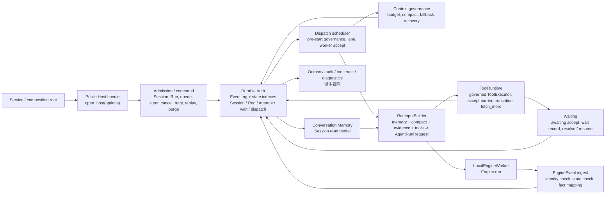

# Host 开发手册

本文档是 `dayu.host` 包的开发手册。

Host 在整体架构中位置如下：

```text
UI -> Service -> Host -> Engine
```

## Agent更新约束【必须遵守】

- 本文档只写两类内容：
  - 当前代码已实现的整个 Agent 的设计意图、架构边界，范围包括 `UI -> Service -> Host -> Engine`。
  - 当前代码已实现的 `dayu.host` package 的开发接口、公共契约、架构、稳定边界、主要组件、关键执行路径、状态机、事件流、关键机制、扩展点。
- 更新本文档时必须先核对 `dayu.host` 当前代码；代码真源高于 `docs/host/design.md`，设计文档只作为设计意图和术语边界参考。
- 必须按本文档现有章节职责写作：`设计意图` 和 `架构边界` 先说明整个 Agent 与 Host 位置；其后章节只说明 `dayu.host` package。
- 不写用户手册、安装运行命令、测试清单、文件级流水账或 review / work unit 过程状态。
- 不写未来计划、路线图、未落地能力或实现细节；只保留当前代码已经实现且对开发者稳定有用的说明。

## 设计意图

Dayu 是生产级通用 Agent，具备买方财报分析能力，核心范式是“宿主强约束下的 LLM in the loop”。

在整个 Agent 中，LLM 负责分析、推理和生成，但生命周期、取消、恢复、工具治理、事件事实、memory / context governance 与持久化事实由 Host 掌控。Host 位于 Service 与 Engine 之间，是 Session / Run / Attempt / EventLog / admission / dispatch / cancel / wait-resume / retry / replay / steer / memory / context governance / projection 的治理真源。

`dayu.host` 的设计重点是把多轮 Agent 运行放在可恢复、可审计、可治理的宿主边界内：

- Host 以 durable EventLog 与同事务状态索引作为事实真源；projection、memory、tool trace、audit、outbox 与 diagnostic 都是派生视图或观察记录。
- 同一 Session 的 active Run 由 Host admission 约束；queued Run 是 durable state，不是内存队列。
- Session public mutation 权限由 opener 内 attachment registry 唯一拥有；跨 opener 的 strict-native per-Session mutex 只决定 attachment 的不可变 read-write / read-only 模式，不代替 durable Run / Attempt truth。
- Engine 只执行单次 `AgentRunRequest`，不拥有 Session / Run / Attempt 生命周期；EngineEvent 必须经 Host identity、状态与幂等校验后才能变成 Host facts。
- 用户取消动作经 UI / Service 映射为 Host cancel command 后，Host 的公开承诺是 Codex / Claude Code 类体感：快速停止等待当前模型 / 工具执行并恢复可交互路径；旧模型输出、旧工具结果或旧 wait result 不能污染已取消 Run。该承诺不表示远端 LLM provider、外部 job 或第三方服务一定已经物理停止。
- 工具调用只通过 Host-owned ToolRuntime 进入业务工具；工具结果、等待、截断、`fetch_more` 与重复调用治理必须经过 Host accept barrier。
- accepted 工具结果投影给 Tool Trace、Read API、Conversation Memory、RunInputBuilder 与 compact material 时，查询语义、状态语义、结果摘要和业务 source 由 Host 统一投影；需要进入 LLM 上下文的工具名称、查询语义、业务来源和工具结果会先形成 typed evidence material，再由唯一 renderer 输出四行业务可读文本。下游消费者只消费该投影，不重新回读或猜测 request atom，也不各自拼接 evidence 文本。
- 上下文预算和 compact 治理由 Host 负责；Engine 只在 provider 明确报告上下文溢出时发出 `context_compaction_requested`。
- Conversation Memory 只消费 committed canonical facts 与 accepted compact 结果；persisted accepted compact candidate 在唯一严格 typed read boundary 恢复，非法 shape、digest 或 enum fail closed，Memory projection、compact material 与 RunInputBuilder 不各自解释 nested candidate JSON。assistant final answer 和普通工具证据不会自动成为 evidence-backed fact。descriptor-backed terminal answer continuity 由 Host terminal resolver 解析成 typed LLM-facing material，Memory projection 与 RunInputBuilder 不通过改写 EventLog payload 来投影回答文本。
- 财报业务语义、财报文档下载、预处理、处理与存取不属于 Host；财报文档存取必须通过 `dayu.fins.storage` 下的仓储协议与仓储实现完成。

## 架构边界

整体依赖方向固定为：

```text
UI -> Service -> Host -> Engine
```

- `UI` 负责展示、输入收集、流式订阅和用户动作触发。
- `Service` 负责业务入口、身份解析、配置 / scene / tool / runner 装配，并调用 Host。
- `Host` 负责 Agent 运行宿主边界、状态治理、持久化、工具运行时治理、memory / context governance、projection、恢复和取消。
- `Engine` 负责单次 run 的模型交互、Runner 协议归一、tool loop、取消观察和 `EngineEvent stream`。

Host 与其它层的稳定边界如下：

- Host 可以在本地 worker 边界调用 Engine public entry；Engine 不导入 Host，不读取 Host durable store，不管理 Session / Run / Attempt，不写 EventLog。
- Host 不导入 `dayu.service`、`dayu.ui` 或 `dayu.fins`，不解释 scene manifest，不扫描业务工具，不读取业务配置文件，不承载财报业务规则。
- Service / composition root 把配置、scene、tools、runner、policy 与 profile 显式映射成 Host typed inputs；Host 接收最终 typed value，不接收 raw config patch、profile lookup 或 extra payload。

公共包边界固定如下：

- `dayu.contracts` 是 Dayu Agent 公共契约包，承载 UI / Service / Host / Engine / ToolRuntime / tools 可共同使用的层中立数据与协议，例如 JSON 值、取消 token、工具声明、工具 schema、工具调用请求、工具执行 outcome、工具等待 outcome 和 `ToolExecutor`；它不承载 Host / Engine 状态机，也不承载业务事实。
- `dayu.engine.contracts` 是 Engine 专属契约包，承载 Host 调用 Engine 所需的 `AgentRunRequest`、`AgentPolicy`、`EngineEvent`、`RunnerEvent`、`RunnerSpec`、`AsyncRunner` 等边界类型；它定义 Host -> Engine 的单次 run contract，不是 Agent 全局公共运行时。
- `dayu.runtime` 是层中立运行期基础设施包，提供取消等待、日志级别、诊断文本脱敏、截断、filelock、lane 等可复用 helper；它不得依赖 `dayu.engine` / `dayu.host` / `dayu.service` / `dayu.ui` / `dayu.fins`，也不承载任何层的状态机或业务语义。
- 工具声明契约属于 `dayu.contracts`；具体工具实现、工具发现、工具权限、工具运行时治理、截断治理、长事务监控和工具审计属于 Host / ToolRuntime、runtime discovery、Service assembly 或具体工具包。Engine 只接收调用方传入的 `tool_schemas` 与 `tool_executor`。

## 接口

Service-facing opener 按 capability 分为两个无继承关系的异步协议：`open_host(options)` 返回 execution `Host`，`open_host_admin(options)` 返回纯 durable `HostAdmin`。execution opener 装配 scheduler、recovery、lane、worker 与可选 wait poller；admin opener 只接收 SQLite / artifact policy，不读取 scene、tool、model 或 secret，也不启动 recovery、projection catch-up、lane、worker 或 scheduler。两种 public handle 都不暴露 durable store、同步 command handle或内部 wakeup port。

execution public command / read / watch 统一提交给单 worker durable actor；command handle、actor store 与 SQLite connection 从创建、使用到关闭始终归属该 actor thread。scheduler 使用另一条独立、同 policy 的 store connection。actor transaction 的 after-commit scheduler wake 与 active worker cancel 通过同步 bridge 回到 opener event loop；caller cancellation 不取消已经开始的 actor future。

`Host` handle 当前提供：

- `attach_session(session_id)`：显式 attach 已存在的 Session；同一 handle 对同一 Session 只允许一个 live attachment。返回的 `HostSessionAttachment.access_mode` 在生命周期内保持不变；read-write attachment 完成 target recovery 后才返回，read-only attachment 可读取和订阅但不能发起 public mutation。
- `ensure_session(request)`：按 `(scope, slot_key)` 原子确保当前 Session。
- `create_session(request)`：显式创建新 Session，可选择重绑定 slot。
- `get_session(session_id)`：读取 Session snapshot。
- `get_run(run_id)`：读取 Run snapshot。Run 是否终态以 Host public `is_terminal_run_status(status)` 为准；终态 `RunSnapshot` 必须携带同状态的 `TerminalResultSummary`，非终态不得携带 terminal summary。
- `submit_followup(session_id, request)`：提交普通 queue 或 steer follow-up。
- `retry_run(run_id, request)`：基于失败源 Run 创建关联的新 Run。
- `replay_run(run_id, request)`：基于成功源 Run 创建 no-tool 结构修复 Run。
- `cancel_run(run_id, request)`：取消单个可治理 Run。
- `cancel_session_runs(session_id, request)`：取消 Session 下可治理的非终态 Run。
- `resolve_wait(wait_id, request)`：接收外部 wait result，由 Host 恢复或收口 Run。
- `close_session(session_id, request)`：关闭 Session 的新输入入口。
- `read_outbox_terminal_items(session_id, request)`：读取离线 terminal notification item。
- `drain_outbox_terminal_items(session_id, request)`：幂等标记 terminal notification item 已 drain。
- `watch_session_events(session_id)`：异步建立 live `HostSessionEvent` 订阅；调用方必须 `await` factory，successful return 表示 durable cursor transaction、per-Session reservation 与当前 runtime 瞬态订阅均已生效。订阅不授予 Session 修改权限，不 replay 建立前的瞬态增量，也不提供离线 replay cursor。
- `close()`：关闭当前 execution runtime；停止新 public call 后先用 finite shared deadline 关闭 wait poller、撤销全部 adapter observation token，再 drain actor command / wake，随后按 scheduler、Session Event Delivery owner、projection flush、actor handle、actor executor、scheduler store 的顺序释放资源。仍阻塞的 provider thread 不持 Host durable authority，supervisor 保持 `CLOSING`，最后一个 thread finally 后才变为 `STOPPED`。该操作不写用户 cancel / failed terminal facts。

`HostAdmin` handle 当前提供：

- `get_session(session_id)` 与 `list_sessions()`：读取 durable Session truth，不触发执行。
- `purge_session(session_id, request)`：清理已关闭且所有 Run 已终态的 Session 本地可恢复事实。
- `report_storage_usage()` 与 `run_storage_maintenance(request)`：读取 storage usage 或执行显式 maintenance；默认 maintenance 为 dry-run。
- `close()`：只关闭 admin actor、command handle、store 与 executor，重复关闭幂等。

包根还导出函数式 command / read facade：`ensure_session`、`create_session`、`get_session`、`list_sessions`、`get_run`、`submit_followup`、`retry_run`、`replay_run`、`cancel_run`、`cancel_session_runs`、`resolve_wait`、`close_session`、`purge_session`、`report_storage_usage`、`run_storage_maintenance`。普通 Service 优先使用 `open_host` 返回的异步 handle；低层 facade 不公开 durable store 或 scheduler 作为包根公共面。

`OpenHostOptions` 是 construction-time boundary，显式接收 durable SQLite 路径、artifact root、SQLite busy / retry policy、payload inline threshold、runtime lane 参数、worker factory、ordinary run baseline、tooling options、context budget policy、compactor baseline、memory projection policy、memory catch-up page size、Session Event Delivery policy 与 truncation manager 开关。process-backed 工具子进程 terminate / kill cleanup grace 属于 `HostToolingOptions.process_capsule_interrupt_policy`，不作为 `OpenHostOptions` 直接字段，也不改变 `AgentPolicy.tool_execution_timeout_seconds` 的业务执行 deadline 语义。

创建或确保 Session 本身不授予后续修改权限。`submit_followup`、steer、retry、replay、cancel、resolve wait、close、outbox drain 等 public mutation 都要求目标 Session 存在 active read-write attachment；read-only、recovering、closing 或 unattached 状态在创建 actor mutation Future 前 typed reject。attachment close 会先阻止新工作并 drain 已接受的 mutation / pre-start work，再释放跨进程机械互斥；同一 live attachment 不会在后台升级模式。

本地执行边界由 `LocalEngineWorkerFactory`、`LocalEngineWorker` 与 `LocalWorkerHandle` 表达。Host 创建 `AttemptDispatchSnapshot` 与 `AgentRunRequest`，worker 接住后返回 handle；Host 消费 handle 的 EngineEvent stream，并在 cancel 或 shutdown 时调用 handle 的关闭 / cancel hook。

## 调用者装配示例

Host 的稳定入口是 `open_host(options)` 返回的异步 `Host` handle。Service / composition root 负责把配置、scene、runner、tool discovery、Fins wait adapter、wait poll adapter registry、wait poller policy、context policy 和 worker factory 先映射成 `OpenHostOptions`；Host 不接收 raw config patch，也不在运行中扫描工具或业务配置。

### Open Host

调用方本地的 composition root 应先构造完整 `OpenHostOptions`，再进入 opener context：

```python
from dayu.host import open_host

options = build_open_host_options(
    workspace_root=workspace_root,
    runtime_config=runtime_config,
    worker_factory=worker_factory,
    business_tool_bundle=business_tool_bundle,
)

async with open_host(options) as host:
    session = await host.ensure_session(ensure_request)
    async with await host.attach_session(session.session_id):
        run = await host.submit_followup(session.session_id, followup_request)
```

`build_open_host_options(...)` 代表 Service / composition root 的本地装配函数，不是 Host public API。它必须产出完整 typed `OpenHostOptions`，包括 durable 路径、ordinary run baseline、worker factory、tooling options、context / memory policy 和可选 compactor baseline。

### Session 与 follow-up

Host public command 只接收 typed request：

```python
from dayu.host import (
    EnsureSessionRequest,
    FollowupBehavior,
    SubmitFollowupRequest,
)

ensure_request = EnsureSessionRequest(
    scope="workspace",
    slot_key=slot_key,
    metadata=(),
)

followup_request = SubmitFollowupRequest(
    context=operation_context,
    session_id=session.session_id,
    client_request_id=client_request_id,
    system_prompt=None,
    user_prompt=user_prompt,
    tool_names=None,
    runner_spec=None,
    runner_options=None,
    agent_policy=None,
    behavior=FollowupBehavior.QUEUE,
    target_run_id=None,
)
```

`tool_names=None` 表示使用 construction-time 业务工具全集；空集合表示禁用业务工具；非空集合表示只启用指定业务工具。`runner_spec`、`runner_options`、`agent_policy` 为完整 per-run typed override；为 `None` 时使用 `OpenHostOptions.ordinary_run_baseline`。

### Steer 与 cancel

`steer` 是同一 Run 内的改向，不创建新 Run。调用方必须指定同一 Session 当前 active 且状态为 `RUNNING` 或 `WAITING` 的 `target_run_id`：

```python
from dayu.host import FollowupBehavior, SubmitFollowupRequest

active_run_id = active_followup.accepted_run_id

steer_request = SubmitFollowupRequest(
    context=operation_context,
    session_id=session.session_id,
    client_request_id=steer_client_request_id,
    system_prompt=None,
    user_prompt=updated_user_prompt,
    tool_names=None,
    runner_spec=None,
    runner_options=None,
    agent_policy=None,
    behavior=FollowupBehavior.STEER,
    target_run_id=active_run_id,
)

steered = await host.submit_followup(session.session_id, steer_request)
```

`steered.accepted_run_id` 仍是 `target_run_id`；Host 会在该 Run 下创建新的 Attempt / execution。旧 Attempt 不会 resume；旧 active worker 若仍在运行，Host 在 commit 后只做 best-effort cancel 传播。

`cancel` 是 Host durable command。当前 public cancel mode 只有 `GRACEFUL`：

```python
from dayu.host import CancelMode, CancelRunRequest

cancel_request = CancelRunRequest(
    context=operation_context,
    client_request_id=cancel_client_request_id,
    reason="user_stop",
    mode=CancelMode.GRACEFUL,
)

cancelled = await host.cancel_run(active_run_id, cancel_request)
```

`cancelled` 是取消 command commit 后的最新 `RunSnapshot`。对于 active Run，Host 会写入 durable cancelling / cancelled 事实，并通过 active worker registry 传播取消；Host 关闭 / 取消本地 Engine worker event stream，向 Engine 注入 cancellation token，并由 ToolRuntime 对可抢占工具执行边界执行取消 / 超时治理。进入取消生命周期的 Run 会在 durable Run row 上保存 typed `cancel_request_event_id`，active watchdog、Engine cooperative cancel、dispatch 与 recovery 都以该 typed link 回查同 Run 的 `CANCEL_REQUESTED`，不从 `RUN_CANCELLING` payload 解析关键链路。每个 steer / cancel command 都必须使用自己的 `client_request_id` 作为幂等边界。

## Wait callback completion

Wait callback completion 是外部长事务完成后回到 Host wait-resume 管线的 typed callback 边界。它是 Host wait API 体系的一部分，但不是 Host 直接注册的 HTTP route。Service / Web transport 层负责解析 HTTP 方法、路径、header 与 body，并把结果映射成 Host 可理解的强类型 callback completion；Host 只接收已经归一化的 typed envelope、认证输入和调用上下文。

Host callback 路径的稳定链路如下：

```text
Service / Web transport
  -> WaitCallbackCompletionEnvelope
  -> DefaultWaitCallbackAdapter
  -> CallbackWaitResolvePort
  -> Host command-layer resolve_wait
  -> wait resolution facts + resume Attempt
```

`DefaultWaitCallbackAdapter` 的职责是 callback 边界预处理，不拥有 durable state transition：

- 先执行 callback authenticator；认证失败时不得读取 wait state，也不得调用 resolver。
- 读取 wait state 只用于 unknown wait、late cancel / lost 与 invalid wait state 的预分类。
- 使用与 direct `resolve_wait` 相同的 wait resolution digest helper 校验 callback payload；request id、认证材料、correlation metadata、`observed_at` 和 `completed_at` 不参与 outcome digest。
- callback adapter 不解析 `deadline_at` / `expires_at`，过期或非法等待时间边界由 Host wait owner 在 `resolve_wait` 管线内统一判定。
- 把通过预检的 callback completion 转成 `ResolveWaitRequest(source=CALLBACK)`，再通过 `CallbackWaitResolvePort` 进入 command-layer `resolve_wait`。
- 只返回 typed `WaitCallbackAdapterResult` 与 stable status / diagnostic code；不回显 outcome payload 或 credential material。

状态迁移仍由 Host 既有 `resolve_wait` 管线负责。同一 `(wait_id, idempotency_key)` 与相同 outcome digest 的重复 callback 是 replay；同 key 不同 outcome 是 idempotency conflict；已 cancel、已 terminal、已 resolved、failed 或 lost 的 late result 不恢复旧 Attempt。command-layer callback port 在非 replay 且创建 resume dispatch 时唤醒 dispatch，replay 不重复唤醒。

durable deadline expiry 由 wait state machine 的 common transaction-local helper 拥有。poll、callback 或 direct result 在 `observed_at` 已越过 durable boundary 时，Host 先把 Wait / Run 同事务收为 `FAILED`，写入固定 `wait_deadline_expired` failure fact，commit 后完成 projection 与 queue-promotion wake，再向迟到 caller 返回 `INVALID_STATE`；expiry 不是 `LOST`，deadline 后 provider success 不会被接受。同步 poll / abandon adapter 调用由 Host-owned bounded observation runner 执行，policy 明确限制单次调用、outstanding invocation 与 close drain；timeout/close 先把 token 从 `ACTIVE` 置为 `INVALIDATED`，迟到线程只能 dropped publish，不能写 durable state。

这个边界当前不包含真实 HTTP route、secret backend、HMAC / bearer verifier、生产 poller、physical cancel、Engine contract 或 UI surface。需要暴露 Web endpoint 时，应在 Host 外部的 Service / Web composition root 中注册路由，构造 framework-neutral request，注入 callback adapter，然后让 Host 按上述 typed callback path 处理。

## 公共契约

Host 公共契约分为 Host 专属契约、Dayu Agent 公共契约和 Engine 交互契约。

### Host 专属契约

- `SessionSnapshot` / `SessionStatus` / `SessionSlotRef`：Session 生命周期与 slot 绑定视图。
- `SessionListItem` / `ListSessionsResult`：全部未 purge Session 的 durable 列表摘要视图。
- `RunSnapshot` / `RunStatus` / `FollowupSnapshot` / `SourceRunRelation`：用户可见 Run 生命周期与 retry / replay 来源关系。
- `AttemptDispatchSnapshot` / `AttemptStatus`：Host 派发给 worker 的 Attempt 执行快照。
- request dataclass：`EnsureSessionRequest`、`CreateSessionRequest`、`SubmitFollowupRequest`、`RetryRunRequest`、`ReplayRunRequest`、`CancelRunRequest`、`CancelSessionRunsRequest`、`ResolveWaitRequest`、`CloseSessionRequest`、`PurgeSessionRequest`、outbox read / drain request。
- `HostEvent` / `HostEventClass` / `HostEventKind` / `HostActivityView` / `HostActivityKind` / `HostActivityStatus` / `HostActivitySeverity` / `HostActivityCounts` / `HostTerminalStatus` / `HostFinalAnswerView`：Host 从 committed EventLog 派生的 durable typed event view 与安全 activity view。
- `HostTransientDelta` / `HostTransientDeltaType` / `HostContentDelta` / `HostReasoningDelta` / `HostToolCallDelta` / `HostSessionEvent` / `HostSessionEventIterator`：Host 当前 runtime 内的三类 typed 瞬态增量及可显式关闭的 durable/transient 联合订阅契约；瞬态 envelope 携带已验证的 Run / Attempt / execution identity、runtime sequence 与 opaque dedupe key。
- `HostSessionEventDeliveryPolicy`：opener construction-time 的 item-only policy，显式约束单订阅 retained item 和单 Session subscription reservation 上限；两个字段都是 required 非 bool 正整数。
- `OutboxTerminalItem` / `OutboxTerminalItemsBatch` / `OutboxTerminalCursor` / `OutboxProjectionStatus` / `OutboxTerminalItemState`：离线 terminal notification 读取与 drain 契约。
- `HostApiError` / `HostApiErrorCode` / `HostApiErrorDetail`：public API 错误；Session delivery overflow 使用 non-retryable `DELIVERY_INTERRUPTED` 与 `HostSessionEventDeliveryDetail`，subscription cap 拒绝使用 retryable `RESOURCE_EXHAUSTED` 与 `HostSessionEventAdmissionDetail`；真实 Host availability 仍使用 `UNAVAILABLE`。
- `HostCallContext` / `OperationContext` / `AuthorizationClaim` / `HostMetadataEntry`：调用上下文、授权声明与稳定 metadata。
- `HostToolingOptions` / `FrameworkToolName` / `FrameworkToolPolicyView` / `ProcessCapsuleInterruptPolicy`：业务 ToolBundle、Host framework tool 与 process-backed capsule cleanup interrupt policy 的 construction-time 输入边界。
- `ContextBudgetPolicy` / `MemoryProjectionPolicy`：context governance 与 conversation memory projection 的 typed policy。
- `WaitCallbackCompletionEnvelope` / `WaitCallbackAuthInput` / `WaitCallbackAuthAccepted` / `WaitCallbackAuthRejected` / `WaitCallbackAdapterResult` / `WaitCallbackAdapterStatus`：framework-independent wait callback completion 契约。调用方在 Service/Web transport 层完成请求解析后，把强类型 envelope 交给 `DefaultWaitCallbackAdapter`；adapter 只做认证、payload digest 校验、late 预分类和 `ResolveWaitRequest(source=CALLBACK)` 转换，状态迁移与等待时间边界判定仍进入 Host `resolve_wait` 管线。
- `CallbackWaitResolvePort` / `CallbackWaitResolveResult` / `WaitCallbackStateReadPort`：callback adapter 接入 command-layer wait resolve 与 wait state 预读的端口契约。command-layer 实现必须保留现有 resolve wakeup 语义：非 replay 且创建 resume dispatch 时唤醒 dispatch，replay 不重复唤醒。

### Dayu Agent 公共契约

这些契约定义真源在 `dayu.contracts`，由 Host / Engine / ToolRuntime / 工具实现共同使用：

- `JsonValue`：公共 JSON 值类型。
- `CancellationToken`：跨层取消观察入口。
- `ToolSchema` 与工具声明相关类型：本次 run 暴露给模型的工具 schema 快照。
- `ToolExecutor` / `BatchToolExecutionRequest` / `BatchToolExecutionOutcome`：批式工具执行协议。
- `ToolCallRequest` / `ToolExecutionOutcome` / `ToolAwaitingOutcome`：单工具调用、普通结果、失败、取消和长事务等待 outcome。
- `ToolSourceRef` 等工具来源引用：用于记录业务工具来源与 digest；Host 不把工具来源引用解释成业务事实。

### Engine 交互契约

这些契约定义真源在 `dayu.engine.contracts`，Host 只用于构造单次 Engine 输入或 ingest Engine 输出：

- `AgentRunRequest`：Host 构造给 Engine 的单次 run 输入快照。
- `RunnerSpec` / `RunnerCallOptions` / `AgentPolicy`：Service / composition root 或 per-run request 显式传入的执行配置。
- `EngineEvent`：EngineEvent stream 的事件类型；进入 Host 前只是输入，不是 durable truth。
- `RunnerRequestIdentity` / client correlation：由 Host 提供 attempt / execution / runner call 上下文，Engine 派生 provider request correlation；该 id 不表达 Host lifecycle ownership。

## 架构

`dayu.host` 内部按 public API、opener、admission、durable truth、dispatch、EngineEvent ingest、ToolRuntime、waiting、context governance、memory 与 projection 分工。



```text
dayu.host
├── api / __init__              # Service-facing public contracts
├── open_host                   # opener runtime 与 async Host handle
├── admission / command         # durable command、queue、steer、cancel、retry、replay、purge
├── durable / event_log         # EventLog、state index、payload、projection、audit、purge truth
├── dispatch / local_proxy      # scheduler、lane、worker accept、active cancel、recovery closeout
├── engine_ingest               # EngineEvent -> Host facts / preview / diagnostic
├── transient_delta             # 当前 runtime 瞬态 delta fanout、overflow、terminal fence
├── run_input                   # EventLog / memory / compact / tool schemas -> AgentRunRequest
├── tool_runtime                # governed ToolExecutor、accept barrier、truncation、fetch_more
├── waiting / wait_adapter      # awaiting accept、wait record、resolve / resume
├── compaction / context_*      # context budget、compact material、compactor operation、fallback
├── memory                      # conversation memory read model
└── outbox / tool_trace / audit # 派生视图与诊断输出
```

核心对象只有 `Session`、`Run`、`Attempt` 与 `EventLog`。其它对象，例如 wait record、dispatch record、memory snapshot、outbox item、tool trace row、audit line、projection checkpoint、compact artifact 和 runtime lane claim，都是内部机制、派生视图或外部资源协调记录，不提升为同级治理真源。

## 稳定边界

Host 稳定边界是 durable command、typed request / snapshot、async subscription factory 返回的 `HostSessionEventIterator` live view、outbox terminal item，以及 execution `open_host(options)` / admin `open_host_admin(options)` 的 construction-time typed inputs。`HostSessionEvent` 是 durable `HostEvent` 与当前 runtime `HostTransientDelta` 的联合；只有前者来自 committed facts。`HostAdmin.list_sessions` 属于 typed read view：它从 durable Session / slot / Run state truth 生成全部未 purge Session 的列表摘要，不读取 projection truth，不触发 projection catch-up，也不启动执行。

Host 不负责：

- UI 展示、用户身份解析、权限系统、scene manifest 解释、workflow 编排或 CLI 参数解析。
- 模型配置加载、secret 解析、provider client 选择、prompt asset 拼装或工具 discovery。
- Engine 内部 iteration、RunnerEvent 解析、provider payload 构造、provider retry、length continuation 或 fallback Runner 调用。
- 财报业务语义、ticker 归一、财报下载、财报预处理 / 处理、XBRL 解析或文档仓储访问。
- 把 projection、outbox、audit、tool trace、memory snapshot、runtime lane 或 provider diagnostics 当成 EventLog truth。

Stream 术语固定如下：

- `EngineEvent stream`：Engine / worker 产出的单次 run 事件流，是 Host ingest 的输入。
- `Host durable event stream`：Host 从 committed EventLog 派生的 typed `HostEvent` view。
- `Host transient delta stream`：当前 Host runtime 内从已通过 identity / state 校验的 content、reasoning 与 tool-call delta 发布的 typed `HostTransientDelta`；不写 EventLog、不 replay、没有 durable cursor，也不参与恢复、memory、outbox 或 audit。
- `Host session live stream`：`watch_session_events(...)` 对 durable event 与 transient delta 的联合观察；只保证两个来源各自有序，不承诺跨来源的单一总序。
- `preview event`：EventLog 内面向 UI 流式体验的非真源事件；不能作为恢复、memory、terminal result 或 audit 的唯一依据。
- `outbox terminal items`：从 Host terminal facts 派生的离线通知队列；drain 只表示 Host outbox projection 状态，不表示外部 channel 投递成功。

## 主要组件

### Public API 与 opener

`api.py` 定义 public dataclass、enum、独立 `Host` / `HostAdmin` Protocol、error 与两类 opener options；包根 `__all__` 收口 Service-facing 导出。`open_host(options)` 负责装配 scheduler store、public durable actor、execution health gate、admission、scheduler、active worker registry、可选 wait poller、projection catch-up ports、context compactor 和本地 worker typed port；`open_host_admin(options)` 只装配 admin durable actor chain。Conversation Memory 的 required repair / catch-up 由 dispatch 前 correctness path 触发，opener 的 after-commit 热路径不执行 memory projection 追平。

### Admission 与 command

Admission 是 Session active Run、queue、steer、retry、replay、cancel、resolve wait、close 与 purge 的写入边界。它在 durable transaction 内写入 canonical facts、状态索引、幂等记录和必要 dispatch / wait / purge 记录；commit 后再唤醒 scheduler 或 projection。幂等 replay 会从最新 Run、current Attempt 与 dispatch row 重新派生 matching dispatch 或 pre-start governance wake，不能用 replay bool 跳过全部 wake。冻结的 effective execution snapshot 在恢复时先对 config canonical JSON 重算 digest，并同时验证 `policy_snapshot_digest` 与由该 digest 派生的 `policy_snapshot_ref`，任一不一致都在反序列化 typed config 前 fail closed。

### Durable EventLog 与状态索引

EventLog 分配全局 `event_sequence`，记录 canonical facts、preview、diagnostic 和 projection signal。canonical facts 与 Run / Attempt / Session / wait / dispatch 状态索引必须同事务推进；Host 读取与恢复以这些 durable rows 为准。

### Dispatch scheduler

Dispatch scheduler 只消费已提交的 accepted / queued / pending dispatch facts。它负责 pre-start governance、本地 runtime lane capacity、worker accept、active worker registry、EngineEvent stream 消费、terminal closeout、queue promotion 和 startup recovery wakeup。queued Run 的后续启动只由 scheduler 走 ordinary governance；admission、terminal closeout 与 cancel 只提交状态并发送 wakeup，不直接把 queued Run 提升为 `STARTING`。execution health gate 在 `STARTING / READY / UNAVAILABLE / CLOSING / CLOSED` 间提供 public new-work 与 scheduler fatal 的单一 lifecycle truth；new-work admission lease 覆盖 actor transaction、commit 后 wake 与 actor future。critical task 非预期退出提交稳定 typed fatal；durable transaction retry exhaustion 只按 poll interval 退避并重新 reconcile，不关闭 scheduler或取消 worker。

### RunInputBuilder

RunInputBuilder 只从 durable providers 读取当前 Run facts、Session continuity、conversation memory、compact artifact provenance、accepted tool evidence、fallback context、tool schema snapshot、ToolRuntime handle、scene parameters 和 policy snapshot，构造 `AgentRunRequest`。source Run 的 exact input fact 由共享 strict parser 恢复原始 policy，worker delegate 只能在 caller identity 与 source identity 一致时复用；startup replay、steer、wait resume 与 attachment recovery 都不能改读当前配置或用 loader fallback 重建历史输入。Session continuity 的 source refs 是每个 construction site 必须显式提供的 provenance；ordinary 路径使用空集合，wait resume 使用同源 request / accepted-result refs。它会把 Host 内部 id、payload ref、projection checkpoint、policy ref、digest 和 dispatch 状态改写为 LLM-facing 自解释 system sections，避免把宿主治理信息伪装成业务事实。普通 RunInput 不把 accepted compact artifact 渲染成第二条 system message；accepted compact 事实必须先由 Conversation Memory 物化后再进入普通输入，compact artifact event ref 与 memory latest compaction ref 不一致时走 memory repair / catch-up 边界。accepted tool evidence 的 ordinary raw tail 和 fallback 渲染只消费 accepted-result projection 产出的 typed material，并调用 `dayu.host.evidence` 的唯一 renderer；section routing 仍由 RunInputBuilder 的 system envelope policy 决定。descriptor-backed terminal answer continuity 只以 typed answer text 进入 LLM-facing messages，不把 descriptor、digest 或治理 label 当作回答内容。完成普通 runner input 装配后，RunInputBuilder 写入 bounded `RUNNER_CALL_INPUT_ASSEMBLED` manifest；ordinary、Engine continuation 与 compactor 共用同一个私有 manifest / hot contract owner，hot payload 只有固定 scalar 与显式 fixed-shape diagnostic atoms，不包含逐消息或 projector metadata 数组。该 owner 同时解析完整 manifest graph，校验 schema/identity、message count/index、message-to-metadata 引用、closed projector/purpose、projection descriptor pair 与 hot/manifest 同源关系。完整 LLM-facing messages、selected tool schema full JSON 与六字段 projector metadata 保存在可校验 descriptor graph 中，供 Tool Trace resolver 按需读取。

### EngineEvent ingest

EngineEvent ingest 校验 run / attempt / execution identity、当前 durable state 与 event type，再把 EngineEvent 转成 Host facts、preview、diagnostic 或当前 runtime 的 transient delta。`EngineEvent` 本身不是 truth；final answer、failure、cancel、lost、usage、iteration_started、context compaction request 和 awaiting confirmation 都必须经 Host ingest 才能影响 Host 状态。content、reasoning 与 tool-call delta 通过相同 identity / late-state 校验后只交给瞬态发布 owner，不创建 EventLog row。

worker clean EOF、stream error 与 worker crash 不是 EngineEvent。它们通过独立的 Host lifecycle closeout candidate、Host lifecycle event identity 与 source 进入同一个 durable terminal transaction；该路径不合成 `run_failed` EngineEvent，也不把 Host lifecycle source ref 写成 Engine event ref。

### ToolRuntime

ToolRuntime 把 construction-time `HostToolingOptions` 中的业务工具 bundle 与 Host framework tools 组合成 effective tool bundle，并向 Engine 提供受治理的 `ToolExecutor`。工具结果只有通过 Host accept barrier 后才会返回给 Engine；side-effect / paid tool 必须携带工具幂等键；attempt-local duplicate governance、run-scoped truncation cursor 和 optional `fetch_more` 都在 ToolRuntime 内治理。普通结果与 awaiting 接受路径共用同一个 canonical `TOOL_CALL_REQUESTED` writer contract：writer 只构造 request atom，调用方 append 后必须使用 EventLog 返回的真实 row / sequence。request atom 保存 Host 已接受的精确参数与同源 digest；`TOOL_AWAITING` 只保存等待治理字段和精确 `{event_id,event_sequence}` request link，不复制参数或 digest。

ToolRuntime 默认从 effective `ToolDefinition.execution` 选择执行 capsule：`async_direct` 直接运行 async callable，`thread_backed` 只表示可取消 wrapper awaitable、不承诺停止 OS thread，`process_backed` 通过可序列化 target factory 构造子进程目标。process-backed 子进程只返回 `dayu.contracts` 定义的 JSON 信封，Host capsule 将 `completed` / `failed` 信封映射为工具 outcome；failed 信封的 `hint` 会映射到结构化 `ToolResultFailure.hint`，不拼入 `message`。取消和超时仍由父进程 Host 治理独占处理。execution capability 与 process-backed 信封字段不进入 Engine-facing `ToolSchema` 或 LLM-facing schema。

长事务工具需要启动外部工作时，业务 callable 先返回 awaiting outcome；ToolRuntime 只在 Host awaiting accept ack 已 durable 成立后，才通过 construction-time activation registry 调用 provider 内部 activation adapter。该 adapter 不进入 Engine contract，也不暴露给 LLM-facing tool schema。

### Waiting

长事务工具返回 `ToolAwaitingOutcome` 时，ToolRuntime 先提交 awaiting facts；Host 在同一治理路径中创建 wait record，把 Run 推进为 `WAITING`、Attempt 推进为 `SUSPENDED`。外部结果通过 `resolve_wait` 回到 Host，Host 决定恢复、失败、取消或 lost。completed / cancelled 结果先以 accepted-result projection 的同一 strict owner 形成 planned typed continuity，再在新 Attempt 启动前提交 runner-call manifest；committed event id 必须与 planned ref 一致。failed / lost 直接终态收口，不生成 resume candidate、manifest、Attempt 或 dispatch。

Engine 不拥有 wait record、activation 或外部 job 生命周期。Engine 只观察 ToolRuntime 返回的 awaiting outcome，并在本次 run 内产出诊断性的 awaiting / suspended 事件；等待真源、activation 时机和后续 resume 都由 Host / ToolRuntime 治理。

Production wait poller 是 `open_host` 可选装配的 Host runtime。它使用 construction-time poll adapter registry 观察 durable wait record 指向的外部 job，并通过 durable claim / expiry / next-observe / backoff 控制可观察资格；调用 provider adapter 前，Host 只把 durable row 投影成 `WaitAdapterSnapshot(tool_name, resume_token, created_at)`，adapter 不接收 Host wait row、deadline / expiry、claim 或 state mutator。完成或 lost 时仍调用同一个 `resolve_wait` command path。正常 `not_ready` 只表示外部 job 仍在运行，poller 会短间隔复查；Host 等待时间边界拒绝、adapter error、missing adapter、resolve error 或 shutdown-skipped 才进入可重试 backoff，并分别写入有界 durable poll outcome。没有可 claim wait record 时，supervisor 使用 idle 间隔降低空查频率；有 active wait 但未到 next-observe / claim expiry 时，supervisor 睡眠到下一次 due 或 idle 上限，并可被本地 wakeup 打断。空轮询不逐轮输出空摘要日志。poller runtime diagnostics 保持在内存中，不写 EventLog，不成为业务事实或用户结论。

同步 adapter observation timeout 只是 Host poller 的本地边界诊断，不是外部 job 的业务结果。poll observation 超时时，Host 撤销该 observation token 的发布权、释放 claim 并按统一 backoff 真源安排重试，Run 与 wait record 继续保持 `WAITING`；线程随后返回的迟到 Ready / Lost 不能进入 `resolve_wait`。cancelled wait 的 abandon observation 超时同样只释放 claim 并保持 `CANCELLED` 可重试，不写 `poll_abandoned_at`。只有 adapter 明确返回 Ready / Lost，或 cancelled external lifecycle 明确返回 applied / unsupported / noop，才可沿各自 owner path 写入对应 durable 语义。

Host 不拥有 wait poller 的 deployment defaults。`WaitPollerRuntimePolicy` 的十二个字段、
`WaitPoller` 与 `WaitPollerSupervisor` 的 policy 都必须由 composition root 显式提供；
不存在无参 policy、模块数值默认或 `None` fallback。`OpenHostOptions.wait_poller_policy=None`
只表示本次 opener 不装配 poller；disabled policy 也不启动。enabled policy 必须同时具有
非空 poll adapter registry，否则在 opener 边界 fail closed。Host 只执行这些最终 typed
值，不从 scene、provider raw config 或工具名发明部署策略。

当 `WAITING` Run 已被 Host cancel 收口后，cancel command transaction 只写 Host durable wait / Run / Attempt 事实，不在事务内执行 provider I/O。后续由 production wait poller 在 cancelled wait row 上 claim，并把 row 投影为同一个 `WaitAdapterSnapshot` 后调用 provider wait adapter 的 external lifecycle 端口。adapter 可以返回三类封闭结果：`WaitExternalJobLifecycleApplied` 表示已执行 `CANCEL` / `REVOKE` / `ABANDON` 中的外部 lifecycle 动作，`WaitExternalJobLifecycleUnsupported` 表示该 wait 明确不支持外部 lifecycle 动作，`WaitExternalJobLifecycleNoop` 表示当前 wait 已无需或无法继续处理。Host poller 只把这些结果折叠成有界 durable outcome：`abandoned`、`abandon_unsupported` 或 `abandon_noop`；adapter 异常记录为 `error` / `abandon_error` 类诊断并按 backoff 重试，缺失 adapter 记录为 missing-adapter retry 诊断。Fins 当前装配的 wait adapter 使用 `ABANDON` 语义做 best-effort observation cancel / cleanup；Host 不把 Fins observation 细节写入自身业务事实。

### Context governance

Context governance 使用 `ContextBudgetPolicy`、完整 candidate 保守估算器、durable usage anchor、compact material、compact artifact store、LLM compactor 和 fallback selector 处理上下文预算。每个新 Attempt 在任何 start transition 前都必须先构造完整 candidate并计算 `E_current`；eligible candidate 还会在调用方同一 transaction snapshot 内按 EventLog sequence 倒序 keyset 扫描，由 strict complete manifest、唯一 accepted iteration link、严格 paired usage 与 accepted `ITERATION_COMPLETED` preview 的全 conjunction 选择最近 compatible anchor。provider、model、context window、estimator id/version、request semantics 或 accepted compact baseline 任一不兼容，以及任何 ambiguous、invalid、incomplete lineage gap，都会形成 barrier 并回退同一个完整 `E_current`，不会越过 barrier 查找更旧 anchor。compatible anchor 的 prediction 只由 sizing owner 按 `U_anchor + (E_current - E_anchor)` 计算，signed delta 不 clamp；范围或结果非法同样回退完整保守估算。

prediction 经 `ORDINARY`、`POST_COMPACT`、`DISPATCH_FALLBACK`、`REACTIVE_POST_COMPACT`、`CONTINUATION` 五个 stage 与三种 pressure 的十五格 closed action matrix 得到治理动作，再提交与 exact input 同源的 runner-call manifest。存在完整 policy 时，同一 transaction 按 manifest、deterministic `CONTEXT_BUDGET_EVALUATED` canonical fact、start / link transition 的顺序提交；policy 不可用时保持 manifest sizing unavailable 且不伪造预算 fact。ordinary dispatch、startup exact replay、running / waiting steer、completed / cancelled wait resume、reactive recovery 与 attachment recovery 都遵守相同 manifest-before-start 不变量；startup continuation 只从严格匹配的 source manifest 与 source budget fact 原样复用 accepted method、prediction、diagnostic、threshold 和 policy atoms，生成新的 continuation fact identity，不重新 resolve anchor，也不读取当前配置重估。Engine complete continuation 对新 candidate 在 ingest transaction 内解析 anchor，并直接记录实际 continuation input，不调用 pre-start candidate recorder。accepted compact immediate candidate（包括 reactive accepted compact）固定回退完整 conservative estimate，直到 compact boundary 后出现新的成功普通 call 才能刷新 anchor。accepted compact 后由 memory projection 消费，不直接改写 memory snapshot。proactive 与 reactive compact 都必须在 operation owner 内基于 accepted candidate 的业务文本与当前输入通过 compact 后 hard threshold 验收；candidate diagnostics 不参与预算。

### Conversation Memory

Conversation Memory 是 Session-level projection / read model，只消费 committed canonical facts 与 accepted `CONTEXT_COMPACTED` payload。它维护 selected recent window、evidence-backed facts、session summary、answer anchor、forward intent、reference continuity 和 diagnostics。Memory 可以重建，不是 EventLog truth。

### Outbox、audit 与 tool trace

Outbox 从 terminal facts 派生离线 terminal notification item；audit JSONL 记录操作流水和 destructive purge 诊断；tool trace 记录工具执行 hot rows 与诊断，并投影 context pressure、tool timing、failure metadata、runner-call manifest refs / digests 等只读结构化 signal。Tool Trace 在缺少 provider request id 但存在 client correlation id 时仍保留该诊断关联字段，不把客户端关联 id 伪装成 provider request id。Tool Trace 查询层提供 resolver，可从 refs/digests 按需恢复 runner input projection、selected tool schema snapshot、工具参数、工具结果 payload 和 terminal final answer；resolver 逐层验证调用方、descriptor、SQLite row 或 artifact 实际 bytes 的 ref / digest / size，并只接受 canonical JSON object。runner-call projector metadata summary 在查询时只从 full-manifest owner 返回的 typed validated manifest 重建，不从 hot arrays、raw strings 或只通过 bytes digest 的未校验 JSON 推断。hot row 与 cold JSONL 会保存 bounded 业务可读的工具请求 / 结果摘要；`TOOL_CALL_REQUESTED` 必须通过真实 EventLog row 和严格 request atom 解析 inline 或 descriptor-backed canonical arguments / query，再做 canonical JSON 序列化和长度限制，不按字段名屏蔽合法业务参数。request row 缺失、事件类型错误、storage 或 digest 损坏均 fail closed，不发布 hot/cold trace。`TOOL_RESULT_ACCEPTED` 只消费 accepted-result projection 的 typed LLM material：结果摘要来自 exact canonical result，业务来源只来自 producer 显式 `result.value.citation` object；无 citation 使用统一中性 unavailable 文案。opaque envelope refs、arguments descriptor ref / digest 与其它 internal provenance 只保留在 durable / audit / diagnostic row，不进入 readable summary。Tool Trace、Conversation Memory、RunInputBuilder 与 compact material 都把 canonical request material 和 typed accepted-result material 视为严格前置条件：envelope、request link、row、identity、request atom shape / digest 或 typed material 缺失、损坏或漂移时统一抛出 `HostDurableError`，不得 skip、fallback 或发布 limited evidence。它们都不能反向驱动 Run / Attempt 状态，也不能从 `TOOL_AWAITING` 或 wait / poll 治理状态推断 LLM-facing 业务语义。

`PROVIDER_DIAGNOSTIC` 是非致命诊断，只能作为 Read API `provider_diagnostic` / `info` activity 与 Tool Trace diagnostic 展示，不写 failure metadata，不进入 Outbox terminal item、Conversation Memory、final answer、accepted evidence material、compact material 或 LLM-facing prompt messages。fatal `PROVIDER_PROTOCOL_ERROR` 在 Read API 中使用独立 `provider_protocol_error` activity kind，避免 UI / Service 从 provider diagnostic kind 反推致命错误。

## 关键执行路径

### 打开与关闭 Host

```text
open_host(options)
  -> validate construction inputs
  -> open durable store and projection ports
  -> create STARTING health gate, admission service and scheduler
  -> run startup recovery scan
  -> mark READY and return async Host handle
  -> handle.close() / context exit enters CLOSING, drains admitted actor wake, then closes scheduler, projections, actor and stores
```

`Host.close()` 是 opener runtime lifecycle 操作，不等于 `close_session`，也不等于用户 cancel。关闭时 Host 会向 active worker 传播 lifecycle cancel 并释放本地资源；未终态 Run 的治理归下次 startup recovery。

### 普通 queue follow-up

```text
submit_followup(queue)
  -> durable admission commit
  -> scheduler wakeup
  -> pre-start context governance
  -> RUN_STARTED / ATTEMPT_STARTED / dispatch record
  -> lane acquire and durable recheck
  -> LocalEngineWorker.accept(...)
  -> ATTEMPT_RUNNING
  -> EngineEvent ingest
  -> terminal fact and queued promotion
```

`SubmitFollowupRequest.tool_names=None` 表示使用 construction-time 全量业务工具；空集合表示禁用业务工具；非空集合表示只启用指定工具名。unknown tool name 在 canonical facts 写入前失败。

### Steer、retry 与 replay

`submit_followup(steer)` 必须指定同 Session 当前 active `RUNNING` 或 `WAITING` Run；Host 在同一 Run 内追加 steer 输入，收口旧 Attempt，并创建新的 Attempt / dispatch。`retry_run` 基于失败源 Run 创建关联新 Run；`replay_run` 基于成功源 Run 创建 no-tool 结构修复 Run。三者都不复用旧 Attempt。

### Cancel

当前 public cancel mode 只有 `CancelMode.GRACEFUL`。`ACCEPTED` / `QUEUED` Run 可以直接 durable terminal；active Run 进入 cancel path 后，Host 通过 active worker registry best-effort 传播取消；`WAITING`、`RECOVERING` 和 pre-dispatch 状态有各自 durable cancel 收口路径。取消 token 的语义是阻止后续工作，不撤回已接受事实。

### Wait 与 resolve

```text
ToolAwaitingOutcome
  -> Host accepts awaiting facts
  -> Run WAITING / Attempt SUSPENDED
  -> resolve_wait(wait_id, outcome)
      -> completed / tool-cancelled: append tool result facts and create resume Attempt
      -> failed: Run FAILED
      -> lost: Run LOST
```

迟到、重复、已 terminal 或已 cancel 的 wait result 不会恢复旧 Attempt；Host 返回幂等结果、冲突或 diagnostic。

### Context compaction

proactive compact 发生在 Attempt 创建前。Host 在 dispatch 前估算当前输入与 memory / compact / evidence / tool schema 预算；超过 policy 阈值时写入 proactive `CONTEXT_COMPACTION_REQUESTED`，运行 compactor，接受合格 compact 后再继续普通 dispatch，或按 fallback / failure 路径收口。

reactive compact 只由 EngineEvent `context_compaction_requested` 触发。该事件来自 provider 明确报告输入上下文溢出，不来自 final candidate 的 `finish_reason=LENGTH`；`LENGTH` 表示模型达到输出上限，属于 Engine length continuation / degraded answer 机制。Host ingest reactive request 后会关闭当前 Attempt、把 Run 推进为 `RECOVERING`，冻结 overflow material，执行 compaction，再创建新的 recovery Attempt 或按 fallback / failure / cancel 路径收口。

每次 compactor proposal 都使用新的 Host-private linked attempt token：provider timeout 只取消当前 attempt child，Run / reactive operation parent 保持生命周期真源并拥有取消原因优先级。prepared proposal 先提交 runner-call manifest，再用同一个 child 重新观察 parent；proactive path 因此会在 provider 调用前重新读取 durable Run 前置条件，且不会跨 provider await 持有 Host transaction。

compact attempt 被拒绝时，Host 会在 `CONTEXT_COMPACTION_ATTEMPT_REJECTED` canonical payload 中保留 operation、attempt、failure stage、parser / validator、offending block locator、digest 与 diagnostic artifact ref 等小字段；若失败发生在 material projection 或 proposal 准备边界，raw previous compacted view / offending block text 只写入 Host diagnostic artifact，并通过 `payload_descriptors` 的 artifact descriptor 追踪，不进入 EventLog canonical payload、Conversation Memory、LLM-facing compact material 或普通 RunInput。

### Purge

`purge_session` 只接受已经 `CLOSED` 且所有 Run 均为终态、没有 active / queued / waiting / cancelling / recovering Run 的 Session。成功后，Host 删除目标 Session 的本地可恢复事实和派生视图数据，保留独立 purge tombstone、purge 幂等记录和 append-only audit JSONL。purge tombstone 不位于被 purge 的 Session EventLog 中，也不参与 resume、retry、replay、memory、RunInputBuilder 或普通 read truth。

### Storage Usage Report

`report_storage_usage` 是 operator-facing 只读诊断入口。它在 durable read transaction 内统计当前 Host SQLite 表 row count，读取 SQLite payload logical bytes、artifact descriptor logical bytes、未被 descriptor 引用的 SQLite payload row 数，并通过文件 `stat` 返回 DB / WAL 文件大小。该 report 不写 EventLog，不改变 Session / Run / Attempt 状态，不扫描 artifact root，不执行 checkpoint，也不删除文件或 row。

### Storage Maintenance

`run_storage_maintenance` 是 operator-facing 显式 maintenance 入口。它基于 `payload_descriptors` 中 `artifact_ref` 的 artifact 相对路径收集引用集合，只扫描 artifact root 下 `sha256/` 内容寻址 namespace，返回超过 grace window 的 orphan artifact 候选、已发布 artifact 物理字节和、usage report、memory snapshot integrity issues 与可选 WAL checkpoint 诊断。checkpoint 使用独立 durable connection，不在 command transaction 内执行。

maintenance 默认 dry-run，不删除 artifact 文件或 SQLite row。请求 `reclaim_orphan_artifacts=True` 时，只回收候选扫描证明为 orphan、且删除前 recheck 仍未被 descriptor 引用的 `sha256/` artifact 物理文件；失败的单文件删除以 `path`、`operation`、`message` 结构化诊断返回，成功删除的路径进入 `reclaimed_artifact_paths`。recheck 与 unlink 之间仍有极短 TOCTOU 窗口；默认 grace、content-addressed artifact 可重写性与 containment-guarded delete 用于降低风险。

maintenance 的 memory snapshot integrity issues 只报告 `invalid_json`、`schema_mismatch`、`digest_mismatch`、`unsupported_item_kind` 或 `storage_read_failed` 分类、短错误摘要和 row identity；不会内联 snapshot JSON、prompt、tool payload 或大内容。

maintenance 不删除任何 SQLite row，不回收 SQLite orphan payload row，不 quarantine / rebuild / overwrite memory snapshot，不执行 `VACUUM`、不启动 scheduler，也不处理 audit JSONL 或 tool-trace JSONL；SQLite space reclamation / VACUUM 继续归 Issue 76。audit JSONL、tool-trace JSONL、`.tmp` 和其它非 `sha256/` namespace 文件不参与 artifact orphan 候选。

## 状态机

### Session

Session 状态集合：

```text
OPEN
CLOSED
```

`OPEN` 允许新输入、queue、steer、读取 snapshot 与 live watch。`CLOSED` 关闭新输入入口，但不取消、不终止、不删除已有 Run；已有 active / queued / waiting / recovering Run 继续按 Host 状态机治理到终态。

### Run

Run 状态集合：

```text
ACCEPTED
QUEUED
RUNNING
WAITING
CANCELLING
RECOVERING
SUCCEEDED
FAILED
CANCELLED
LOST
```

Run 终态是 `SUCCEEDED`、`FAILED`、`CANCELLED`、`LOST`。`LOST` 表示 Host 无法确认或恢复执行结果，不等同于普通 `FAILED`。同一 Session 同时最多一个 active Run；queued Run 按 accepted `event_sequence` FIFO promotion。

### Attempt

Attempt 状态集合：

```text
STARTING
RUNNING
SUCCEEDED
FAILED
CANCELLED
SUSPENDED
STEERED
LOST
```

Attempt 是一次执行生命周期。旧 Attempt 永不 resume；wait resolve、steer、recovery、retry 与 replay 都创建新 Attempt 或新关联 Run。`execution_id` 用于拒绝迟到 Attempt 事件，不是 lease、fencing token 或远端 ownership。

## 事件流

Host EventLog event class 包括：

- `CANONICAL_FACT`：恢复、状态索引、memory、outbox、audit 和 Run terminal truth 的事实来源。
- `PREVIEW`：EventLog 内面向 UI 流式体验的展示事件，例如 iteration preview、content completed、tool batch ready / done、tool request / result accepted preview。content、reasoning 与 tool-call delta 都只作为当前 runtime 的 transient ingest 信号接受，三者均不写 EventLog，也不参与 durable replay。
- `DIAGNOSTIC`：诊断、拒绝、非致命 provider diagnostic、provider protocol、closeout、projection 或 recovery 观察。
- `PROJECTION_SIGNAL`：projection catch-up 与派生视图状态信号。

Host terminal event kind 包括 `SUCCEEDED`、`FAILED`、`CANCELLED`、`LOST`。`HostEvent` 是 Service-facing durable typed view，携带 `event_id`、`event_sequence`、`session_id`、`run_id`、EventLog public `event_class` / `event_type`、`kind`、可选 `HostActivityView`、dedupe key、terminal status、final answer 或错误 / cancel 摘要。progress event 不携带 terminal payload；succeeded terminal 必须携带 `HostFinalAnswerView`；failed / cancelled / lost terminal 不携带 final answer。`RUN_LOST` 是 Host terminal / read API 的 `lost` 事实，但 public outbox terminal item 只覆盖 succeeded / failed / cancelled，不把 lost 伪装成可投递 terminal item。`HostActivityView` 只承载 UI / Service 安全展示字段，工具 activity 的展示名来自 Host admission 冻结的 effective tool display snapshot，缺失时 fallback 稳定工具名；`CONTEXT_BUDGET_EVALUATED` 严格投影为 `CONTEXT_USAGE` activity，其 `HostContextUsageView` 只包含 prediction、window、未 clamp basis points、soft / hard threshold、estimate method 和真实 pressure 七个字段。raw `USAGE_REPORTED`、anchor diagnostic、policy ref 与 stage-aware action 不进入 public view，Host read 层也不从 raw usage 重算。

`HostTransientDelta` 是与 `HostEvent` 分离的 live-only typed envelope。Session Event Delivery owner 在 durable cursor transaction 前先占用 per-Session reservation，达到上限时以 retryable `RESOURCE_EXHAUSTED` 拒绝且不分配 mailbox、cursor transaction、iterator 或 task；successful async factory return 才表示 subscription 已 attach。每个 subscription 使用 item-bound mailbox 与唯一 in-flight 引用，二者合计为 retained item；pop 只转移单项，不用 batch drain，也不降低 retained count。包内 composition policy 为单订阅 `512` items、单 Session `4` subscriptions；该 policy 不承诺 logical bytes 或 resident heap 上界。

发布是 non-blocking fanout。prospective retained item 超过 policy 时，owner 立即把该 subscription 移出 fanout，保留已经接受的有序前缀；前缀耗尽后 iterator 抛出 non-retryable `DELIVERY_INTERRUPTED`，detail reason 为 `TRANSIENT_MAILBOX_OVERFLOW`。该错误只表示当前订阅连续性交付中断，不是 Host availability，也不阻塞其它 watcher、terminal append 或 Run。durable terminal 在同一 watcher 上建立 Run-local fence：先交付已接受的 delta 前缀，再交付 terminal，terminal 后不再交付该 Run 的迟到 delta。Host close、显式 `aclose()`、迭代取消或错误终止都会清空 retained state 并释放 reservation；这些动作不取消 Run，也不伪造 terminal fact。

EngineEvent ingest、transient publish 与 HostEvent projection 是三条边界：

- EngineEvent 进入 Host 前只是 worker 输入；Host 必须校验 identity 与 durable state。
- 三类 delta 校验通过后进入当前 runtime transient hub；它们不写 EventLog，订阅只观察 attach 后的增量。
- HostEvent 是 EventLog 派生 view；watch 只观察 attach 后的 durable events，离线 terminal 通知走 outbox terminal read / drain。
- failed terminal public projection 可在原始错误消息后追加 `provider_request_id` / `client_correlation_id` 诊断后缀；后缀只来自 terminal payload 已有字段，不改写 EventLog payload message 或 payload digest。

Runner call manifest 由 Host 在 RunInputBuilder 装配普通 runner input 时写入 `RUNNER_CALL_INPUT_ASSEMBLED`。Engine `iteration_started` 到达后，Host ingest 将未关联 manifest 显式链接为 `RUNNER_CALL_INPUT_ITERATION_LINKED`；missing、ambiguous、mismatch 或 link conflict 都 fail closed 为 `ENGINE_EVENT_REJECTED`。工具结果进入下一轮时，Engine `iteration_started.input_projection` 提供本轮真实 messages 的中性投影，Host ingest 将其保存为 runner-call projection payload，并写 continuation-owned limited-signal manifest；observed projection 完整时该 envelope 的 diagnostic 可以是 `complete`，但它不是 pre-start complete candidate manifest。旧事件缺少 projection 时 diagnostic 为 `limited_signal(missing_projection_artifact)`。

## 关键机制

### Admission 与 active slot

Admission 是所有 Run 输入的 durable 入口。它在事务内判断 Session 状态、active / start-blocking Run、queue 顺序、steer 目标、tool selection、幂等语义和 request digest。显式请求字段必须进入 typed request；不得把语义字段塞进 metadata 或 extra payload。

业务工具选择由 admission 冻结为完整 typed effective facts：selector 只保留调用方意图，exact effective names、完整业务 bundle digest、selected schema digest、display snapshot 与 source refs 才是后续执行真源。dispatch 在创建 Attempt 前以当前 construction-time runtime 逐项校验这些冻结事实，`all` 也只消费 admission 时的 exact names，不按当前配置重新选择；bundle、schema、source 或 digest 漂移一律在 start 前 fail closed。永久 no-tool 的 repair replay 使用独立 empty bundle/schema/source truth，不读取当前业务工具配置。

同一 Session 的 active slot 由 durable Run 状态决定，不由 scheduler 内存队列决定。显式 start-run queue policy 只允许 `queue`、`reject`、`attach_active` 三种取值，并由 Host queue policy owner 统一校验；fresh durable schema 对 `host_runs.queue_policy` 使用同一闭集 CHECK。`submit_followup(queue)` 在没有 active / start-blocking Run 时创建 `ACCEPTED` Run，有 active / start-blocking Run 时创建 `QUEUED` Run；queued promotion 按 accepted `event_sequence` FIFO。unknown tool name、closed Session、幂等语义冲突等错误都必须在 canonical facts 写入前 fail closed。

### Steer

`submit_followup(steer)` 是同一 Run 内的改向机制，不创建新 Run。请求必须指定 `target_run_id`，且目标必须是同 Session 当前 active 的 `RUNNING` 或 `WAITING` Run。Host 在同一事务内写入新的 `USER_INPUT_ACCEPTED` 与 `STEER_REQUESTED` canonical facts，并按目标状态收口旧执行边界：

- 目标为 `RUNNING` 时，Host 写入 `ATTEMPT_STEERED`，把当前 Attempt 终态置为 `STEERED`。
- 目标为 `WAITING` 时，Host 取消目标 Run 的 active wait records，避免旧等待结果再恢复旧 Attempt。

随后 Host 在同一 Run 下创建新的 Attempt / execution / dispatch record。steer 后旧 Attempt 不会 resume；如果旧 active worker 仍在运行，commit 后只做 best-effort cancel 传播，真实状态仍以新写入的 EventLog 与 Attempt index 为准。

### Cancel

当前 public cancel mode 只有 `CancelMode.GRACEFUL`。cancel 是 Host durable command，不是直接杀 worker，也不是撤回已接受事实：

- `ACCEPTED` / `QUEUED` Run 可直接写入 cancel request 与 `RUN_CANCELLED` terminal，并释放 queue promotion 资格。
- pre-worker `STARTING` Attempt 可在 worker accept 前直接写入 Attempt / Run cancelled。
- active `RUNNING` / `CANCELLING` Run 会写入 `RUN_CANCELLING` 并在 Run row 保存 typed `cancel_request_event_id`。提交 cancel 的 opener 先按含 Session 的精确 worker identity 走本地 fast path，并只唤醒目标 Session watchdog；fresh read-write attach 也只恢复目标 Session。实际拥有 worker 的 scheduler 周期性快照自己的精确 `(session_id, run_id, attempt_id, execution_id)`，用 dispatch owner 与 durable cancel link 读取 strict typed target，再向同一 worker 的 Engine cancellation token 与 `LocalWorkerHandle.on_cancel(reason)` 传播。该查询不按 terminal Run status 过滤，因此 caller watchdog 先完成 durable closeout也不会抹掉物理传播控制事实；identity、current Attempt / execution 或 dispatch owner 漂移时则过滤 stale target。linked cancel event 缺失、错链、非 canonical 或 payload / digest 非法均 fail closed。terminal closeout 仍复用既有 accepted-cancel watchdog transition，不创建第二套 cancel 状态 owner。该收口不表示底层 provider / tool 已被物理杀停。
- active worker event stream 在取消路径上会被关闭或取消，避免 Host 继续等待旧模型流自然结束；迟到 EngineEvent 进入 Host 前必须通过 identity 与状态校验，不匹配当前 durable state 时 fail closed 为 rejected / diagnostic。
- Doc、Fins read 与 Web blocking 工具生产路径声明为 process-backed execution；取消或超时时，ToolRuntime 父进程治理返回 `tool_runtime_cancelled` / `tool_runtime_timeout` 类结果，并对进程边界执行 terminate / kill cleanup。子进程不得返回 `awaiting`、`cancelled`、`timeout` 或 `host_cancelled` 等 Host-governed 信封；迟到工具结果不能越过 Host accept barrier。
- WAITING Run 取消只收口 Host durable wait / Run / Attempt 事实，不在 command transaction 内等待 provider I/O；外部 lifecycle 由 wait poller / adapter best-effort 处理，迟到 wait result 不会恢复旧 Attempt。
- `WAITING` Run 直接收口 wait 与 Run cancel，不恢复旧 Attempt。
- `RECOVERING` Run 可在 recovery dispatch 前直接 cancel，释放 active slot。
- 已 terminal Run 的 cancel 只记录幂等 ack 并返回当前 terminal snapshot，不改写 terminal truth。

单 Run cancel 的 supported、deferred、terminal 与 conflict 分类全部来自 admission write transaction 的同一 Run/Attempt/dispatch snapshot；command facade 不在错误后另开 read transaction重判。只有首次释放 active slot 的结果会投递 queue-promotion wake，幂等 replay、terminal loser 与未提交 mutation 的分类不会重复 wake。

`cancel_session_runs` 按 Session 扫描当前支持的非终态目标，覆盖 queued、pre-dispatch、active worker、waiting 与 recovering Run；遇到不在支持子集内的非终态状态时 fail closed，避免部分状态被误取消。

### Resume

resume 只来自 `resolve_wait`，不是旧 Agent / Runner 的继续执行。长事务工具返回 `ToolAwaitingOutcome` 后，ToolRuntime 先进入 Host awaiting accept path；Host 在单个 durable transaction 内写入 canonical `TOOL_CALL_REQUESTED` request atom、只含治理字段与显式 request link 的 `TOOL_AWAITING`、`RUN_WAITING`、`ATTEMPT_SUSPENDED`，创建 wait record，并把 Run / Attempt 推进到 `WAITING` / `SUSPENDED`。

外部长事务完成后，调用方通过 `resolve_wait(wait_id, request)` 把结果交回 Host：

wait resolution transition 在任何事实或状态写入前，要求 active WaitRecord 的 execution identity 与挂起的 source Attempt 完全一致；`TOOL_RESULT_ACCEPTED` 始终归属该 source Attempt / execution，不借用新建 resume Attempt 的 identity，也不留空 identity。

- completed 或 tool-cancelled outcome 会关闭 wait record，写入 wait resolution 对应的 tool result facts，追加 `RESUME_REQUESTED`，再为同一 Run 创建新的 resume Attempt / execution / dispatch record。
- failed outcome 使 Run 进入 `FAILED`。
- lost outcome 使 Run 进入 `LOST`。
- 已 cancel、已 terminal、已 resolved / failed / lost 的 late result 不会恢复 Run；Host 只返回幂等结果、冲突或 `WAIT_LATE_RESULT_REJECTED` 诊断。

resume Attempt 的 runner input 会把当前用户请求、使用 exact canonical replay 参数重建的工具调用、以及已完成工具结果按模型工具协议重建为 LLM-facing 消息；replay identity 与参数只来自 `TOOL_RESULT_ACCEPTED` accepted evidence envelope 指向的 `TOOL_CALL_REQUESTED` request atom，并要求 arguments payload digest、normalized arguments digest 与 envelope identity 同源。canonical request material 缺失、错链或 digest 漂移时抛出 `HostDurableError`，不投影恢复说明或伪造工具调用。

因此 wait-resume 的稳定边界是“新 Attempt 恢复同一 Run”，不是恢复旧 Engine 生成器、旧 Runner HTTP stream 或旧工具调用栈。

### Dispatch

Dispatch scheduler 不从内存队列恢复状态，只扫描 durable accepted / queued / pending dispatch facts。standard path 是 dispatch 前执行 context governance，写入 `RUN_STARTED` / `ATTEMPT_STARTED` / dispatch record，然后 acquire runtime lane、durable recheck、调用 `LocalEngineWorker.accept(...)`，最后写入 `ATTEMPT_RUNNING` 并消费 worker 的 EngineEvent stream。

runtime lane 只表达资源容量，不能证明 worker ownership。lane acquire 成功后仍要重新读取 durable state；worker startup timeout、worker accept failure、worker stream crash、cancel 后 clean EOF、非 cancel clean EOF 都由 Host closeout 成结构化 terminal 或 diagnostic。worker EOF / crash closeout 使用 Host lifecycle identity，不借用 EngineEvent identity；`CANCELLING` 下该 signal 只产生 Host lifecycle diagnostic，terminal cancel 仍由 accepted-cancel watchdog 或既有 terminal first-committer 拥有。caller cancel 与 fresh read-write attach 只唤醒目标 Session watchdog；scheduler 的 periodic reconcile 先快照本 opener 的 active worker exact identities，再只读取这些 identities 中由自己 dispatch ownership 持有且具有合法 durable cancel link 的 target。它不做 workspace-wide cancelling scan，不凭 Session attachment 接管旧 worker。terminal closeout 后，scheduler 唤醒同 Session queued promotion。

### Host 启动恢复

如果 LLM / Engine 还没返回时 Host 进程退出，Host 不在退出瞬间伪造 terminal facts；已写入 durable store 的 Run / Attempt / dispatch row 会留给下一次 `open_host` 的 startup recovery scanner 处理。

startup recovery 读取 durable Run / Attempt / dispatch / Host instance liveness truth，并调用 `recovery_process.classify_orphan_candidate(...)` 做只读 positive orphan proof 分类：

- `ACCEPTED` 与 `QUEUED` 不被判 lost；scanner 只唤醒 dispatch 或 queue promotion。
- `WAITING` 不自动恢复；等待外部 `resolve_wait` 或 cancel。
- `RUNNING` / `CANCELLING` 只有在 positive orphan proof 成立并通过 CAS recheck 后才收口旧 Attempt；带 accepted cancel facts 的 `CANCELLING` Run 由 watchdog 收口为 `CANCELLED`，startup recovery 不先转为 `LOST`。
- `RECOVERING` 若 recovery dispatch 次数未超过上限，会创建新的 recovery Attempt / execution / pending dispatch；超过上限或缺少可恢复事实时转为 `LOST`。

scanner 在 durable actor 独占的连接上冻结本轮 `policy.now` 与 non-terminal Run upper watermark，并按 `(accepted_event_sequence, run_id)` keyset 读取有界 page；每个 page 独立提交 write transaction，默认最多处理 64 个 Run，不使用 offset。matching dispatch / queue-promotion wake 只在所属 page commit 后经 opener-loop bridge 投递。全部 page 与 wake 完成后 execution health 才从 `STARTING` 进入 `READY`；任一 batch、invariant 或 wake 失败都会中止 opener，后续 healthy opener 只依赖 durable facts 重新扫描，不依赖进程内 offset。

positive orphan proof 需要 durable owner liveness 与本机进程证据支持，例如 owner 已 `STOPPED`、pid 缺失、pid 被复用且 start token / boot id 不匹配等。heartbeat stale 单独不构成 takeover proof；runtime lane TTL、projection lag 或 worker 没有返回也不构成 Host recovery truth。

Session attachment 使用独立的 target recovery：read-write allocation 先处于 recovering，扫描只绑定目标 Session 的 fixed watermark 与有界 page；page commit 后才唤醒对应 dispatch / promotion，并在 target active cancel watchdog 与 recovery 全部收口后激活 attachment。read-only attachment 不运行 recovery，unattached opener 也不扫描其它 Session。稳定旧 Attempt 可以由原 scheduler 继续收口，但 detach 后不再获得新工作资格。

### EngineEvent ingest

Host ingest 对 Engine-origin final answer、run failed、cancelled、usage、iteration_started、provider diagnostic、tool awaiting confirmation 与 context compaction request 分别建模；worker lost 属于独立 Host lifecycle path。final answer 内容有效性由 Engine 判定，Host ingest 只消费 Engine 已接受的 final answer；空白或纯空白回答必须由 Engine 以 `run_failed(runner_empty_final_content)` 上报，而不是由 Host 用另一套谓词修补。EngineEvent 进入 Host 前只是 worker 输入，必须匹配 run / attempt / execution identity 与当前 durable state；迟到、错 execution、错状态或无法链接 runner-call manifest 的事件会 fail closed 为 diagnostic / rejected path。Host lifecycle path 同样校验 durable identity，但使用自己的 event namespace、source 与 late-event routing。Engine typed failure code 只在 ingest 边界通过 Engine serializer 写成 durable 文本；Read API、Tool Trace、Outbox 与 public HostEvent 只读取 durable payload，不检查 provider / runner-specific wrapper internals。

同步 ingest 不处理需要异步 compact 的 reactive path；异步 ingest 在必要时执行 reactive compact / recovery。`iteration_started` 会显式链接 Host 先前写入的 `RUNNER_CALL_INPUT_ASSEMBLED` manifest；missing、ambiguous、mismatch 或 link conflict 都以 `ENGINE_EVENT_REJECTED` 收口，避免 provider observation 与 Host input manifest 脱节。已有 prior iteration 后的 Engine-only continuation 使用 `iteration_started.input_projection` 保存真实 runner input projection；projection 缺失时保留 limited diagnostic。

### ToolRuntime accept barrier

ToolRuntime 只有在 Host 接受工具事实后才向 Engine 返回 batch outcome。业务工具实现只返回语义 outcome；工具调用请求、工具结果、awaiting facts、payload descriptor、tool trace 与 diagnostic 都由 Host / ToolRuntime 统一治理。side-effect / paid tool 缺少工具幂等键会被治理为工具失败，避免没有幂等边界的副作用工具绕过 Host。

### 重复调用治理

重复调用治理是 attempt-scoped、ToolRuntime-owned 的内存治理机制，不是 durable cross-attempt 事实。治理 key 由 Attempt id、工具名、工具身份 digest、规范化参数 digest 与可选 semantic duplicate key 组成，不包含 `index_in_iteration`，因此同一 Attempt 内相同语义请求会被识别。

当前 duplicate decision 包括：

- `ALLOW`：允许重复执行。
- `REUSE`：要求模型复用上一次 accepted 结果。
- `HINT`：提示优先复用，只有证据范围不同才重新调用。
- `REQUIRE_JUSTIFICATION`：要求参数中给出重复调用理由。
- `HARD_STOP`：拒绝本次重复调用，返回受治理工具失败。
- `DURABLE_MISSING`：先前 in-flight owner 没有产生可复用 accepted fact 时的治理结果。
- `AWAITING_FANOUT`：先前 in-flight owner 已被 Host accepted 为等待中间态时，后续重复请求共享同一个 owner awaiting outcome；这是 Host internal 防御分支，不是普通 completed result 复用。

该机制会跟踪 attempt-local in-flight owner 与 waiter；owner 产生 accepted fact 后，后续重复请求可按策略复用或被治理。owner 被 Host accepted 为等待中间态后，会记录 attempt-local terminal marker，避免 cleanup 把已 accepted awaiting 误标为 durable-missing。若 owner cancelled、工具异常、Host accept rejected / timeout 或调用在 accept 前被治理，则记录 durable-missing reason。steer、resume、recovery、retry、replay 都创建新 Attempt 或新 Run，因此不会继承旧 Attempt 的重复治理内存状态。

### Truncation 与 fetch_more

工具声明启用截断时，ToolRuntime 会按 effective truncate spec 对结果截断，并创建 run-scoped、短期、一次性 cursor。`FrameworkToolName.FETCH_MORE` 是 Host framework tool 名称；只有 framework policy 启用时才注入给 Engine。

### Context budget 与 compaction

`ContextBudgetPolicy.context_window_size` 是 Host 的上下文窗口 typed 输入；Service / composition root 通常从模型配置的 `context_window_tokens` 映射而来。Host 以 ratio-first policy 派生 soft / hard threshold，并用完整 candidate estimate 与可选 compatible anchor 判断 proactive compact 或 reactive recovery。当前 dispatch-relevant budget fact 即使 provider 不返回 usage 也会以 `conservative_fallback` 完整成立，并保存实际 pressure 与 stage-aware decision；存在严格 compatible anchor 时 method 为 `usage_anchored`。超过 context window 时 utilization basis points 保持未 clamp。usage presence 只由实际 durable `USAGE_REPORTED` 证明；`supports_stream_usage` 仅进入 request semantics compatibility，不能推断 usage 存在。usage 只能校准后续 candidate，不能回头修改已经完成的 dispatch decision。Engine usage 事件携带 provider request id 时，Host ingest 会把它写入 durable usage projection signal 与 usage observation diagnostic；缺失时保持 `None`，不使用 client correlation id 伪装 provider id。

proactive compact 发生在 Attempt 创建前；同一 Run / input 最多创建一个 durable proactive operation，operation id 与其 request event id 同源。operation 在 request 中冻结 source identity、material refs 与 semantic proposal attempt budget，每个 prepared proposal 先写 manifest，crash 后按已提交 attempt number 继续剩余预算；重复 wake 只恢复或收口同一 operation，不创建第二个 request。预算超限时 Host 运行 compactor，接受合格 compact 后继续普通 dispatch，失败时按 fallback / failure path 收口。reactive compact 只由 EngineEvent `context_compaction_requested` 触发，并继续受单 Run reactive operation 上限约束；Host 关闭当前 Attempt、把 Run 推进为 `RECOVERING`，冻结 overflow material，再执行 compact 并创建 recovery Attempt。proactive 与 reactive operation 共用单 operation semantic proposal attempt 预算，Runner transport retry 不计入该预算；`finish_reason=LENGTH` 表示模型输出上限，不触发 reactive compact。

### Conversation Memory projection

Conversation Memory 是 Host 最重要的 Session-level read model 之一。它的定义真源在 `dayu.host.memory`，consumer id 固定为 `host.memory.session.v1`，schema version 为 `conversation_memory_snapshot_v1`。Memory 只消费已提交的 EventLog canonical facts 与 accepted vNext compact payload；它可由 ordered EventLog events 确定性重建，不导入 Engine / Service / UI / Fins，也不写 Run / Attempt 状态。

Memory 当前只投影这些事件：

- `USER_INPUT_ACCEPTED`：生成 selected recent window 的 user item。
- `RUN_SUCCEEDED`：从 terminal answer continuity 中提取 assistant item；缺失可读 final answer 时跳过，不用 payload ref / digest / event id 补洞。
- `TOOL_RESULT_ACCEPTED`：生成 self-explaining readable evidence item；durable memory consumer 先通过 Host accepted result projection 取得非空 typed LLM evidence material，Conversation Memory 总是调用 `dayu.host.evidence` 的唯一 renderer 得到工具名称、查询语义、业务来源和工具结果四行文本。canonical accepted result 缺 typed material 时在 Memory owner boundary 抛出 `HostDurableError`，不 skip、不 fallback，也不从 envelope、request atom 或 raw outcome 重建 accepted evidence；正常 readable evidence 不暴露 tool call id、EventLog id、payload / artifact ref、digest、opaque provenance ref、wait / poll / cancel lifecycle或实现类型名。
- `CONTEXT_COMPACTED`：读取 accepted `conversation_compact_output_v1` candidate，物化 session summary、evidence-backed facts、answer anchors、forward intents、reference continuity items，并记录 latest compaction event ref；candidate 未提供 session summary replacement 时保留既有 Session Summary Memory。

Memory 不消费 Host waiting lifecycle 事件。`TOOL_AWAITING`、`RUN_WAITING`、`CANCEL_REQUESTED`、`RUN_CANCELLED`、wait record、poller outcome 与 abandon 只属于 Host durable / audit / wait governance，不进入 LLM-facing memory schema；有无 awaiting 执行机制不能改变下一轮 memory 语义。长事务完成后的可读结果必须经普通 tool result / resume summary 路径进入模型上下文。

snapshot 包含五类稳定视图：

- Trace Memory：`selected_recent_window` 与 reference continuity items。
- Evidence / Fact Memory：accepted compact 生成的 evidence-backed facts，以及 recent evidence items。
- Session Summary Memory：accepted compact 的 session summary。
- Answer Anchor Memory：用于后续回答连续性的 anchors。
- Forward Intent Memory：用于下一轮继续推进的意图线索。

Memory policy 是按语义分区的 budget 模型，不是简单截断全文。`MemoryProjectionPolicy` 包含 `context_window_size`、selected recent window item / char cap、selected recent turn floor、fallback selected recent caps、evidence fact floor / cap、session summary cap、answer anchor cap、forward intent cap、reference continuity floor / cap、inline delta repair 上限和 `policy_ref`。projection 会按 item 数量、字符预算和 floor/cap 裁剪，并生成 budget diagnostics；facts 会按 claim/evidence 去重合并。

snapshot 自带稳定 `snapshot_id`、policy digest、cursor、built_at 与 snapshot digest。cursor 记录当前覆盖到的 EventLog `checkpoint_event_sequence` / `checkpoint_event_id`；projection lag、snapshot missing / damaged、snapshot ahead、inline delta repair 等情况以 typed diagnostics 表达。RunInputBuilder 可以在 snapshot 轻微滞后时用 EventLog delta 做 inline repair；超过 policy 上限时必须走 repair / catch-up 路径，而不是让模型看到不一致 memory。Memory repair / catch-up 的 batch size 只控制单页读取和事务粒度；required path 会追到目标 cursor、idle 或 failure，不把 page size 当作正确性停止预算。

Memory 与 compact 的关系必须保持单向：Context Governance / compactor 产出 accepted `CONTEXT_COMPACTED` fact 和 artifact；Memory projection 消费它并更新 read model。Memory 不直接写 compact artifact，不把 failed compact fallback 写成 compact 成功，也不把普通 final answer 或工具结果自动升级为 evidence-backed fact。ordinary RunInput 可以读取 memory snapshot 作为已物化 read model；pre-dispatch compact material 则由 EventLog / payload / artifact truth 构造 latest accepted compact、post-compact delta 与 current input anchor，不把 memory snapshot 当 compact input truth。latest accepted compact 会一次性生成 previous compacted blocks 与 typed readable view pair，后续 pipeline 只能同步过滤该 pair，不能从字符串或 snapshot 重新解析同一语义。任何 Run / Attempt truth 仍只来自 EventLog 与状态索引。

### LLM-facing 输入改写

RunInputBuilder 负责把 Host 内部治理事实转成模型完成当前任务所需的自解释输入。它从 durable providers 读取当前 Run facts、Session continuity、Conversation Memory、compact artifact、accepted tool evidence、fallback context、tool schema snapshot、ToolRuntime handle、scene parameters 和 policy snapshot，构造单次 `AgentRunRequest`。

LLM-facing 文本不得要求模型理解 event id、payload ref、dispatch id、policy ref、projection checkpoint、runner call manifest 或 Host state machine；这些只能作为必要的引用标签进入诊断或 manifest。给模型的输入应包含业务可读语义、当前任务约束、可引用证据和必要上下文，而不是 Host 内部治理术语。

### Outbox terminal delivery

Outbox 是 terminal fact 的派生通知队列。`read_outbox_terminal_items` 不改变 drain state；`drain_outbox_terminal_items` 只幂等更新 Host outbox projection queue state。Outbox projection lag 或 failure 不改写 Run terminal truth。

成功终态的 live `HostEvent` 与 Outbox item 必须携带非空 final answer。两者共用 Host terminal-answer continuity resolver：优先读取 canonical `RUN_SUCCEEDED` 的 inline `final_answer`，否则校验 terminal descriptor / digest 后读取顶层 `content`；`filtered`、`degraded` 与 `finish_reason` 始终来自 canonical `RUN_SUCCEEDED`。failed、cancelled、lost 不得携带 final answer，其中 lost 不生成 public Outbox item。Outbox 在同一 projection transaction 内解析回答、写 item 并推进 checkpoint；resolver 失败会整体回滚并留下 projection failure，descriptor 原样恢复后可重试，同一 terminal identity 只生成一个 item。

Outbox terminal item 的 failed `error_message` 与 live `HostEvent` 使用同一个 Host projection helper 追加 provider / client correlation 诊断后缀；该后缀属于 public projection 文本，不改变 terminal fact payload。

### Purge tombstone

purge 是 EventLog append-only retention 的 destructive exception。成功 purge 删除目标 Session 的可恢复 facts 与派生视图，但保留 tombstone 和 audit JSONL。重复同一 purge 请求通过 tombstone 幂等重放；同 key 不同语义返回 `IDEMPOTENCY_CONFLICT`，不同请求清理同一已 purge Session 返回 `CONFLICT`。普通 read path 不从 tombstone、audit、projection、outbox、tool trace 或 memory 重建 Session。

## 扩展点

扩展业务工具时，在 Host 外部通过工具 discovery / Service assembly 生成业务 ToolBundle，并以 `HostToolingOptions` 传入 `open_host`。Host 不扫描模块、不读取工具配置、不把业务工具注册表作为 per-run request。

扩展本地执行后端时，实现 `LocalEngineWorkerFactory`、`LocalEngineWorker` 与 `LocalWorkerHandle`，保持 Host durable state、cancel、EngineEvent ingest 和 terminal closeout 仍由 Host 控制。

扩展 ordinary runner baseline、per-run runner override 或 AgentPolicy 时，使用 `OrdinaryRunExecutionBaseline` 与 `SubmitFollowupRequest.runner_spec` / `runner_options` / `agent_policy` 的完整 typed value；不要传 patch dict、profile id 或 extra payload。

扩展 context governance 时，优先调整 `ContextBudgetPolicy`、compactor baseline、compact material / candidate 校验或 fallback policy。Engine 的 `context_compaction_requested` 只表达 provider context overflow；compact 执行、接受、失败和恢复调度都属于 Host。

扩展 conversation memory 时，保持 memory 是 committed facts 的 projection；新增 memory view 必须有明确 provenance、budget、digest 和 rebuild 语义，不得直接写 Run / Attempt 状态。

扩展 terminal delivery、audit、tool trace 或 projection 时，只消费 committed Host facts，不能反向驱动 EventLog truth。需要清理历史数据时，通过 `purge_session` 的 tombstone / audit 语义扩展，不把 close、cancel、archive、memory forget 或 UI hide 混成同一操作。

扩展财报能力时，把下载、read、preprocess / process、存储和业务规则放在 Fins service / runtime / storage 边界内；Host 只通过受治理工具调用接收工具结果，不直接访问财报仓储或财报原文。
