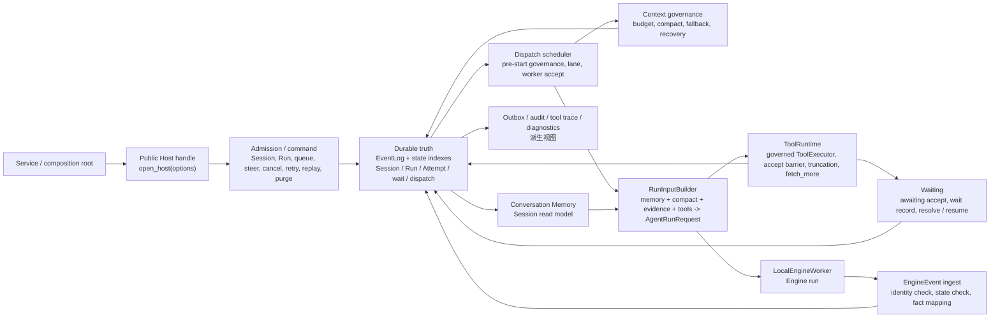

# Host 开发手册

本文档是 `dayu.host` 包的开发手册。

Host 在整体架构中位置如下：

```text
UI -> Service -> Host -> Engine
```

## Agent更新约束【必须遵守】

- 本文档只写两类内容：
  - 当前代码已实现的整个 Agent 的设计意图、架构边界，范围包括 `UI -> Service -> Host -> Engine`。
  - 当前代码已实现的 `dayu.host` package 的开发接口、公共契约、架构、稳定边界、主要组件、关键执行路径、状态机、事件流、关键机制、扩展点。
- 更新本文档时必须先核对 `dayu.host` 当前代码；代码真源高于 `docs/host/design.md`，设计文档只作为设计意图和术语边界参考。
- 必须按本文档现有章节职责写作：`设计意图` 和 `架构边界` 先说明整个 Agent 与 Host 位置；其后章节只说明 `dayu.host` package。
- 不写用户手册、安装运行命令、测试清单、文件级流水账或 review / work unit 过程状态。
- 不写未来计划、路线图、未落地能力或实现细节；只保留当前代码已经实现且对开发者稳定有用的说明。

## 设计意图

Dayu 是生产级通用 Agent，具备买方财报分析能力，核心范式是“宿主强约束下的 LLM in the loop”。

在整个 Agent 中，LLM 负责分析、推理和生成，但生命周期、取消、恢复、工具治理、事件事实、memory / context governance 与持久化事实由 Host 掌控。Host 位于 Service 与 Engine 之间，是 Session / Run / Attempt / EventLog / admission / dispatch / cancel / wait-resume / retry / replay / steer / memory / context governance / projection 的治理真源。

`dayu.host` 的设计重点是把多轮 Agent 运行放在可恢复、可审计、可治理的宿主边界内：

- Host 以 durable EventLog 与同事务状态索引作为事实真源；projection、memory、tool trace、audit、outbox 与 diagnostic 都是派生视图或观察记录。
- 同一 Session 的 active Run 由 Host admission 约束；queued Run 是 durable state，不是内存队列。
- Engine 只执行单次 `AgentRunRequest`，不拥有 Session / Run / Attempt 生命周期；EngineEvent 必须经 Host identity、状态与幂等校验后才能变成 Host facts。
- 工具调用只通过 Host-owned ToolRuntime 进入业务工具；工具结果、等待、截断、`fetch_more` 与重复调用治理必须经过 Host accept barrier。
- 上下文预算和 compact 治理由 Host 负责；Engine 只在 provider 明确报告上下文溢出时发出 `context_compaction_requested`。
- Conversation Memory 只消费 committed canonical facts 与 accepted compact 结果；assistant final answer 和普通工具证据不会自动成为 evidence-backed fact。
- 财报业务语义、财报文档下载、预处理、处理与存取不属于 Host；财报文档存取必须通过 `dayu.fins.storage` 下的仓储协议与仓储实现完成。

## 架构边界

整体依赖方向固定为：

```text
UI -> Service -> Host -> Engine
```

- `UI` 负责展示、输入收集、流式订阅和用户动作触发。
- `Service` 负责业务入口、身份解析、配置 / scene / tool / runner 装配，并调用 Host。
- `Host` 负责 Agent 运行宿主边界、状态治理、持久化、工具运行时治理、memory / context governance、projection、恢复和取消。
- `Engine` 负责单次 run 的模型交互、Runner 协议归一、tool loop、取消观察和 `EngineEvent stream`。

Host 与其它层的稳定边界如下：

- Host 可以在本地 worker 边界调用 Engine public entry；Engine 不导入 Host，不读取 Host durable store，不管理 Session / Run / Attempt，不写 EventLog。
- Host 不导入 `dayu.service`、`dayu.ui` 或 `dayu.fins`，不解释 scene manifest，不扫描业务工具，不读取业务配置文件，不承载财报业务规则。
- Service / composition root 把配置、scene、tools、runner、policy 与 profile 显式映射成 Host typed inputs；Host 接收最终 typed value，不接收 raw config patch、profile lookup 或 extra payload。

公共包边界固定如下：

- `dayu.contracts` 是 Dayu Agent 公共契约包，承载 UI / Service / Host / Engine / ToolRuntime / tools 可共同使用的层中立数据与协议，例如 JSON 值、取消 token、工具声明、工具 schema、工具调用请求、工具执行 outcome、工具等待 outcome 和 `ToolExecutor`；它不承载 Host / Engine 状态机，也不承载业务事实。
- `dayu.engine.contracts` 是 Engine 专属契约包，承载 Host 调用 Engine 所需的 `AgentRunRequest`、`AgentPolicy`、`EngineEvent`、`RunnerEvent`、`RunnerSpec`、`AsyncRunner` 等边界类型；它定义 Host -> Engine 的单次 run contract，不是 Agent 全局公共运行时。
- `dayu.runtime` 是层中立运行期基础设施包，提供取消等待、日志级别、诊断文本脱敏、截断、filelock、lane 等可复用 helper；它不得依赖 `dayu.engine` / `dayu.host` / `dayu.service` / `dayu.ui` / `dayu.fins`，也不承载任何层的状态机或业务语义。
- 工具声明契约属于 `dayu.contracts`；具体工具实现、工具发现、工具权限、工具运行时治理、截断治理、长事务监控和工具审计属于 Host / ToolRuntime、runtime discovery、Service assembly 或具体工具包。Engine 只接收调用方传入的 `tool_schemas` 与 `tool_executor`。

## 接口

普通 Service-facing 入口是包根导出的 `open_host(options)`。它是异步 context manager，进入后返回异步 `Host` handle；Service 使用该 handle 发起 Session / Run / outbox / wait / cancel / purge 操作，不直接持有 durable store、scheduler、command handle、registry、wait poller 或 ToolRuntime 内部对象。`OpenHostOptions.wait_poller_policy=None` 时不启动 production wait poller；传入启用的 policy 时，`HostToolingOptions.wait_poll_adapter_registry` 必须同时提供，poller 才会由 `open_host` 装配。

`Host` handle 当前提供：

- `ensure_session(request)`：按 `(scope, slot_key)` 原子确保当前 Session。
- `create_session(request)`：显式创建新 Session，可选择重绑定 slot。
- `get_session(session_id)`：读取 Session snapshot。
- `list_sessions()`：读取全部未 purge Session 的 durable 列表摘要。
- `get_run(run_id)`：读取 Run snapshot。
- `submit_followup(session_id, request)`：提交普通 queue 或 steer follow-up。
- `retry_run(run_id, request)`：基于失败源 Run 创建关联的新 Run。
- `replay_run(run_id, request)`：基于成功源 Run 创建 no-tool 结构修复 Run。
- `cancel_run(run_id, request)`：取消单个可治理 Run。
- `cancel_session_runs(session_id, request)`：取消 Session 下可治理的非终态 Run。
- `resolve_wait(wait_id, request)`：接收外部 wait result，由 Host 恢复或收口 Run。
- `close_session(session_id, request)`：关闭 Session 的新输入入口。
- `purge_session(session_id, request)`：清理已关闭且所有 Run 已终态的 Session 本地可恢复事实。
- `report_storage_usage()`：读取只读 storage usage report，包含 durable SQLite 表 row count、payload logical bytes、orphan SQLite payload 诊断计数以及 DB/WAL 文件大小。
- `run_storage_maintenance(request)`：执行显式 maintenance，返回 orphan artifact 候选、已发布 artifact 物理字节和、usage report 与可选 WAL checkpoint 诊断；默认 dry-run 不删除文件，显式 `reclaim_orphan_artifacts=True` 时只回收删除前 recheck 仍未被引用的 orphan artifact 物理文件。
- `read_outbox_terminal_items(session_id, request)`：读取离线 terminal notification item。
- `drain_outbox_terminal_items(session_id, request)`：幂等标记 terminal notification item 已 drain。
- `watch_session_events(session_id)`：创建 live HostEvent 订阅；订阅从当前 live cursor 开始，不提供离线 replay cursor。
- `close()`：关闭当前 opener runtime，先关闭 wait poller，再关闭 scheduler，并向 active worker 传播 lifecycle cancel；该操作不写用户 cancel / failed terminal facts。

包根还导出函数式 command / read facade：`ensure_session`、`create_session`、`get_session`、`list_sessions`、`get_run`、`submit_followup`、`retry_run`、`replay_run`、`cancel_run`、`cancel_session_runs`、`resolve_wait`、`close_session`、`purge_session`、`report_storage_usage`、`run_storage_maintenance`。普通 Service 优先使用 `open_host` 返回的异步 handle；低层 facade 不公开 durable store 或 scheduler 作为包根公共面。

`OpenHostOptions` 是 construction-time boundary，显式接收 durable SQLite 路径、artifact root、SQLite busy / retry policy、payload inline threshold、runtime lane 参数、worker factory、ordinary run baseline、tooling options、context budget policy、compactor baseline、memory projection policy、memory catch-up page size、active cancel timeout 与 truncation manager 开关。

本地执行边界由 `LocalEngineWorkerFactory`、`LocalEngineWorker` 与 `LocalWorkerHandle` 表达。Host 创建 `AttemptDispatchSnapshot` 与 `AgentRunRequest`，worker 接住后返回 handle；Host 消费 handle 的 EngineEvent stream，并在 cancel 或 shutdown 时调用 handle 的关闭 / cancel hook。

## 调用者装配示例

Host 的稳定入口是 `open_host(options)` 返回的异步 `Host` handle。Service / composition root 负责把配置、scene、runner、tool discovery、Fins wait adapter、wait poll adapter registry、wait poller policy、context policy 和 worker factory 先映射成 `OpenHostOptions`；Host 不接收 raw config patch，也不在运行中扫描工具或业务配置。

### Open Host

调用方本地的 composition root 应先构造完整 `OpenHostOptions`，再进入 opener context：

```python
from dayu.host import open_host

options = build_open_host_options(
    workspace_root=workspace_root,
    runtime_config=runtime_config,
    worker_factory=worker_factory,
    business_tool_bundle=business_tool_bundle,
)

async with open_host(options) as host:
    session = await host.ensure_session(ensure_request)
    run = await host.submit_followup(session.session_id, followup_request)
```

`build_open_host_options(...)` 代表 Service / composition root 的本地装配函数，不是 Host public API。它必须产出完整 typed `OpenHostOptions`，包括 durable 路径、ordinary run baseline、worker factory、tooling options、context / memory policy 和可选 compactor baseline。

### Session 与 follow-up

Host public command 只接收 typed request：

```python
from dayu.host import (
    EnsureSessionRequest,
    FollowupBehavior,
    SubmitFollowupRequest,
)

ensure_request = EnsureSessionRequest(
    scope="workspace",
    slot_key=slot_key,
    metadata=(),
)

followup_request = SubmitFollowupRequest(
    context=operation_context,
    session_id=session.session_id,
    client_request_id=client_request_id,
    system_prompt=None,
    user_prompt=user_prompt,
    tool_names=None,
    runner_spec=None,
    runner_options=None,
    agent_policy=None,
    behavior=FollowupBehavior.QUEUE,
    target_run_id=None,
)
```

`tool_names=None` 表示使用 construction-time 业务工具全集；空集合表示禁用业务工具；非空集合表示只启用指定业务工具。`runner_spec`、`runner_options`、`agent_policy` 为完整 per-run typed override；为 `None` 时使用 `OpenHostOptions.ordinary_run_baseline`。

### Steer 与 cancel

`steer` 是同一 Run 内的改向，不创建新 Run。调用方必须指定同一 Session 当前 active 且状态为 `RUNNING` 或 `WAITING` 的 `target_run_id`：

```python
from dayu.host import FollowupBehavior, SubmitFollowupRequest

active_run_id = active_followup.accepted_run_id

steer_request = SubmitFollowupRequest(
    context=operation_context,
    session_id=session.session_id,
    client_request_id=steer_client_request_id,
    system_prompt=None,
    user_prompt=updated_user_prompt,
    tool_names=None,
    runner_spec=None,
    runner_options=None,
    agent_policy=None,
    behavior=FollowupBehavior.STEER,
    target_run_id=active_run_id,
)

steered = await host.submit_followup(session.session_id, steer_request)
```

`steered.accepted_run_id` 仍是 `target_run_id`；Host 会在该 Run 下创建新的 Attempt / execution。旧 Attempt 不会 resume；旧 active worker 若仍在运行，Host 在 commit 后只做 best-effort cancel 传播。

`cancel` 是 Host durable command，不是直接杀 worker。当前 public cancel mode 只有 `GRACEFUL`：

```python
from dayu.host import CancelMode, CancelRunRequest

cancel_request = CancelRunRequest(
    context=operation_context,
    client_request_id=cancel_client_request_id,
    reason="user_stop",
    mode=CancelMode.GRACEFUL,
)

cancelled = await host.cancel_run(active_run_id, cancel_request)
```

`cancelled` 是取消 command commit 后的最新 `RunSnapshot`。对于 active Run，Host 会写入 durable cancelling / cancelled 事实，并通过 active worker registry 传播取消；已 accepted 的事实不会被撤回。每个 steer / cancel command 都必须使用自己的 `client_request_id` 作为幂等边界。

## Wait callback completion

Wait callback completion 是外部长事务完成后回到 Host wait-resume 管线的 typed callback 边界。它是 Host wait API 体系的一部分，但不是 Host 直接注册的 HTTP route。Service / Web transport 层负责解析 HTTP 方法、路径、header 与 body，并把结果映射成 Host 可理解的强类型 callback completion；Host 只接收已经归一化的 typed envelope、认证输入和调用上下文。

Host callback 路径的稳定链路如下：

```text
Service / Web transport
  -> WaitCallbackCompletionEnvelope
  -> DefaultWaitCallbackAdapter
  -> CallbackWaitResolvePort
  -> Host command-layer resolve_wait
  -> wait resolution facts + resume Attempt
```

`DefaultWaitCallbackAdapter` 的职责是 callback 边界预处理，不拥有 durable state transition：

- 先执行 callback authenticator；认证失败时不得读取 wait state，也不得调用 resolver。
- 读取 wait state 只用于 unknown wait、stale、late cancel / lost 与 invalid wait state 的预分类。
- 使用与 direct `resolve_wait` 相同的 wait resolution digest helper 校验 callback payload；request id、认证材料、correlation metadata、`observed_at` 和 `completed_at` 不参与 outcome digest。
- 把通过预检的 callback completion 转成 `ResolveWaitRequest(source=CALLBACK)`，再通过 `CallbackWaitResolvePort` 进入 command-layer `resolve_wait`。
- 只返回 typed `WaitCallbackAdapterResult` 与 stable status / diagnostic code；不回显 outcome payload 或 credential material。

状态迁移仍由 Host 既有 `resolve_wait` 管线负责。同一 `(wait_id, idempotency_key)` 与相同 outcome digest 的重复 callback 是 replay；同 key 不同 outcome 是 idempotency conflict；已 cancel、已 terminal、已 resolved、failed 或 lost 的 late result 不恢复旧 Attempt。command-layer callback port 在非 replay 且创建 resume dispatch 时唤醒 dispatch，replay 不重复唤醒。

这个边界当前不包含真实 HTTP route、secret backend、HMAC / bearer verifier、生产 poller、physical cancel、Engine contract 或 UI surface。需要暴露 Web endpoint 时，应在 Host 外部的 Service / Web composition root 中注册路由，构造 framework-neutral request，注入 callback adapter，然后让 Host 按上述 typed callback path 处理。

## 公共契约

Host 公共契约分为 Host 专属契约、Dayu Agent 公共契约和 Engine 交互契约。

### Host 专属契约

- `SessionSnapshot` / `SessionStatus` / `SessionSlotRef`：Session 生命周期与 slot 绑定视图。
- `SessionListItem` / `ListSessionsResult`：全部未 purge Session 的 durable 列表摘要视图。
- `RunSnapshot` / `RunStatus` / `FollowupSnapshot` / `SourceRunRelation`：用户可见 Run 生命周期与 retry / replay 来源关系。
- `AttemptDispatchSnapshot` / `AttemptStatus`：Host 派发给 worker 的 Attempt 执行快照。
- request dataclass：`EnsureSessionRequest`、`CreateSessionRequest`、`SubmitFollowupRequest`、`RetryRunRequest`、`ReplayRunRequest`、`CancelRunRequest`、`CancelSessionRunsRequest`、`ResolveWaitRequest`、`CloseSessionRequest`、`PurgeSessionRequest`、outbox read / drain request。
- `HostEvent` / `HostEventClass` / `HostEventKind` / `HostActivityView` / `HostActivityKind` / `HostActivityStatus` / `HostActivitySeverity` / `HostActivityCounts` / `HostTerminalStatus` / `HostFinalAnswerView`：Host 对 UI / Service 暴露的 typed event view 与安全 activity view。
- `OutboxTerminalItem` / `OutboxTerminalItemsBatch` / `OutboxTerminalCursor` / `OutboxProjectionStatus` / `OutboxTerminalItemState`：离线 terminal notification 读取与 drain 契约。
- `HostApiError` / `HostApiErrorCode` / `HostApiErrorDetail`：public API 错误；错误码包括 `NOT_FOUND`、`INVALID_STATE`、`CONFLICT`、`IDEMPOTENCY_CONFLICT`、`PERMISSION_DENIED`、`UNSUPPORTED_OPERATION`、`INTERNAL_ERROR`。
- `HostCallContext` / `OperationContext` / `AuthorizationClaim` / `HostMetadataEntry`：调用上下文、授权声明与稳定 metadata。
- `HostToolingOptions` / `FrameworkToolName` / `FrameworkToolPolicyView`：业务 ToolBundle 与 Host framework tool 的 construction-time 输入边界。
- `ContextBudgetPolicy` / `MemoryProjectionPolicy`：context governance 与 conversation memory projection 的 typed policy。
- `WaitCallbackCompletionEnvelope` / `WaitCallbackAuthInput` / `WaitCallbackAuthAccepted` / `WaitCallbackAuthRejected` / `WaitCallbackAdapterResult` / `WaitCallbackAdapterStatus`：framework-independent wait callback completion 契约。调用方在 Service/Web transport 层完成请求解析后，把强类型 envelope 交给 `DefaultWaitCallbackAdapter`；adapter 只做认证、payload digest 校验、stale / late 预分类和 `ResolveWaitRequest(source=CALLBACK)` 转换，状态迁移仍进入 Host `resolve_wait` 管线。
- `CallbackWaitResolvePort` / `CallbackWaitResolveResult` / `WaitCallbackStateReadPort`：callback adapter 接入 command-layer wait resolve 与 wait state 预读的端口契约。command-layer 实现必须保留现有 resolve wakeup 语义：非 replay 且创建 resume dispatch 时唤醒 dispatch，replay 不重复唤醒。

### Dayu Agent 公共契约

这些契约定义真源在 `dayu.contracts`，由 Host / Engine / ToolRuntime / 工具实现共同使用：

- `JsonValue`：公共 JSON 值类型。
- `CancellationToken`：跨层取消观察入口。
- `ToolSchema` 与工具声明相关类型：本次 run 暴露给模型的工具 schema 快照。
- `ToolExecutor` / `BatchToolExecutionRequest` / `BatchToolExecutionOutcome`：批式工具执行协议。
- `ToolCallRequest` / `ToolExecutionOutcome` / `ToolAwaitingOutcome`：单工具调用、普通结果、失败、取消和长事务等待 outcome。
- `ToolSourceRef` 等工具来源引用：用于记录业务工具来源与 digest；Host 不把工具来源引用解释成业务事实。

### Engine 交互契约

这些契约定义真源在 `dayu.engine.contracts`，Host 只用于构造单次 Engine 输入或 ingest Engine 输出：

- `AgentRunRequest`：Host 构造给 Engine 的单次 run 输入快照。
- `RunnerSpec` / `RunnerCallOptions` / `AgentPolicy`：Service / composition root 或 per-run request 显式传入的执行配置。
- `EngineEvent`：EngineEvent stream 的事件类型；进入 Host 前只是输入，不是 durable truth。
- `RunnerRequestIdentity` / client correlation：由 Host 提供 attempt / execution / runner call 上下文，Engine 派生 provider request correlation；该 id 不表达 Host lifecycle ownership。

## 架构

`dayu.host` 内部按 public API、opener、admission、durable truth、dispatch、EngineEvent ingest、ToolRuntime、waiting、context governance、memory 与 projection 分工。



```text
dayu.host
├── api / __init__              # Service-facing public contracts
├── open_host                   # opener runtime 与 async Host handle
├── admission / command         # durable command、queue、steer、cancel、retry、replay、purge
├── durable / event_log         # EventLog、state index、payload、projection、audit、purge truth
├── dispatch / local_proxy      # scheduler、lane、worker accept、active cancel、recovery closeout
├── engine_ingest               # EngineEvent -> Host facts / preview / diagnostic
├── run_input                   # EventLog / memory / compact / tool schemas -> AgentRunRequest
├── tool_runtime                # governed ToolExecutor、accept barrier、truncation、fetch_more
├── waiting / wait_adapter      # awaiting accept、wait record、resolve / resume
├── compaction / context_*      # context budget、compact material、compactor operation、fallback
├── memory                      # conversation memory read model
└── outbox / tool_trace / audit # 派生视图与诊断输出
```

核心对象只有 `Session`、`Run`、`Attempt` 与 `EventLog`。其它对象，例如 wait record、dispatch record、memory snapshot、outbox item、tool trace row、audit line、projection checkpoint、compact artifact 和 runtime lane claim，都是内部机制、派生视图或外部资源协调记录，不提升为同级治理真源。

## 稳定边界

Host 稳定边界是 durable command、typed request / snapshot、HostEvent view、outbox terminal item 与 `open_host(options)` construction-time typed inputs。`list_sessions` 属于 typed read view：它从 durable Session / slot / Run state truth 生成全部未 purge Session 的列表摘要，不读取 projection truth，不触发 projection catch-up，也不启动执行。

Host 不负责：

- UI 展示、用户身份解析、权限系统、scene manifest 解释、workflow 编排或 CLI 参数解析。
- 模型配置加载、secret 解析、provider client 选择、prompt asset 拼装或工具 discovery。
- Engine 内部 iteration、RunnerEvent 解析、provider payload 构造、provider retry、length continuation 或 fallback Runner 调用。
- 财报业务语义、ticker 归一、财报下载、财报预处理 / 处理、XBRL 解析或文档仓储访问。
- 把 projection、outbox、audit、tool trace、memory snapshot、runtime lane 或 provider diagnostics 当成 EventLog truth。

Stream 术语固定如下：

- `EngineEvent stream`：Engine / worker 产出的单次 run 事件流，是 Host ingest 的输入。
- `Host event stream`：Host 从 committed EventLog 派生的 typed event view。
- `preview event`：面向 UI 流式体验的非真源事件；不能作为恢复、memory、terminal result 或 audit 的唯一依据。
- `outbox terminal items`：从 Host terminal facts 派生的离线通知队列；drain 只表示 Host outbox projection 状态，不表示外部 channel 投递成功。

## 主要组件

### Public API 与 opener

`api.py` 定义 public dataclass、enum、Protocol、error 与 opener options；包根 `__all__` 收口 Service-facing 导出。`open_host(options)` 负责装配 durable store、admission service、scheduler、active worker registry、可选 wait poller supervisor、audit / tool trace / outbox projection catch-up ports、context compactor 和本地 worker typed port，并在 async context 退出时关闭当前 opener runtime。Conversation Memory 的 required repair / catch-up 由 dispatch 前 correctness path 触发，opener 的 after-commit 热路径不执行 memory projection 追平。

### Admission 与 command

Admission 是 Session active Run、queue、steer、retry、replay、cancel、resolve wait、close 与 purge 的写入边界。它在 durable transaction 内写入 canonical facts、状态索引、幂等记录和必要 dispatch / wait / purge 记录；commit 后再唤醒 scheduler 或 projection。

### Durable EventLog 与状态索引

EventLog 分配全局 `event_sequence`，记录 canonical facts、preview、diagnostic 和 projection signal。canonical facts 与 Run / Attempt / Session / wait / dispatch 状态索引必须同事务推进；Host 读取与恢复以这些 durable rows 为准。

### Dispatch scheduler

Dispatch scheduler 只消费已提交的 accepted / queued / pending dispatch facts。它负责 pre-start governance、本地 runtime lane capacity、worker accept、active worker registry、EngineEvent stream 消费、terminal closeout、queue promotion 和 startup recovery wakeup。

### RunInputBuilder

RunInputBuilder 只从 durable providers 读取当前 Run facts、Session continuity、conversation memory、compact artifact、accepted tool evidence、fallback context、tool schema snapshot、ToolRuntime handle、scene parameters 和 policy snapshot，构造 `AgentRunRequest`。它会把 Host 内部 id、payload ref、projection checkpoint、policy ref、digest 和 dispatch 状态改写为 LLM-facing 自解释 system sections，避免把宿主治理信息伪装成业务事实。

### EngineEvent ingest

EngineEvent ingest 校验 run / attempt / execution identity、当前 durable state 与 event type，再把 EngineEvent 转成 Host facts、preview 或 diagnostic。`EngineEvent` 本身不是 truth；final answer、failure、cancel、lost、usage、iteration_started、context compaction request 和 awaiting confirmation 都必须经 Host ingest 才能影响 Host 状态。

### ToolRuntime

ToolRuntime 把 construction-time `HostToolingOptions` 中的业务工具 bundle 与 Host framework tools 组合成 effective tool bundle，并向 Engine 提供受治理的 `ToolExecutor`。工具结果只有通过 Host accept barrier 后才会返回给 Engine；side-effect / paid tool 必须携带工具幂等键；attempt-local duplicate governance、run-scoped truncation cursor 和 optional `fetch_more` 都在 ToolRuntime 内治理。

长事务工具需要启动外部工作时，业务 callable 先返回 awaiting outcome；ToolRuntime 只在 Host awaiting accept ack 已 durable 成立后，才通过 construction-time activation registry 调用 provider 内部 activation adapter。该 adapter 不进入 Engine contract，也不暴露给 LLM-facing tool schema。

### Waiting

长事务工具返回 `ToolAwaitingOutcome` 时，ToolRuntime 先提交 awaiting facts；Host 在同一治理路径中创建 wait record，把 Run 推进为 `WAITING`、Attempt 推进为 `SUSPENDED`。外部结果通过 `resolve_wait` 回到 Host，Host 决定恢复、失败、取消或 lost。

Engine 不拥有 wait record、activation 或外部 job 生命周期。Engine 只观察 ToolRuntime 返回的 awaiting outcome，并在本次 run 内产出诊断性的 awaiting / suspended 事件；等待真源、activation 时机和后续 resume 都由 Host / ToolRuntime 治理。

Production wait poller 是 `open_host` 可选装配的 Host runtime。它使用 construction-time poll adapter registry 观察 durable wait record 指向的外部 job，并通过 durable claim / expiry / backoff 控制可观察资格；完成或 lost 时仍调用同一个 `resolve_wait` command path。poller runtime diagnostics 保持在内存中，不写 EventLog，不成为业务事实或用户结论。

当 `WAITING` Run 已被 Host cancel 收口后，cancel command transaction 只写 Host durable wait / Run / Attempt 事实，不在事务内执行 provider I/O。后续由 production wait poller 在 cancelled wait row 上 claim 后调用 provider wait adapter 的 external lifecycle 端口。adapter 可以返回三类封闭结果：`WaitExternalJobLifecycleApplied` 表示已执行 `CANCEL` / `REVOKE` / `ABANDON` 中的外部 lifecycle 动作，`WaitExternalJobLifecycleUnsupported` 表示该 wait 明确不支持外部 lifecycle 动作，`WaitExternalJobLifecycleNoop` 表示当前 wait 已无需或无法继续处理。Host poller 只把这些结果折叠成有界 durable outcome：`abandoned`、`abandon_unsupported` 或 `abandon_noop`；adapter 异常记录为 `error` / `abandon_error` 类诊断并按 backoff 重试，缺失 adapter 记录为 missing-adapter retry 诊断。Fins 当前装配的 wait adapter 使用 `ABANDON` 语义做 best-effort observation cancel / cleanup；Host 不把 Fins observation 细节写入自身业务事实。

### Context governance

Context governance 使用 `ContextBudgetPolicy`、保守估算器、compact material、compact artifact store、LLM compactor 和 fallback selector 处理上下文预算。它只写 context compaction canonical facts 与 compact artifact refs；accepted compact 后由 memory projection 消费，不直接改写 memory snapshot。

### Conversation Memory

Conversation Memory 是 Session-level projection / read model，只消费 committed canonical facts 与 accepted `CONTEXT_COMPACTED` payload。它维护 selected recent window、evidence-backed facts、session summary、answer anchor、forward intent、reference continuity 和 diagnostics。Memory 可以重建，不是 EventLog truth。

### Outbox、audit 与 tool trace

Outbox 从 terminal facts 派生离线 terminal notification item；audit JSONL 记录操作流水和 destructive purge 诊断；tool trace 记录工具执行 hot rows 与诊断，并投影 context pressure、tool timing、failure metadata 等只读结构化 signal。Tool Trace 在缺少 provider request id 但存在 client correlation id 时仍保留该诊断关联字段，不把客户端关联 id 伪装成 provider request id。它们都不能反向驱动 Run / Attempt 状态。

## 关键执行路径

### 打开与关闭 Host

```text
open_host(options)
  -> validate construction inputs
  -> open durable store and projection ports
  -> create admission service and scheduler
  -> run startup recovery scan
  -> return async Host handle
  -> handle.close() / context exit closes scheduler, projections, command handle and store
```

`Host.close()` 是 opener runtime lifecycle 操作，不等于 `close_session`，也不等于用户 cancel。关闭时 Host 会向 active worker 传播 lifecycle cancel 并释放本地资源；未终态 Run 的治理归下次 startup recovery。

### 普通 queue follow-up

```text
submit_followup(queue)
  -> durable admission commit
  -> scheduler wakeup
  -> pre-start context governance
  -> RUN_STARTED / ATTEMPT_STARTED / dispatch record
  -> lane acquire and durable recheck
  -> LocalEngineWorker.accept(...)
  -> ATTEMPT_RUNNING
  -> EngineEvent ingest
  -> terminal fact and queued promotion
```

`SubmitFollowupRequest.tool_names=None` 表示使用 construction-time 全量业务工具；空集合表示禁用业务工具；非空集合表示只启用指定工具名。unknown tool name 在 canonical facts 写入前失败。

### Steer、retry 与 replay

`submit_followup(steer)` 必须指定同 Session 当前 active `RUNNING` 或 `WAITING` Run；Host 在同一 Run 内追加 steer 输入，收口旧 Attempt，并创建新的 Attempt / dispatch。`retry_run` 基于失败源 Run 创建关联新 Run；`replay_run` 基于成功源 Run 创建 no-tool 结构修复 Run。三者都不复用旧 Attempt。

### Cancel

当前 public cancel mode 只有 `CancelMode.GRACEFUL`。`ACCEPTED` / `QUEUED` Run 可以直接 durable terminal；active Run 进入 cancel path 后，Host 通过 active worker registry best-effort 传播取消；`WAITING`、`RECOVERING` 和 pre-dispatch 状态有各自 durable cancel 收口路径。取消 token 的语义是阻止后续工作，不撤回已接受事实。

### Wait 与 resolve

```text
ToolAwaitingOutcome
  -> Host accepts awaiting facts
  -> Run WAITING / Attempt SUSPENDED
  -> resolve_wait(wait_id, outcome)
      -> completed / tool-cancelled: append tool result facts and create resume Attempt
      -> failed: Run FAILED
      -> lost: Run LOST
```

迟到、重复、已 terminal 或已 cancel 的 wait result 不会恢复旧 Attempt；Host 返回幂等结果、冲突或 diagnostic。

### Context compaction

proactive compact 发生在 Attempt 创建前。Host 在 dispatch 前估算当前输入与 memory / compact / evidence / tool schema 预算；超过 policy 阈值时写入 proactive `CONTEXT_COMPACTION_REQUESTED`，运行 compactor，接受合格 compact 后再继续普通 dispatch，或按 fallback / failure 路径收口。

reactive compact 只由 EngineEvent `context_compaction_requested` 触发。该事件来自 provider 明确报告输入上下文溢出，不来自 final candidate 的 `finish_reason=LENGTH`；`LENGTH` 表示模型达到输出上限，属于 Engine length continuation / degraded answer 机制。Host ingest reactive request 后会关闭当前 Attempt、把 Run 推进为 `RECOVERING`，冻结 overflow material，执行 compaction，再创建新的 recovery Attempt 或按 fallback / failure / cancel 路径收口。

compact attempt 被拒绝时，Host 会在 `CONTEXT_COMPACTION_ATTEMPT_REJECTED` canonical payload 中保留 operation、attempt、failure stage、parser / validator、offending block locator、digest 与 diagnostic artifact ref 等小字段；若失败发生在 material projection 或 proposal 准备边界，raw previous compacted view / offending block text 只写入 Host diagnostic artifact，并通过 `payload_descriptors` 的 artifact descriptor 追踪，不进入 EventLog canonical payload、Conversation Memory、LLM-facing compact material 或普通 RunInput。

### Purge

`purge_session` 只接受已经 `CLOSED` 且所有 Run 均为终态、没有 active / queued / waiting / cancelling / recovering Run 的 Session。成功后，Host 删除目标 Session 的本地可恢复事实和派生视图数据，保留独立 purge tombstone、purge 幂等记录和 append-only audit JSONL。purge tombstone 不位于被 purge 的 Session EventLog 中，也不参与 resume、retry、replay、memory、RunInputBuilder 或普通 read truth。

### Storage Usage Report

`report_storage_usage` 是 operator-facing 只读诊断入口。它在 durable read transaction 内统计当前 Host SQLite 表 row count，读取 SQLite payload logical bytes、artifact descriptor logical bytes、未被 descriptor 引用的 SQLite payload row 数，并通过文件 `stat` 返回 DB / WAL 文件大小。该 report 不写 EventLog，不改变 Session / Run / Attempt 状态，不扫描 artifact root，不执行 checkpoint，也不删除文件或 row。

### Storage Maintenance

`run_storage_maintenance` 是 operator-facing 显式 maintenance 入口。它基于 `payload_descriptors` 中 `artifact_ref` 的 artifact 相对路径收集引用集合，只扫描 artifact root 下 `sha256/` 内容寻址 namespace，返回超过 grace window 的 orphan artifact 候选、已发布 artifact 物理字节和、usage report、memory snapshot integrity issues 与可选 WAL checkpoint 诊断。checkpoint 使用独立 durable connection，不在 command transaction 内执行。

maintenance 默认 dry-run，不删除 artifact 文件或 SQLite row。请求 `reclaim_orphan_artifacts=True` 时，只回收候选扫描证明为 orphan、且删除前 recheck 仍未被 descriptor 引用的 `sha256/` artifact 物理文件；失败的单文件删除以 `path`、`operation`、`message` 结构化诊断返回，成功删除的路径进入 `reclaimed_artifact_paths`。recheck 与 unlink 之间仍有极短 TOCTOU 窗口；默认 grace、content-addressed artifact 可重写性与 containment-guarded delete 用于降低风险。

maintenance 的 memory snapshot integrity issues 只报告 `invalid_json`、`schema_mismatch`、`digest_mismatch`、`unsupported_item_kind` 或 `storage_read_failed` 分类、短错误摘要和 row identity；不会内联 snapshot JSON、prompt、tool payload 或大内容。

maintenance 不删除任何 SQLite row，不回收 SQLite orphan payload row，不 quarantine / rebuild / overwrite memory snapshot，不执行 `VACUUM`、不启动 scheduler，也不处理 audit JSONL 或 tool-trace JSONL；SQLite space reclamation / VACUUM 继续归 Issue 76。audit JSONL、tool-trace JSONL、`.tmp` 和其它非 `sha256/` namespace 文件不参与 artifact orphan 候选。

## 状态机

### Session

Session 状态集合：

```text
OPEN
CLOSED
```

`OPEN` 允许新输入、queue、steer、读取 snapshot 与 live watch。`CLOSED` 关闭新输入入口，但不取消、不终止、不删除已有 Run；已有 active / queued / waiting / recovering Run 继续按 Host 状态机治理到终态。

### Run

Run 状态集合：

```text
ACCEPTED
QUEUED
RUNNING
WAITING
CANCELLING
RECOVERING
SUCCEEDED
FAILED
CANCELLED
LOST
```

Run 终态是 `SUCCEEDED`、`FAILED`、`CANCELLED`、`LOST`。`LOST` 表示 Host 无法确认或恢复执行结果，不等同于普通 `FAILED`。同一 Session 同时最多一个 active Run；queued Run 按 accepted `event_sequence` FIFO promotion。

### Attempt

Attempt 状态集合：

```text
STARTING
RUNNING
SUCCEEDED
FAILED
CANCELLED
SUSPENDED
STEERED
LOST
```

Attempt 是一次执行生命周期。旧 Attempt 永不 resume；wait resolve、steer、recovery、retry 与 replay 都创建新 Attempt 或新关联 Run。`execution_id` 用于拒绝迟到 Attempt 事件，不是 lease、fencing token 或远端 ownership。

## 事件流

Host EventLog event class 包括：

- `CANONICAL_FACT`：恢复、状态索引、memory、outbox、audit 和 Run terminal truth 的事实来源。
- `PREVIEW`：面向 UI 流式体验的展示事件，例如 iteration preview、content completed、tool batch ready / done、tool request / result accepted preview。content / reasoning / tool-call delta 默认只作为 transient ingest 信号接受，不写入主 EventLog，也不参与 durable replay。
- `DIAGNOSTIC`：诊断、拒绝、provider protocol、closeout、projection 或 recovery 观察。
- `PROJECTION_SIGNAL`：projection catch-up 与派生视图状态信号。

Host terminal event kind 包括 `SUCCEEDED`、`FAILED`、`CANCELLED`、`LOST`。`HostEvent` 是 Service-facing typed view，携带 `event_id`、`event_sequence`、`session_id`、`run_id`、EventLog public `event_class` / `event_type`、`kind`、可选 `HostActivityView`、dedupe key、terminal status、final answer 或错误 / cancel 摘要。progress event 不携带 terminal payload；succeeded terminal 必须携带 `HostFinalAnswerView`；failed / cancelled / lost terminal 不携带 final answer。`HostActivityView` 只承载 UI / Service 安全展示字段，工具 activity 的展示名来自 Host admission 冻结的 effective tool display snapshot，缺失时 fallback 稳定工具名；content / reasoning delta 不投影 raw delta activity。

EngineEvent ingest 与 HostEvent projection 是两条边界：

- EngineEvent 进入 Host 前只是 worker 输入；Host 必须校验 identity 与 durable state。
- HostEvent 是 EventLog 派生 view；watch 只订阅 live events，离线 terminal 通知走 outbox terminal read / drain。
- failed terminal public projection 可在原始错误消息后追加 `provider_request_id` / `client_correlation_id` 诊断后缀；后缀只来自 terminal payload 已有字段，不改写 EventLog payload message 或 payload digest。

Runner call manifest 由 Host 在 RunInputBuilder 装配普通 runner input 时写入 `RUNNER_CALL_INPUT_ASSEMBLED`。Engine `iteration_started` 到达后，Host ingest 将未关联 manifest 显式链接为 `RUNNER_CALL_INPUT_ITERATION_LINKED`；missing、ambiguous、mismatch 或 link conflict 都 fail closed 为 `ENGINE_EVENT_REJECTED`。

## 关键机制

### Admission 与 active slot

Admission 是所有 Run 输入的 durable 入口。它在事务内判断 Session 状态、active / start-blocking Run、queue 顺序、steer 目标、tool selection、幂等语义和 request digest。显式请求字段必须进入 typed request；不得把语义字段塞进 metadata 或 extra payload。

同一 Session 的 active slot 由 durable Run 状态决定，不由 scheduler 内存队列决定。`submit_followup(queue)` 在没有 active / start-blocking Run 时创建 `ACCEPTED` Run，有 active / start-blocking Run 时创建 `QUEUED` Run；queued promotion 按 accepted `event_sequence` FIFO。unknown tool name、closed Session、幂等语义冲突等错误都必须在 canonical facts 写入前 fail closed。

### Steer

`submit_followup(steer)` 是同一 Run 内的改向机制，不创建新 Run。请求必须指定 `target_run_id`，且目标必须是同 Session 当前 active 的 `RUNNING` 或 `WAITING` Run。Host 在同一事务内写入新的 `USER_INPUT_ACCEPTED` 与 `STEER_REQUESTED` canonical facts，并按目标状态收口旧执行边界：

- 目标为 `RUNNING` 时，Host 写入 `ATTEMPT_STEERED`，把当前 Attempt 终态置为 `STEERED`。
- 目标为 `WAITING` 时，Host 取消目标 Run 的 active wait records，避免旧等待结果再恢复旧 Attempt。

随后 Host 在同一 Run 下创建新的 Attempt / execution / dispatch record。steer 后旧 Attempt 不会 resume；如果旧 active worker 仍在运行，commit 后只做 best-effort cancel 传播，真实状态仍以新写入的 EventLog 与 Attempt index 为准。

### Cancel

当前 public cancel mode 只有 `CancelMode.GRACEFUL`。cancel 是 Host durable command，不是直接杀 worker，也不是撤回已接受事实：

- `ACCEPTED` / `QUEUED` Run 可直接写入 cancel request 与 `RUN_CANCELLED` terminal，并释放 queue promotion 资格。
- pre-worker `STARTING` Attempt 可在 worker accept 前直接写入 Attempt / Run cancelled。
- active `RUNNING` / `CANCELLING` Run 会写入 `RUN_CANCELLING`，commit 后通过 `ActiveWorkerRegistry` 传播 cancel；Host 注入 Engine 的 cancellation token 是主通道，`LocalWorkerHandle.on_cancel(reason)` 只是补充 hook。`OpenHostOptions.active_cancel_timeout_seconds` 为有限正数时，Host active cancel watchdog 会在 post-cancel timeout 后把仍未收口的 active Attempt / Run 关闭为 `CANCELLED`，并触发 queued promotion；该收口不表示底层 provider / tool 已被物理杀停。
- `WAITING` Run 直接收口 wait 与 Run cancel，不恢复旧 Attempt。
- `RECOVERING` Run 可在 recovery dispatch 前直接 cancel，释放 active slot。
- 已 terminal Run 的 cancel 只记录幂等 ack 并返回当前 terminal snapshot，不改写 terminal truth。

`cancel_session_runs` 按 Session 扫描当前支持的非终态目标，覆盖 queued、pre-dispatch、active worker、waiting 与 recovering Run；遇到不在支持子集内的非终态状态时 fail closed，避免部分状态被误取消。

### Resume

resume 只来自 `resolve_wait`，不是旧 Agent / Runner 的继续执行。长事务工具返回 `ToolAwaitingOutcome` 后，ToolRuntime 先进入 Host awaiting accept path；Host 在单个 durable transaction 内写入 `TOOL_AWAITING`、`RUN_WAITING`、`ATTEMPT_SUSPENDED`，创建 wait record，并把 Run / Attempt 推进到 `WAITING` / `SUSPENDED`。

外部长事务完成后，调用方通过 `resolve_wait(wait_id, request)` 把结果交回 Host：

- completed 或 tool-cancelled outcome 会关闭 wait record，写入 wait resolution 对应的 tool result facts，追加 `RESUME_REQUESTED`，再为同一 Run 创建新的 resume Attempt / execution / dispatch record。
- failed outcome 使 Run 进入 `FAILED`。
- lost outcome 使 Run 进入 `LOST`。
- 已 cancel、已 terminal、已 resolved / failed / lost 的 late result 不会恢复 Run；Host 只返回幂等结果、冲突或 `WAIT_LATE_RESULT_REJECTED` 诊断。

因此 wait-resume 的稳定边界是“新 Attempt 恢复同一 Run”，不是恢复旧 Engine 生成器、旧 Runner HTTP stream 或旧工具调用栈。

### Dispatch

Dispatch scheduler 不从内存队列恢复状态，只扫描 durable accepted / queued / pending dispatch facts。standard path 是 dispatch 前执行 context governance，写入 `RUN_STARTED` / `ATTEMPT_STARTED` / dispatch record，然后 acquire runtime lane、durable recheck、调用 `LocalEngineWorker.accept(...)`，最后写入 `ATTEMPT_RUNNING` 并消费 worker 的 EngineEvent stream。

runtime lane 只表达资源容量，不能证明 worker ownership。lane acquire 成功后仍要重新读取 durable state；worker startup timeout、worker accept failure、worker stream crash、cancel 后 clean EOF、非 cancel clean EOF 都由 Host closeout 成结构化 terminal 或 diagnostic。active cancel watchdog 使用 durable `CANCEL_REQUESTED` / `RUN_CANCELLING` 时间和当前 `CANCELLING` Run / `RUNNING` Attempt / worker accepted dispatch record 做 deterministic tick；cancel commit 会唤醒 watchdog，scheduler 也会做 periodic fallback scan。terminal closeout 后，scheduler 唤醒同 Session queued promotion。

### Host 启动恢复

如果 LLM / Engine 还没返回时 Host 进程退出，Host 不在退出瞬间伪造 terminal facts；已写入 durable store 的 Run / Attempt / dispatch row 会留给下一次 `open_host` 的 startup recovery scanner 处理。

startup recovery 读取 durable Run / Attempt / dispatch / Host instance liveness truth，并调用 `recovery_process.classify_orphan_candidate(...)` 做只读 positive orphan proof 分类：

- `ACCEPTED` 与 `QUEUED` 不被判 lost；scanner 只唤醒 dispatch 或 queue promotion。
- `WAITING` 不自动恢复；等待外部 `resolve_wait` 或 cancel。
- `RUNNING` / `CANCELLING` 只有在 positive orphan proof 成立并通过 CAS recheck 后才收口旧 Attempt；启用 active cancel watchdog 时，带 accepted cancel facts 的 `CANCELLING` Run 由 watchdog 收口为 `CANCELLED`，startup recovery 不先转为 `LOST`。
- `RECOVERING` 若 recovery dispatch 次数未超过上限，会创建新的 recovery Attempt / execution / pending dispatch；超过上限或缺少可恢复事实时转为 `LOST`。

positive orphan proof 需要 durable owner liveness 与本机进程证据支持，例如 owner 已 `STOPPED`、pid 缺失、pid 被复用且 start token / boot id 不匹配等。heartbeat stale 单独不构成 takeover proof；runtime lane TTL、projection lag 或 worker 没有返回也不构成 Host recovery truth。

### EngineEvent ingest

Host ingest 对 final answer、run failed、cancelled、lost、usage、iteration_started、tool awaiting confirmation 与 context compaction request 分别建模。EngineEvent 进入 Host 前只是 worker 输入，必须匹配 run / attempt / execution identity 与当前 durable state；迟到、错 execution、错状态或无法链接 runner-call manifest 的事件会 fail closed 为 diagnostic / rejected path。

同步 ingest 不处理需要异步 compact 的 reactive path；异步 ingest 在必要时执行 reactive compact / recovery。`iteration_started` 会显式链接 Host 先前写入的 `RUNNER_CALL_INPUT_ASSEMBLED` manifest；missing、ambiguous、mismatch 或 link conflict 都以 `ENGINE_EVENT_REJECTED` 收口，避免 provider observation 与 Host input manifest 脱节。

### ToolRuntime accept barrier

ToolRuntime 只有在 Host 接受工具事实后才向 Engine 返回 batch outcome。业务工具实现只返回语义 outcome；工具调用请求、工具结果、awaiting facts、payload descriptor、tool trace 与 diagnostic 都由 Host / ToolRuntime 统一治理。side-effect / paid tool 缺少工具幂等键会被治理为工具失败，避免没有幂等边界的副作用工具绕过 Host。

### 重复调用治理

重复调用治理是 attempt-scoped、ToolRuntime-owned 的内存治理机制，不是 durable cross-attempt 事实。治理 key 由 Attempt id、工具名、工具身份 digest、规范化参数 digest 与可选 semantic duplicate key 组成，不包含 `index_in_iteration`，因此同一 Attempt 内相同语义请求会被识别。

当前 duplicate decision 包括：

- `ALLOW`：允许重复执行。
- `REUSE`：要求模型复用上一次 accepted 结果。
- `HINT`：提示优先复用，只有证据范围不同才重新调用。
- `REQUIRE_JUSTIFICATION`：要求参数中给出重复调用理由。
- `HARD_STOP`：拒绝本次重复调用，返回受治理工具失败。
- `DURABLE_MISSING`：先前 in-flight owner 没有产生可复用 accepted fact 时的治理结果。
- `AWAITING_FANOUT`：先前 in-flight owner 已被 Host accepted 为等待中间态时，后续重复请求共享同一个 owner awaiting outcome；这是 Host internal 防御分支，不是普通 completed result 复用。

该机制会跟踪 attempt-local in-flight owner 与 waiter；owner 产生 accepted fact 后，后续重复请求可按策略复用或被治理。owner 被 Host accepted 为等待中间态后，会记录 attempt-local terminal marker，避免 cleanup 把已 accepted awaiting 误标为 durable-missing。若 owner cancelled、工具异常、Host accept rejected / timeout 或调用在 accept 前被治理，则记录 durable-missing reason。steer、resume、recovery、retry、replay 都创建新 Attempt 或新 Run，因此不会继承旧 Attempt 的重复治理内存状态。

### Truncation 与 fetch_more

工具声明启用截断时，ToolRuntime 会按 effective truncate spec 对结果截断，并创建 run-scoped、短期、一次性 cursor。`FrameworkToolName.FETCH_MORE` 是 Host framework tool 名称；只有 framework policy 启用时才注入给 Engine。

### Context budget 与 compaction

`ContextBudgetPolicy.context_window_size` 是 Host 的上下文窗口 typed 输入；Service / composition root 通常从模型配置的 `context_window_tokens` 映射而来。Host 以 ratio-first policy 派生 soft / hard threshold，并用保守估算器判断 proactive compact 或 reactive recovery。usage 是 provider capability 驱动的 post-call observation，只能用于诊断、校准和后续治理参考，不能回头修改已经完成的 dispatch decision。

proactive compact 发生在 Attempt 创建前；预算超限时 Host 写入 proactive `CONTEXT_COMPACTION_REQUESTED`，运行 compactor，接受合格 compact 后继续普通 dispatch，失败时按 fallback / failure path 收口。reactive compact 只由 EngineEvent `context_compaction_requested` 触发；Host 关闭当前 Attempt、把 Run 推进为 `RECOVERING`，冻结 overflow material，再执行 compact 并创建 recovery Attempt。`finish_reason=LENGTH` 表示模型输出上限，不触发 reactive compact。

### Conversation Memory projection

Conversation Memory 是 Host 最重要的 Session-level read model 之一。它的定义真源在 `dayu.host.memory`，consumer id 固定为 `host.memory.session.v1`，schema version 为 `conversation_memory_snapshot_v1`。Memory 只消费已提交的 EventLog canonical facts 与 accepted vNext compact payload；它可由 ordered EventLog events 确定性重建，不导入 Engine / Service / UI / Fins，也不写 Run / Attempt 状态。

Memory 当前只投影这些事件：

- `USER_INPUT_ACCEPTED`：生成 selected recent window 的 user item。
- `RUN_SUCCEEDED`：从 terminal answer continuity 中提取 assistant item；缺失可读 final answer 时跳过，不用 payload ref / digest / event id 补洞。
- `TOOL_RESULT_ACCEPTED`：生成 readable evidence item，优先使用 `display_text`，其次 `content`，再退化为中性 ref summary。
- `CONTEXT_COMPACTED`：读取 accepted `conversation_compact_output_v1` candidate，物化 session summary、evidence-backed facts、answer anchors、forward intents、reference continuity items，并记录 latest compaction event ref。

snapshot 包含五类稳定视图：

- Trace Memory：`selected_recent_window` 与 reference continuity items。
- Evidence / Fact Memory：accepted compact 生成的 evidence-backed facts，以及 recent evidence items。
- Session Summary Memory：accepted compact 的 session summary。
- Answer Anchor Memory：用于后续回答连续性的 anchors。
- Forward Intent Memory：用于下一轮继续推进的意图线索。

Memory policy 是按语义分区的 budget 模型，不是简单截断全文。`MemoryProjectionPolicy` 包含 `context_window_size`、selected recent window item / char cap、selected recent turn floor、fallback selected recent caps、evidence fact floor / cap、session summary cap、answer anchor cap、forward intent cap、reference continuity floor / cap、inline delta repair 上限和 `policy_ref`。projection 会按 item 数量、字符预算和 floor/cap 裁剪，并生成 budget diagnostics；facts 会按 claim/evidence 去重合并。

snapshot 自带稳定 `snapshot_id`、policy digest、cursor、built_at 与 snapshot digest。cursor 记录当前覆盖到的 EventLog `checkpoint_event_sequence` / `checkpoint_event_id`；projection lag、snapshot missing / damaged、snapshot ahead、inline delta repair 等情况以 typed diagnostics 表达。RunInputBuilder 可以在 snapshot 轻微滞后时用 EventLog delta 做 inline repair；超过 policy 上限时必须走 repair / catch-up 路径，而不是让模型看到不一致 memory。Memory repair / catch-up 的 batch size 只控制单页读取和事务粒度；required path 会追到目标 cursor、idle 或 failure，不把 page size 当作正确性停止预算。

Memory 与 compact 的关系必须保持单向：Context Governance / compactor 产出 accepted `CONTEXT_COMPACTED` fact 和 artifact；Memory projection 消费它并更新 read model。Memory 不直接写 compact artifact，不把 failed compact fallback 写成 compact 成功，也不把普通 final answer 或工具结果自动升级为 evidence-backed fact。ordinary RunInput 可以读取 memory snapshot 作为已物化 read model；pre-dispatch compact material 则由 EventLog / payload / artifact truth 构造 latest accepted compact、post-compact delta 与 current input anchor，不把 memory snapshot 当 compact input truth。任何 Run / Attempt truth 仍只来自 EventLog 与状态索引。

### LLM-facing 输入改写

RunInputBuilder 负责把 Host 内部治理事实转成模型完成当前任务所需的自解释输入。它从 durable providers 读取当前 Run facts、Session continuity、Conversation Memory、compact artifact、accepted tool evidence、fallback context、tool schema snapshot、ToolRuntime handle、scene parameters 和 policy snapshot，构造单次 `AgentRunRequest`。

LLM-facing 文本不得要求模型理解 event id、payload ref、dispatch id、policy ref、projection checkpoint、runner call manifest 或 Host state machine；这些只能作为必要的引用标签进入诊断或 manifest。给模型的输入应包含业务可读语义、当前任务约束、可引用证据和必要上下文，而不是 Host 内部治理术语。

### Outbox terminal delivery

Outbox 是 terminal fact 的派生通知队列。`read_outbox_terminal_items` 不改变 drain state；`drain_outbox_terminal_items` 只幂等更新 Host outbox projection queue state。Outbox projection lag 或 failure 不改写 Run terminal truth。

Outbox terminal item 的 failed `error_message` 与 live `HostEvent` 使用同一个 Host projection helper 追加 provider / client correlation 诊断后缀；该后缀属于 public projection 文本，不改变 terminal fact payload。

### Purge tombstone

purge 是 EventLog append-only retention 的 destructive exception。成功 purge 删除目标 Session 的可恢复 facts 与派生视图，但保留 tombstone 和 audit JSONL。重复同一 purge 请求通过 tombstone 幂等重放；同 key 不同语义返回 `IDEMPOTENCY_CONFLICT`，不同请求清理同一已 purge Session 返回 `CONFLICT`。普通 read path 不从 tombstone、audit、projection、outbox、tool trace 或 memory 重建 Session。

## 扩展点

扩展业务工具时，在 Host 外部通过工具 discovery / Service assembly 生成业务 ToolBundle，并以 `HostToolingOptions` 传入 `open_host`。Host 不扫描模块、不读取工具配置、不把业务工具注册表作为 per-run request。

扩展本地执行后端时，实现 `LocalEngineWorkerFactory`、`LocalEngineWorker` 与 `LocalWorkerHandle`，保持 Host durable state、cancel、EngineEvent ingest 和 terminal closeout 仍由 Host 控制。

扩展 ordinary runner baseline、per-run runner override 或 AgentPolicy 时，使用 `OrdinaryRunExecutionBaseline` 与 `SubmitFollowupRequest.runner_spec` / `runner_options` / `agent_policy` 的完整 typed value；不要传 patch dict、profile id 或 extra payload。

扩展 context governance 时，优先调整 `ContextBudgetPolicy`、compactor baseline、compact material / candidate 校验或 fallback policy。Engine 的 `context_compaction_requested` 只表达 provider context overflow；compact 执行、接受、失败和恢复调度都属于 Host。

扩展 conversation memory 时，保持 memory 是 committed facts 的 projection；新增 memory view 必须有明确 provenance、budget、digest 和 rebuild 语义，不得直接写 Run / Attempt 状态。

扩展 terminal delivery、audit、tool trace 或 projection 时，只消费 committed Host facts，不能反向驱动 EventLog truth。需要清理历史数据时，通过 `purge_session` 的 tombstone / audit 语义扩展，不把 close、cancel、archive、memory forget 或 UI hide 混成同一操作。

扩展财报能力时，把下载、read、preprocess / process、存储和业务规则放在 Fins service / runtime / storage 边界内；Host 只通过受治理工具调用接收工具结果，不直接访问财报仓储或财报原文。
